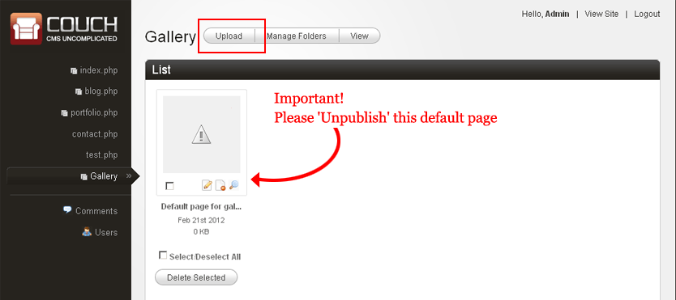
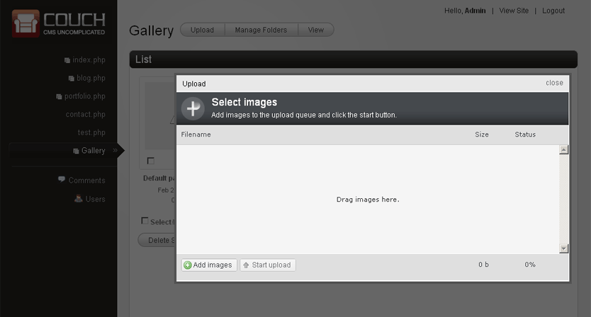
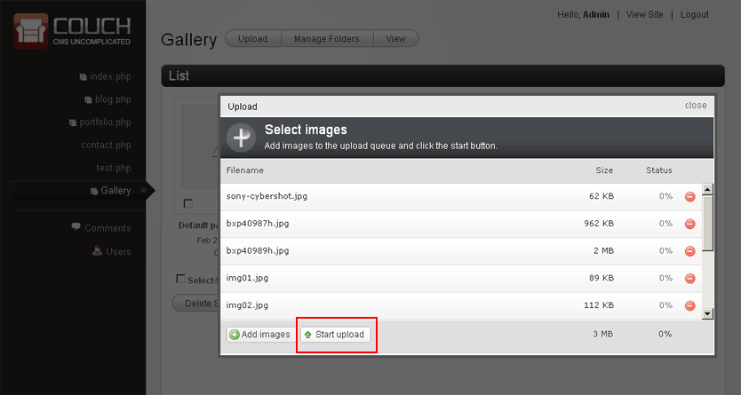
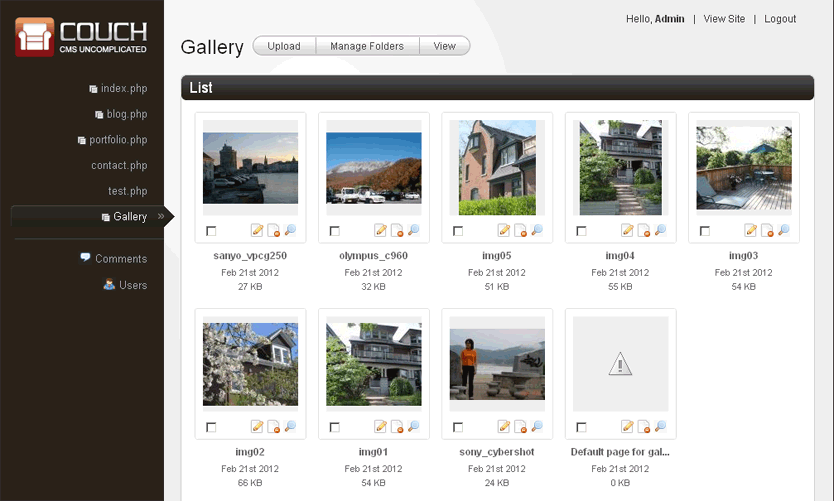
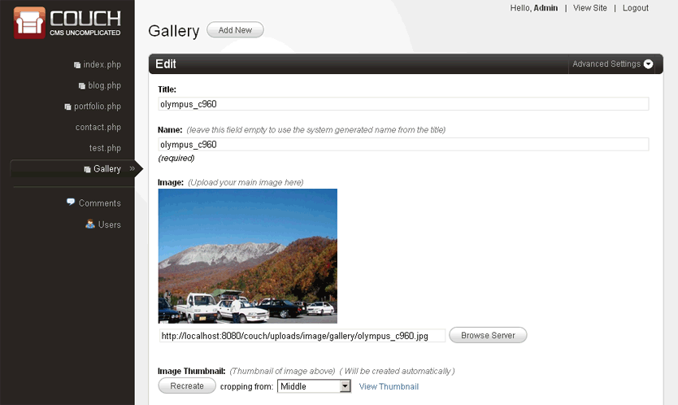
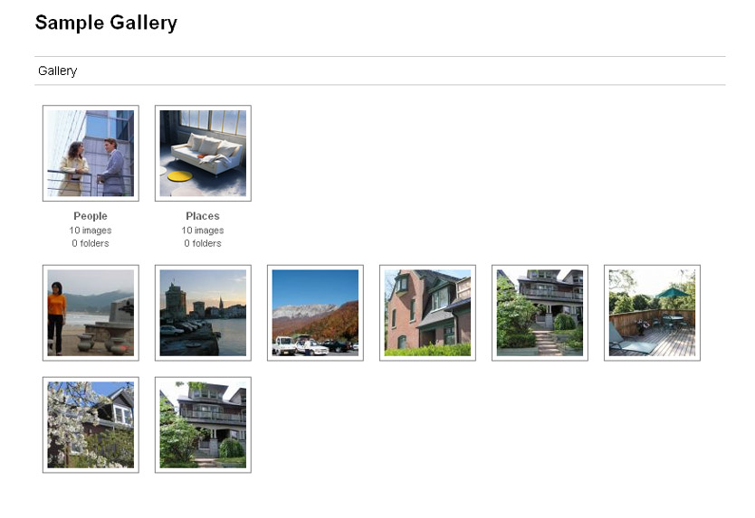
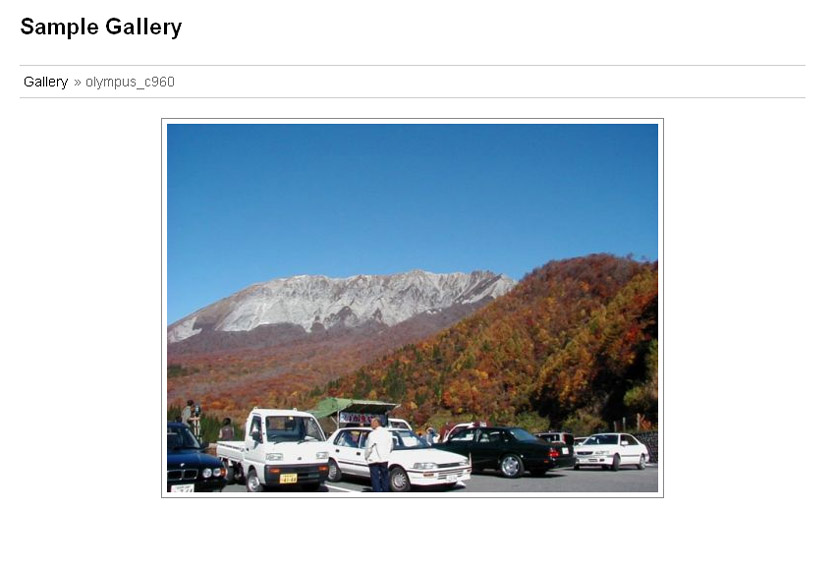

import { Steps } from "@astrojs/starlight/components";

One of the most demanded features in Couch has been the image gallery.

In all fairness, it has always been possible to create functional image galleries using the native features of Couch.

The workflow could go something like this:

<Steps>

1. Create a clonable template
2. Define (at least) two editable regions - one of type `image` for the main image and another of type `thumbnail` that is associated with the main image
3. Add images to the gallery by creating a cloned page for each image. The folders may be used to create individual albums
4. Finally display the gallery on the website by using the `cms:pages` tag

</Steps>

The method outlined above works but the step number 3 of manually creating a page each for every gallery item is what quickly proves to be tedious. This is especially so for albums those are required to be created by adding a large number of images at the same time.

To take the tedium out of creating such galleries, version 1.2.5 of Couch introduces the feature of automated creation of photo galleries using multiple images upload. Simply drag-n-drop a bunch of images and Couch uploads them one by one while automatically creating a cloned page for each of the uploaded image.

## How to use it

This new feature is built upon the existing functionality of Couch and requires only minimal modifications to the usual method described above in order to use it. Let us walk through all the steps leading up to the creation of a full-featured gallery. I'll point out the parts where something new is required to be done.

#### 1. Create a clonable template

The process begins, as is the norm, by creating a cloned template for the gallery. For our example, let us assume the name of our template is `gallery.php`. We use the regular method of declaring the template as **clonable**:

```php title="gallery.php" ins="clonable='1'" ins="dynamic_folders='1'" 
<cms:template title='Gallery' clonable='1' dynamic_folders='1'>

</cms:template>
```

Notice that we are also declaring the template as using **dynamic folders** because those will be used for creating albums.

Now comes the new part in this step. We add a new parameter to this declaration:

```php title="gallery.php" ins="gallery='1'"
<cms:template title='Gallery' clonable='1' dynamic_folders='1' gallery='1'>

</cms:template>
```

By adding `gallery='1'`, we inform Couch that template will require special consideration.

#### 2. Define editable regions

As mentioned before, any template meant to be used for a gallery will require at least two editable regions - one for the main image and another for the thumbnail.

Let us add the following declarations to the code above:

```php title="gallery.php" ins={3-11} ins={13-22}
<cms:template title='Gallery' clonable='1' dynamic_folders='1' gallery='1'>

    <cms:editable
        name='gg_image'
        label='Image'
        desc='Upload your main image here'
        width='500'
        show_preview='1'
        preview_height='200'
        type='image'
    />

    <cms:editable
        name='gg_thumb'
        assoc_field='gg_image'
        label='Image Thumbnail'
        desc='Thumbnail of image above'
        width='115'
        height='115'
        enforce_max='1'
        type='thumbnail'
    />

</cms:template>
```

As you can see, we are using the regular way to define the two editable regions. The only new part in this step is that **the gallery module expects the two regions to have specific names**. It is mandatory to name the region of type `image` as `gg_image` while the region of type `thumbnail` is required to be named as `gg_thumb`. This is necessary because later on while automatically creating the cloned pages, Couch will populate these regions without requiring any user intervention. To do so, it will need to know the names of the regions.

You can tweak all other parameters of the two regions to your fill but the names cannot be changed if Couch is to recognize them. You can, of course, also create as many other editable regions as you wish (e.g. a region for 'description' is a usual addition).

:::tip
The thumbnail region `gg_thumb` is used by Couch for displaying the image thumbnails in the admin panel as such it is not advised to modify the dimensions of it. You can always create another associated thumbnail region if you wish to use thumbnails of other dimensions.
:::

To persist the changes made to the template, make the mandatory visit to the template using your browser while being logged on as the super-admin. This will add the template to Couch admin. We are now all set to begin adding images to our gallery.

#### 3. Creating cloned pages

This is the step where everything is now very different. The first thing that you'll notice is that there is no 'add new' button in the admin-panel of this template (this is the `gallery` parameter in action). Instead you have an 'Upload' button


> Upload interface in admin panel

Also notice the 'Default page' that Couch creates for all cloned templates. For a gallery, this default page is really not needed and you should 'unpublish' it. It gets shown to only the super-admin. The site-owner will never see it.

Clicking on this 'Upload' button will bring up the following window:


> Multiple image upload window

This is the new mass uploader that ships with Couch. Click on the 'Add images' button at the bottom of it and select multiple images from your local machine (you can also drag-n-drop if your browser supports the facility). Once all the images are queued up, click 'Start upload':



You'll see Couch uploading and processing the images one after another.

Errors that might occur in the process will be reported as they are encountered - one common error is trying to upload an image that is too large. For now only a **maximum size of 2MB** is supported.

:::danger
You might receive errors at this point stating something like 'Access not allowed' or 'Failed to open stream' etc. This can happen if your server is running under **SAFE MODE restrictions** (this mode has been deprecated but you still might run into some paranoid hosts insisting on using it). To by-pass these restrictions you'll have to lend a helping hand to PHP by creating some folders and setting their permissions manually. This [**thread**](https://www.couchcms.com/forum/viewtopic.php?f=4&t=6912&p=8703) of our forum discusses the procedure in detail.
:::

Once all the images are successfully uploaded, the admin-panel you were on will refresh and there you have it:



Couch has not only uploaded en-masse all the images to the server but has also automatically created a cloned page each for every successfully uploaded image.

Click on any thumbnail and you'll reach the familiar 'Edit' panel common to all templates.



You'll notice that Couch has used the uploaded image's name as the page's title and name fields. If that does not suit you, you can always edit them.

#### 4. Displaying the gallery

With the pages already created, it is time to display them on your site. This step is no different to what is used with the regular templates. The markup, as always, will be yours and you can use the cms:pages tag to output the list of the images in your gallery the regular way. Example:

```php title="Gallery Display Example"
<cms:pages masterpage="gallery.php" include_subfolders='0' >
   <a href="<cms:show gg_image />">
      " title="<cms:show k_page_title />" />
   </a>
</cms:pages>
```

## New variables

Apart from all the [usual variables pertaining to a page](../variables-in-views/) made available by Couch, the following new variables are also made available for gallery pages:

- `k_file_name`
- `k_file_ext`
- `k_file_size`

As the names of the variables suggest, they show meta data about the uploaded image.

For gallery pages, the [**cms:pages**](../../tags-reference/pages/) tag also recognizes the following new values for the `orderby` parameter. These can be helpful in ordering the listing of images according to the meta data of the images.

- `file_name`
- `file_ext`
- `file_size`

## EXIF data

EXIF (Exchangeable image file) format is a specification for image files used by digital cameras to add meta-data to images. Couch can extract this data from uploaded images and make it available as simple variables.

:::note
As this addition is more likely to be useful to only professional photographers, it is turned off by default. To turn this feature on, please set the following directive in `config.php` to `1`:

```php title="config.php"
// 25
// Set the following to '1' if you wish to extract EXIF data from images uploaded to Gallery
define( 'K_EXTRACT_EXIF_DATA', 0 );
```

:::

Following is the complete list of variables that may become available (depending on their presence in the image):

- `exif_aperture`
- `exif_color`
- `exif_componentconfig`
- `exif_jpegquality`
- `exif_exifcomment`
- `exif_contrast`
- `exif_copyright`
- `exif_customrendered`
- `exif_datetime`
- `exif_datetimedigitized`
- `exif_zoomratio`
- `exif_distancerange`
- `exif_height`
- `exif_width`
- `exif_exifversion`
- `exif_exposurebias`
- `exif_exposuremode`
- `exif_exposure`
- `exif_exposuretime`
- `exif_fnumber`
- `exif_flashused`
- `exif_flashpixversion`
- `exif_focallength`
- `exif_focusdistance`
- `exif_gaincontrol`
- `exif_isoequiv`
- `exif_make`
- `exif_meteringmode`
- `exif_model`
- `exif_orientation`
- `exif_jpegquality`
- `exif_resolution`
- `exif_resolutionunit`
- `exif_saturation`
- `exif_screencapturetype`
- `exif_sharpness`
- `exif_software`
- `exif_whitebalance`
- `exif_ycbcrpositioning`
- `exif_xresolution`
- `exif_yresolution`

These variables, however, are not available for direct use. To get to them, you need to make use of a new tag named `exif`. The usage is simply:

```php title="EXIF Usage Example" ins="cms:exif"
<cms:pages masterpage="gallery.php" include_subfolders='0' >
    <a href="<cms:show gg_image />">" title="<cms:show k_page_title />" /></a>
    <cms:exif>
        Dimensions: <cms:show exif_resolution /><br />
        Taken on: <cms:show exif_datetime /><br />
        Camera make: <cms:show exif_make /><br />
        Camera model: <cms:show exif_model /><br />
        Shutter speed: <cms:show exif_exposuretime /><br />
        Aperture: <cms:show exif_aperture /><br />
        Focal length: <cms:show exif_focallength /><br />
    </cms:exif>
</cms:pages>
```

As can be seen, the `exif` tag makes available all the Exif data within its opening and closing tags.

:::danger[A note of caution here]
The GD library used on the server side (by Couch as well as most other scripts) for image manipulation has the property of discarding away the Exif data for good from the image being manipulated (resized for example).

As such, once the you turn on the setting to capture Exif data from images, Couch will **NOT resize** the uploaded images at all. This is to keep the exif data within the image intact. Please remember that with this setting on, you'll have to upload the images already resized on your local machine using any Exif savvy program (like IrfanView).

If this is not possible for the client, a workaround could be to define a new thumbnail associated with the main image that has the proper dimension. The original image will be left untouched however the thumbnail can now be used instead of the original image itself.
:::

## A working sample Gallery

To jump-start your development, here is a complete sample gallery template that can be used as a guide (or even 'as-is' if you are in a hurry - the markup is neutral enough to go with almost any design).

- [**Download the template here**](https://www.couchcms.com/docs/code/gallery.zip).
- [**Download the Slimbox version here**](https://www.couchcms.com/docs/code/gallery_using_slimbox.zip) (this is another version of the same template using JavaScript (Slimbox) to display the images).


> Basic gallery example


> Slimbox gallery example

## Summary

To sum up, to use the new gallery feature you are only required making the following changes:

<Steps>

1. Declare your clonable template with the `gallery` attribute.
2. Declare an editable region of type 'image' with the name `gg_image` and an associated editable region of type thumbnail with the name `gg_thumb`.

</Steps>
