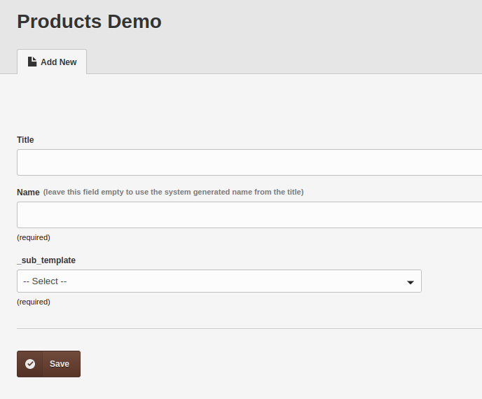
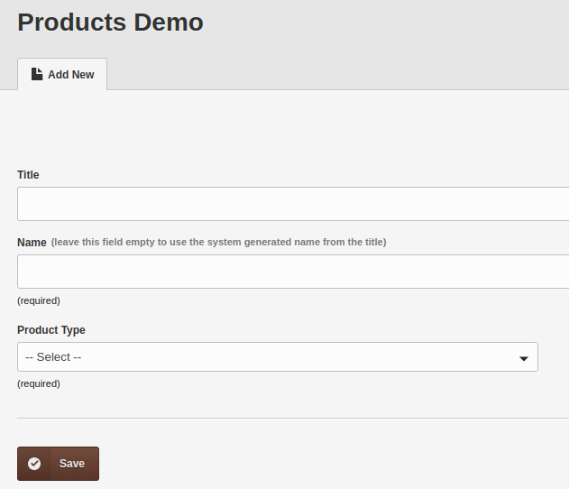
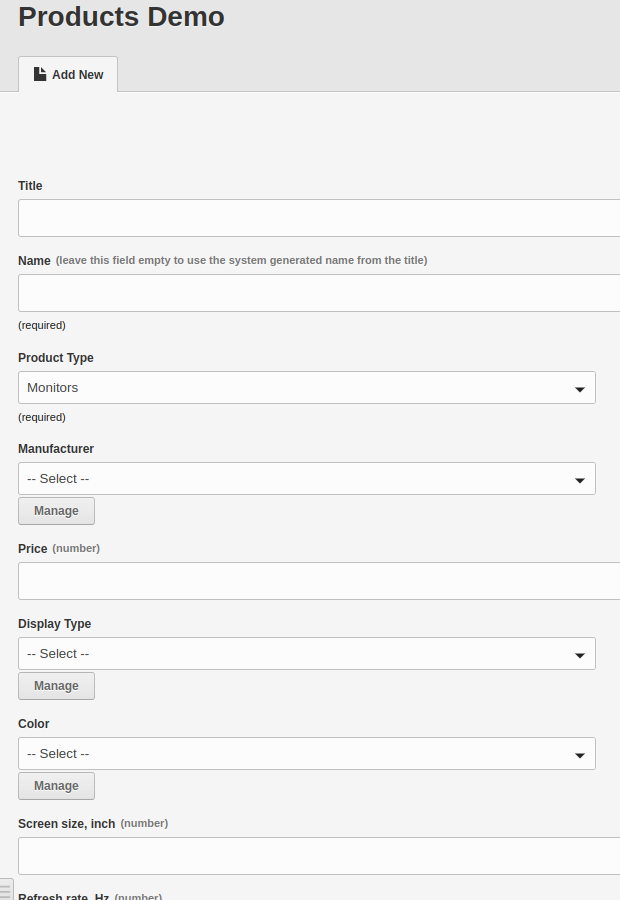
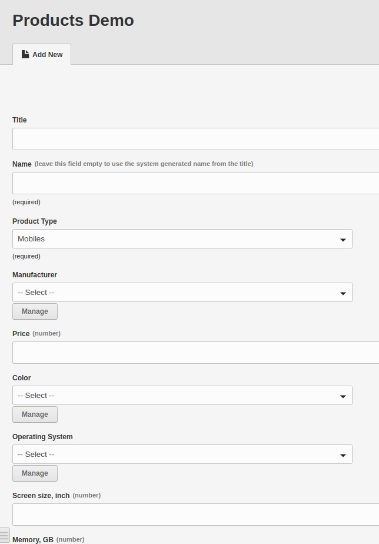
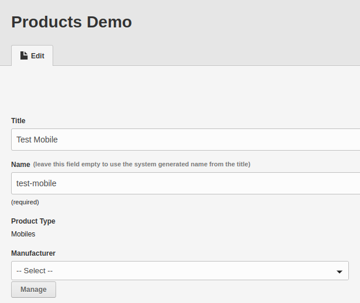
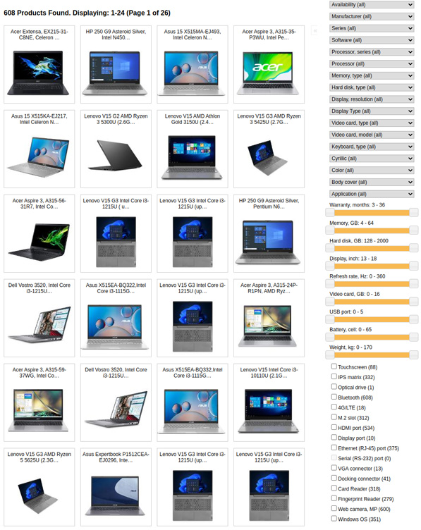

import { FileTree, Steps, Card } from "@astrojs/starlight/components";

<Card icon="star">

This feature was introduced in Couch v2.4 and first discussed on the forum in this [**thread**](https://www.couchcms.com/forum/viewtopic.php?f=5&t=13469&sid=82d8d726ce3ddb28d3627529bed87b2f). Continue to follow the ongoing discussion within the same [**thread**](https://www.couchcms.com/forum/viewtopic.php?f=5&t=13469&sid=82d8d726ce3ddb28d3627529bed87b2f).

</Card>

The defining features of this release of Couch help in creating large 'directory' style sites like property listings, product catalogs, reviews etc. (though these features are equally useful for smaller sites).

:::note[Credit]
The development of these features resulted from @orbital (Ivo Dragomanski) approaching me with challenges in his e-commerce site. Special thanks to Ivo for allowing the incorporation of code created for him into this release.
:::

## The Challenge

The site featured over 20,000 products (with more to be added) divided into 70+ distinct categories (monitors, mobiles, laptops etc.). Each category required unique editable regions - averaging about 150 regions per category.

The site featured 20,000+ products to begin with (with many more to be added in the future).
This number, though, was not a problem; the problem was that the products were divided into 70+ distinct categories (e.g. monitors, mobiles, laptops etc.) where products of each category would have their own unique set of editable regions (on an average about 150 unique regions per category).

The products were, of course, cloned pages of a single template and so all the required editable regions had to be defined in that template - multiply 150 regions by 70 categories and you get a total that runs into thousands. Which meant that any time a product (i.e. a cloned page) is loaded by Couch, it would require fetching those many thousands of regions from the database (where only 150 of those regions actually pertained to that product - the rest were deadwood). Imagine doing this to create a listing of 100 pages through `<cms:pages>` and you can see the problem Ivo was struggling with.


> Example of a product filter with layered navigation

The second problem was another feature that the e-commerce site required - it needed a 'product filter' (AKA 'Layered Navigation') of the kind shown above, where selecting a value from one (or more) filter(s) causes all other filters to show only the products that satisfy the condition imposed by the selected filter(s). For example, selecting 'red' from the 'color' filter should make the 'size' filter show sizes that apply only to products of red color.

Some of our members will recall that we have a thread on our forum that discusses the creation of a similar filter ([**Product Filter Discussion**](https://www.couchcms.com/forum/viewtopic.php?f=8&t=7620/)).
However, that is not a 'layered' filter (i.e., values shown in various inputs do not change depending on the selections made). Also, notice in the image above the sheer number of filter fields involved (and this is for only one category; there are 69 other categories that have their own set of fields), and you can see the futility of trying to create this manually.

This release tries to solve both problems. Let us see how.

## Sub-Templates

The first problem is solved by the introduction of '**sub-templates**'.

This construct allows us to subdivide the main template into sub-groups (called sub-templates) and then allocate the desired fields to these sub-templates.
When a cloned page is created from this template, Couch notices that the template uses sub-templates and prompts us to first select one for the page being created.
Depending on the selection, Couch loads only those limited number of fields that are allocated to the selected sub-template.

Taking the example of the e-commerce site under discussion, we define all the fields in the main template, then define the 70 odd product-types (monitors, mobiles, laptops etc.) as sub-templates and then allocate only the relevant fields to each sub-template.

This way, every cloned page of a template using sub-templates is always associated with one sub-template and hence a limited set of fields.
Anywhere Couch has to deal with these cloned pages (creation, editing, listing, deleting etc.), it loads only that set of fields - for all practical purposes, the rest of the fields defined in the template do not exist at all.

Let us see this feature in action by implementing it in a demo template (named `products.php`) for a trivial e-commerce site.

Before proceeding any further, first install (or upgrade to) the latest version (2.4) of Couch from GitHub.
Next, make sure to enable the 'sub-templates' addon by editing the `couch/addons/kfunctions.php` file (if this file is not present, rename `couch/addons/kfunctions.example.php` to `kfunctions.php`) to uncomment the following line:

```php title="couch/addons/kfunctions.php"
require_once( K_COUCH_DIR.'addons/sub-templates/sub-templates.php' );
```

Moving on to our demo now - Assume the site sells only products belonging to two product types, monitors and mobiles, where each needs a separate set of editable regions.

:::danger[Important]
Please note that it is perfectly OK to have fields that are common to some or even all the sub-types e.g. 'price' is a field that will be common to products across all product-types and 'color' would be common to many.
:::

Our approach to implementing this use case would be to:

<Steps>

1. First, declare the product template as supporting the 'sub-templates' feature:

    ```php title="products.php"
    <cms:template title='Products Demo' clonable='1' dynamic_folders='1' has_subtemplates='1'>


    </cms:template>
    ```

    As you can see, `has_subtemplates` is the param that declares that this template will have sub-templates. Visit the template on the front-end as a super-admin to register it with Couch. Returning to the admin panel, set the default page that Couch (annoyingly) creates for all clonable templates to 'unpublished' to get it out of our way.

2. Next, define all the editable regions that will be used by all the sub-templates:

    ```php title="products.php"
    <cms:template title='Products Demo' clonable='1' dynamic_folders='1' has_subtemplates='1'>
        <!-- monitors -->
        <cms:editable name='display-type' label='Display Type' type='relation' has='one' searchable='0' order='1' orderby='page_name' order_dir='asc' create_auto='1' />
        <cms:editable name='color' label='Color' type='relation' has='one' searchable='0' order='2' orderby='page_name' order_dir='asc' create_auto='1' />
        <cms:editable name='screen-size' label='Screen size, inch' desc='number' type='text' search_type='decimal' order='3' />
        <cms:editable name='refresh-rate' label='Refresh rate, Hz' desc='number' type='text' search_type='decimal' order='4' />
        <cms:editable name='widescreen' label='Widescreen' type='single_check' opt_values='Yes' search_type='integer' order='5' />
        <cms:editable name='hdmi' label='HDMI' type='single_check' opt_values='Yes' search_type='integer' order='6' />

        <!-- mobiles -->
        <cms:editable name='os' label='Operating System' type='relation' has='one' searchable='0' order='2' orderby='page_name' order_dir='asc' create_auto='1' />
        <cms:editable name='memory' label='Memory, GB' desc='number' type='text' search_type='decimal' order='3' />
        <cms:editable name='gps' label='GPS' type='single_check' opt_values='Yes' search_type='integer' order='5' />
        <cms:editable name='fm-radio' label='FM radio' type='single_check' opt_values='Yes' search_type='integer' order='6' />

    </cms:template>
    ```

3. Now define the sub-templates and allocate the fields to them:

    :::note[A short aside]

    Keen-eyed, long-term users of Couch will notice the use of some new terms in the editable regions defined above. I am describing those below but they are not important at this point - just know that you can use all types of editable-regions in sub-templates and exactly the way you do in other templates.

    **a**. 'create_auto' param with type 'relation' -
    As you know, type 'relation' demands a second template to form the other end of the relation being defined, so, e.g. for the 'color' editable region, we'd normally need to create a second template (say named `options/color.php`) and then specify it as follows using the 'masterpage' param

    ```php
    <cms:editable name='color' label='Color' type='relation' masterpage='options/color.php' has='one' order='2' orderby='page_name' order_dir='asc' />
    ```

    For layered navigation, most of these templates serve only to provide a simple value tuple (name and title) to be shown in the dropdown for selection. When hundreds of such regions are needed, to avoid the chore of having to manually create the second template for each of them, the 'create_auto' param was added which automatically creates the second template for you.

    Notice how now the definition we are using no longer requires the 'masterpage' param -

    ```php
    <cms:editable name='color' label='Color' type='relation' has='one' searchable='0' order='2' orderby='page_name' order_dir='asc' create_auto='1' />
    ```

    **b**. Editable region of type 'single_check'
    As is apparent form the name, it creates a single checkbox that can be used to store boolean values. More importantly, those values can be stored as numbers in the database which makes queries more efficient.
    :::

    Once again visit the products template on the front-end as super-admin and then, coming back to the admin-panel, try creating a cloned page. You'll notice the first difference between a normal template and a template with sub-templates -

    

    > Sub-templates dropdown in the admin panel

    You'll notice that, although we have defined several editable regions in the template, none of them show up when we try to create a cloned page. The editable regions will appear only once we select a sub-template for the page.

    To do that, notice the dropdown that gets added automatically by Couch. This is the sub-template selector and the page won't save until we choose one from it. At this point, however, the dropdown is empty because we have not defined any sub-templates yet. Let us do that next but before that let us change the default label '_sub_template' that the dropdown sports to something more relevant.

    Modify the `<cms:template>` declaration to add a couple of new params:

    ```php
    <cms:template title='Products Demo' clonable='1' dynamic_folders='1' has_subtemplates='1' subtpl_selector_label='Product Type' subtpl_selector_is_advanced='0'>
    ```

    'Product Type' seems to be an apt label for our use-case:

    

    > Sub-template selector dropdown in the admin panel

    The `subtpl_selector_is_advanced` can be set to `1` to make Couch show a popup window (instead of a dropdown) for the selector - comes in handy when we have a large number of sub-templates to contend with.
    For now, the dropdown is fine so let us move to creating the sub-templates that populate this dropdown.

3. Declare our sub-templates.
    We have two types of products, so we define two sub-templates for them and allocate relevant editable regions to each:

    

    > Example of sub-template configuration in the admin panel

    ```php
    <cms:template title='Products Demo' clonable='1' dynamic_folders='1' has_subtemplates='1' subtpl_selector_label='Product Type' subtpl_selector_is_advanced='0'>
        <!-- monitors -->
        <cms:editable name='display-type' label='Display Type' type='relation' has='one' searchable='0' order='1' orderby='page_name' order_dir='asc' create_auto='1' />
        <cms:editable name='color' label='Color' type='relation' has='one' searchable='0' order='2' orderby='page_name' order_dir='asc' create_auto='1' />
        <cms:editable name='screen-size' label='Screen size, inch' desc='number' type='text' search_type='decimal' order='3' />
        <cms:editable name='refresh-rate' label='Refresh rate, Hz' desc='number' type='text' search_type='decimal' order='4' />
        <cms:editable name='widescreen' label='Widescreen' type='single_check' opt_values='Yes' search_type='integer' order='5' />
        <cms:editable name='hdmi' label='HDMI' type='single_check' opt_values='Yes' search_type='integer' order='6' />

        <!-- mobiles -->
        <cms:editable name='os' label='Operating System' type='relation' has='one' searchable='0' order='2' orderby='page_name' order_dir='asc' create_auto='1' />
        <cms:editable name='memory' label='Memory, GB' desc='number' type='text' search_type='decimal' order='3' />
        <cms:editable name='gps' label='GPS' type='single_check' opt_values='Yes' search_type='integer' order='5' />
        <cms:editable name='fm-radio' label='FM radio' type='single_check' opt_values='Yes' search_type='integer' order='6' />

        <cms:sub_template name='monitors' label='Monitors'>
            <cms:stub name='display-type' />
            <cms:stub name='color' />
            <cms:stub name='screen-size' />
            <cms:stub name='refresh-rate' />
            <cms:stub name='widescreen' />
            <cms:stub name='hdmi' />
        </cms:sub_template>

        <cms:sub_template name='mobiles' label='Mobiles'>
            <cms:stub name='os' />
            <cms:stub name='color' />
            <cms:stub name='screen-size' />
            <cms:stub name='memory' />
            <cms:stub name='gps' />
            <cms:stub name='fm-radio' />
        </cms:sub_template>

    </cms:template>
    ```

    As can be seen, we use `<cms:sub_template>` tag to define a sub-template. By adding to it a `<cms:stub>` tag bearing the same name as an editable region defined outside, we allocate that editable region to the sub-template.

    Please notice the repetition of stubs named 'color' and 'screen-size' in both the sub-templates - this will allocate the editable regions of those names to both.

</Steps>

:::note[Important]
The `<cms:editable>` declaration for a field will always only be once; `<cms:stub>` representing it may be used in multiple sub-templates.
:::

There are some editable-regions that need to be allotted to *all* the sub-templates (e.g. 'price' and 'manufacturer' in this demo use-case). Instead of declaring them and then placing `<cms:stub>` representing them in each sub-template, we can do the following instead -

```php title="products.php"
<cms:template title='Products Demo' clonable='1' dynamic_folders='1' has_subtemplates='1' subtpl_selector_label='Product Type' subtpl_selector_is_advanced='0'>
    <!-- common -->
    <cms:editable name='manufacturer' label='Manufacturer' type='relation' has='one' searchable='0' order='-2' orderby='page_name' order_dir='asc' create_auto='1' />
    <cms:editable name='price' label='Price' desc='number' type='text' search_type='decimal' order='-1' />

    <!-- monitors -->
    <cms:editable name='display-type' label='Display Type' type='relation' has='one' searchable='0' order='1' orderby='page_name' order_dir='asc' create_auto='1' />
    <cms:editable name='color' label='Color' type='relation' has='one' searchable='0' order='2' orderby='page_name' order_dir='asc' create_auto='1' />
    <cms:editable name='screen-size' label='Screen size, inch' desc='number' type='text' search_type='decimal' order='3' />
    <cms:editable name='refresh-rate' label='Refresh rate, Hz' desc='number' type='text' search_type='decimal' order='4' />
    <cms:editable name='widescreen' label='Widescreen' type='single_check' opt_values='Yes' search_type='integer' order='5' />
    <cms:editable name='hdmi' label='HDMI' type='single_check' opt_values='Yes' search_type='integer' order='6' />

    <!-- mobiles -->
    <cms:editable name='os' label='Operating System' type='relation' has='one' searchable='0' order='2' orderby='page_name' order_dir='asc' create_auto='1' />
    <cms:editable name='memory' label='Memory, GB' desc='number' type='text' search_type='decimal' order='3' />
    <cms:editable name='gps' label='GPS' type='single_check' opt_values='Yes' search_type='integer' order='5' />
    <cms:editable name='fm-radio' label='FM radio' type='single_check' opt_values='Yes' search_type='integer' order='6' />

    <cms:sub_template name='@common'>
        <cms:stub name='manufacturer' />
        <cms:stub name='price' />
    </cms:sub_template>

    <cms:sub_template name='monitors' label='Monitors'>
        <cms:stub name='display-type' />
        <cms:stub name='color' />
        <cms:stub name='screen-size' />
        <cms:stub name='refresh-rate' />
        <cms:stub name='widescreen' />
        <cms:stub name='hdmi' />
    </cms:sub_template>

    <cms:sub_template name='mobiles' label='Mobiles'>
        <cms:stub name='os' />
        <cms:stub name='color' />
        <cms:stub name='screen-size' />
        <cms:stub name='memory' />
        <cms:stub name='gps' />
        <cms:stub name='fm-radio' />
    </cms:sub_template>

</cms:template>
```

Notice the addition of a third sub-template named `@common` above that contains the stubs for two new editable regions. `@common` is a special name and does not actually create a sub-template; instead, it serves to show all editable regions allotted to it in all the other sub-templates of the template.

Visit the modified template on the front-end as super-admin and return to the admin-panel to once again try creating a new cloned page. This time, the two sub-templates we defined should show up in the selector dropdown.

Try selecting 'Monitors' sub-template and see how only the editable regions allotted to it show up for editing (as do the two common fields too).



> Example of sub-templates in action

Without saving the page, try selecting the 'Mobiles' sub-template and see how a new set of fields show up:



Now save the page. You'll notice that once the page is saved, the selector dropdown disappears and we are no longer allowed to change the sub-template we chose while saving the page.


This is an important point to remember - so long as a page remains in an unsaved state (i.e. is new), we can freely change the selected sub-template (the offered fields will change accordingly). However, once we hit the save button, the selected sub-template (and hence the set of editable regions associated with the page) can no longer be changed.

Essentially, that is about all that one needs to know to work with sub-templates but I'd like to mention here some additional points that could be helpful:

1. With `<cms:stub>`, the editable region showing up in the admin panel borrows all its characteristics from the `<cms:editable>` defined in the main template (i.e. outside all sub-templates). We have a couple of ways though to tweak these characteristics:

a. For specifying a new 'order' (frequently needed when a field is used in multiple sub-templates), we can set the 'order' param of `<cms:stub>` as follows:

```php
<cms:stub name='color' order='1' />
```

b. For more extensive changes, we can include a regular `<cms:config_form_view>` block to the containing `<cms:sub_template>` block e.g. as follows:

```php
<cms:sub_template name='mobiles' label='Mobiles'>
    <cms:stub name='os' />
    <cms:stub name='color' order='-3' />
    <cms:stub name='screen-size' />
    <cms:stub name='memory' />
    <cms:stub name='gps' />
    <cms:stub name='fm-radio' />

    <cms:config_form_view>
        <cms:field 'color' label='Mobile Color' />
    </cms:config_form_view>
</cms:sub_template>
```

Please note that such a block can also be placed in the '@common' sub-template and any settings defined within that will be applied to all sub-templates.

c. In a regular template, we use 'groups' and 'rows' to arrange the fields in a more manageable manner. We can do the same with sub-templates also - we use the 'groups' and 'rows' with the `<cms:editable>` tags outside the sub-template blocks e.g. as follows

```php
<!-- test grid -->
<cms:editable name='grp_coordinates' label='Coordinates' type='group' collapsed='0'>
    <cms:editable name='test_row' type='row' order='1'>
        <cms:editable name='lng' label='Longitude' type='text' class='col-xs-2' />
        <cms:editable name='lat' label='Latitude' type='text' class='col-xs-2' />
    </cms:editable>

    <cms:editable name='test_row2' type='row' order='2'>
        <cms:editable name='directions' label='Directions' type='text' class='col-xs-4' />
    </cms:editable>
</cms:editable>
```

and then add those as `<cms:stub>` to whatever sub-template you want them to appear in e.g. as follows:

```php
    <cms:sub_template name='grid' label='Grid'>
        <cms:stub name='grp_coordinates' />
        <cms:stub name='test_row' />
        <cms:stub name='lng' />
        <cms:stub name='lat' />
        <cms:stub name='test_row2' />
        <cms:stub name='directions' />
    </cms:sub_template>
```

2. An editable region allocated to one sub-template cannot be transferred to another sub-template without losing data from existing pages of the original sub-template. This is because if we remove a `<cms:stub>` from a sub-template and place it in another, this will actually result in the field being deleted from the original sub-template (with its values disappearing from all existing cloned pages of that sub-type) and a new field with blank values appearing in pages of the target sub-template.

3. To delete an editable region from a sub-template (and hence from all existing pages of that sub-template), simply removing its `<cms:stub>` from the sub-template block will suffice. However, this will *not* delete that region from the main template itself. You'll remember that in regular Couch templates, deletion of an editable region is a two-step procedure - you remove the `<cms:editable>` definition of the region from the template and visit the template as super-admin (in its page-view) for the deletion to be noticed by Couch. Next, you visit the admin-panel where Couch will show you that field (deactivated and in red) and ask you for a final confirmation before actually deleting the field.

This procedure remains exactly the same in a template with sub-templates except that we should keep at least one `<cms:stub>` of that region in some sub-type. The reason for this is that, as we have seen before, any region that is not allotted to a sub-template is simply not show in the admin-panel. So, if there is no `<cms:stub>` for an editable region we removed from the template, that region will never show up in the admin-panel for the final confirmation followed by true deletion.

Therefore, to completely remove an editable region from the template, remove its `<cms:editable>` definition but keep its (at least one) `<cms:stub>` in some sub-template. Visit the template as super-admin and then delete that region from the admin-panel. Once that is done, you may remove all `<cms:stub>`s of that region.

4. So far, we have seen how to create/edit pages that use sub-templates from within the admin-panel. As I am sure, you know, cloned pages can be created/edited from the frontend too using DataBound Forms (via `<cms:db_persist_form>`) and `<cms:db_persist>` tags. For making a DataBound Form create a new page with a particular sub-template, we can use the 'sub_template' param of `<cms:form>` as follows:

```php
<cms:form
    masterpage='products.php'
    sub_template='monitors'
    mode='create'
    method='post'
>

    <cms:if k_success >
        <cms:db_persist_form
            _invalidate_cache='0'
            k_page_title='Test Product'
        />
    </cms:if>

    ..

    <input type='submit' value='Post'>
</cms:form>
```

The corresponding param for `<cms:db_persist>` is '_sub_template':

```php
<cms:db_persist
    _masterpage='products.php'
    _sub_template='monitors'
    _mode='create'
    k_page_title='Test Product'
>
    <cms:if k_error >
        <font color='red'>ERROR:
            <cms:each k_error >
                <cms:show item /><br>
            </cms:each>
        </font>
    <cms:else />
        <cms:show k_last_insert_id />
        <cms:show k_last_insert_page_name />
    </cms:if>
</cms:db_persist>
```

Please note in both of the methods above that we need to explicitly specify the sub_template only while creating a new page (i.e. 'create' mode). For working with existing pages (i.e. 'edit' mode) this is not necessary as this info is already present in the saved page itself.

OK, now that we have seen the creation of cloned pages using sub-templates, let us now move on to listing those pages on the front-end.

## Listing pages with sub-templates

The dropdown selector for the sub-templates that you have already seen is actually a regular editable region of type 'relation' named '_sub_template'. You can use it with `<cms:pages>` the usual way (as documented at this [tread](viewtopic.php?f=5&t=8581) under '2. Enhanced cms:pages tag') e.g. as follows:

```php title="products.php"
<cms:pages masterpage='products.php' custom_field="_sub_template=monitors"  >
    <a href="<cms:show k_page_link />"><h3><cms:show k_page_title /></h3></a>
</cms:pages>
```

That said, let me emphasize at this point that 'sub-template' is an internal construct meant only to define the set of editable regions that a page will contain - It is not meant primarily to be used as a categorization method for the pages as displayed on the front-end (although you may do this is use-case dictates). For that, we already have the 'folders' feature.

Assuming we already have a folders structure in place, when we create a page selecting a sub-template, we then also place that page in some folder. The semantics of categorization through folders dictate that pages placed within a folder are similar in some way, so you'll soon find that most of the pages you place in a folder belong to one sub-template. e.g. for a folders sub-tree as follows, all products within the 'Monitors' folder are likely to be of 'monitors' sub-template and likewise all products within 'Mobiles' will be of 'mobiles' sub-template.

<FileTree>
- Electronics/
    - Monitors/
    - Mobiles/
</FileTree>

and for a folder structure as follows, all products placed within 'Male', 'Female', and 'Kids' could be of a single sub-template named 'clothes':

<FileTree>
- Clothes/
    - Male/
    - Female/
    - Kids/
</FileTree>

In such cases, you list pages on the frontend using folders the regular way (i.e. folder-view etc.) and sub-templates don't need any kind of consideration for the listing.

:::note[Important]
There is no restriction on placing pages of different sub-templates within the same folder, but this may lead to some UX issues while using 'Layered Navigation' - filters of one sub-type will not be applicable to pages of the other sub-types and hence will turn up empty.
:::

## Layered Navigation

And now we move to the second feature of this release, the layered navigation or filtering.
If you care to take a look again at the screenshot of the sample layered navigation at the beginning of this discussion, you'll notice that there are three distinct types of inputs serving as filters:



1. **Dropdown**: Allows selection of discrete 'text' values like 'red' or 'green' for 'colors' or 'medium' and 'large' for 'sizes'.
2. **Slider**: Allows selection of a range (maximum and minimum) from 'numeric' values e.g. all mobiles from 1GB to 32GB of memory.
3. **Checkbox**: Allows selecting a single 'boolean' value (Yes or No) e.g. all products that have a particular characteristic.

Couch helps us in creating these filters by first locating all relevant editable regions that can serve as filters, finding out all the values from these regions to show as values in the filter inputs (taking care to pick only the values that are in concordance with already selected filters, if a selection has already been made - remember, this is layered navigation) and then finally making all this information available to us as a simple array variable to output the HTML.

To do that, however, it needs the editable regions that will serve as filters to be of specific types:
- **Dropdown**: needs the editable region to be of type `relation` with single selection (i.e. `has='one'`)
- **Slider**: needs the editable region to be of type `text` with a numeric `search_type` i.e. either `integer` or `decimal`
- **Checkbox**: needs the editable region to be of type `single_check` with a numeric `search_type` i.e. either `integer` or `decimal`

If you take a look at the definition of the editable regions we used in our demo template above, you'll find that they satisfy all these conditions.

:::note
Not all editable regions that you define in a sub-template will be needed to serve as filters; such regions can be of any desired type.
:::

To indicate to Couch which of these editable regions will serve as filters, we modify our code to make it as follows:

```php
<cms:sub_template name='@common'>
    <cms:stub name='manufacturer' filter='dropdown' />
    <cms:stub name='price' filter='slider' />
</cms:sub_template>

<cms:sub_template name='monitors' label='Monitors'>
    <cms:stub name='display-type' filter='dropdown' />
    <cms:stub name='color' filter='dropdown' />
    <cms:stub name='screen-size' filter='slider' />
    <cms:stub name='refresh-rate' filter='slider' />
    <cms:stub name='widescreen' filter='checkbox' />
    <cms:stub name='hdmi' filter='checkbox' />
</cms:sub_template>

<cms:sub_template name='mobiles' label='Mobiles'>
    <cms:stub name='os' filter='dropdown' />
    <cms:stub name='color' order='-3' filter='dropdown' />
    <cms:stub name='screen-size' filter='slider' />
    <cms:stub name='memory' filter='slider' />
    <cms:stub name='gps' filter='checkbox' />
    <cms:stub name='fm-radio' filter='checkbox' />

    <cms:config_form_view>
        <cms:field 'color' label='Mobile Color' />
    </cms:config_form_view>
</cms:sub_template>
```

As can be seen, it required adding the 'filter' param to the `<cms:stub>` tags representing the editable regions.

And with that, we are ready to create the layered navigation on the frontend. The ideal location to place such navigation is the 'folder-view' where we list pages belonging to a specific category (we have discussed above how folders and sub-templates go hand in hand).

We begin by placing the `<cms:process_filters>` tag within the folder-view:

```php title="products.php"
<cms:if k_is_folder>
    <cms:process_filters folder=k_folder_name with_count='1'/>
    ..
    ..
</cms:if>
```

At this point, I'd like to draw your attention to the fact that the list of filter inputs you saw above as the layered navigation is only one part of the filtering; the second part is using the values selected in those filters to actually show a listing of pages (using `<cms:pages>`) that match those selections.

The `<cms:process_filters>` tag we saw above helps in both of these parts - It provides us with the data we can use to output the inputs and also provides us with a pre-formatted filter string we can directly use with the `<cms:pages>` tag to make it list only the pages matching the selection made from the filter inputs.

`<cms:process_filters>` tag makes available to us an array variable named 'st_filter_fields' that contains all information we may require to output the HTML of the filter inputs. For testing purposes, try placing the following code right after the `<cms:process_filters>` in your template and you should see all the raw info that the tag provides

```php
<cms:each st_filter_fields as='field'>
    <h3><cms:show field.label /> (<cms:show field.name />)</h3>
    <cms:each field.options as='option'>
        <cms:show option.label />: <cms:show option.name /> (<cms:show option.count />) <cms:if field.selected eq option.name><b>*</b></cms:if><br>
    </cms:each>
</cms:each>
<br>
<cms:show st_filters_str /><br>
<cms:show st_filters_folder /><br>
<cms:show st_include_subfolders /><br>
```

Of course, instead of outputting the raw info, we'd want to use it for creating a form with the filter inputs. One way of doing that is shown in the full code of the demo template attached here - you are free to use your own markup.

[products](https://www.couchcms.com/forum/download/file.php?id=2871)

To create a listing of pages matching values selected from the filters, we make use of variables made available by `<cms:process_filters>` e.g. as follows:

```php
<cms:pages folder=st_filters_folder include_subfolders=st_include_subfolders orderby='page_name' order='asc' custom_field=st_filters_str>
    <h3><cms:show k_page_title /></h3>
    <cms:no_results>
        <h4>No Products Found</h4>
    </cms:no_results>
</cms:pages>
```

The `st_filters_str` variable used above is the crucial piece that ties the pages listing to the filter inputs.
The `st_filters_folder` and `st_include_subfolders` variables only serve to keep the `<cms:process_filters>` in sync with `<cms:pages>` (i.e. makes sure the two work with the same set of pages).


