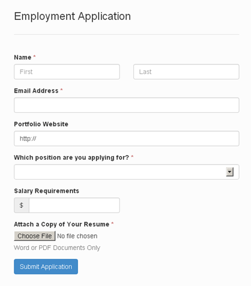
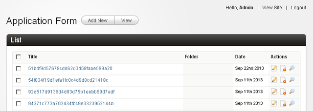
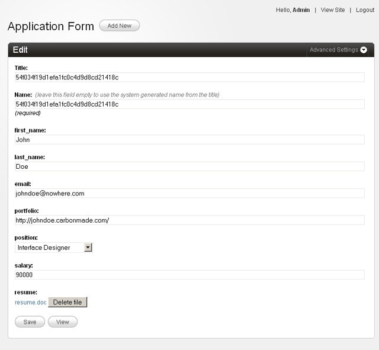
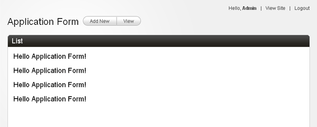
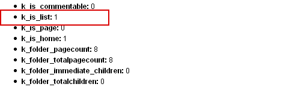
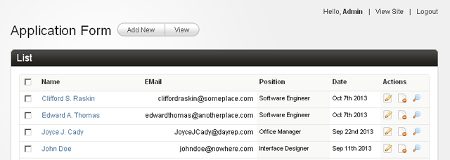
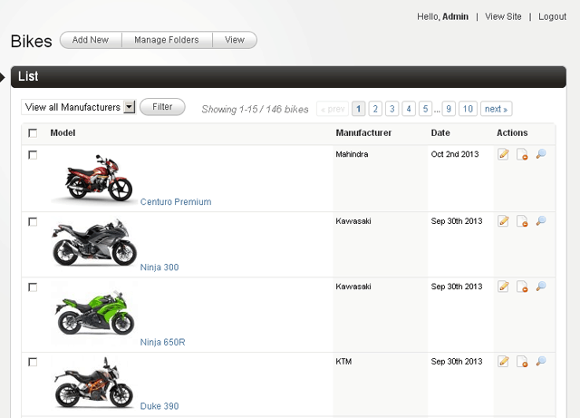
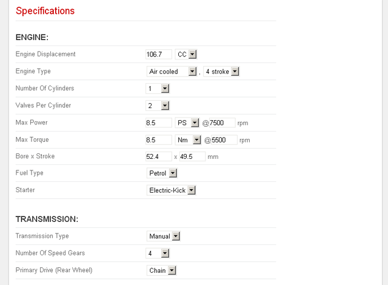
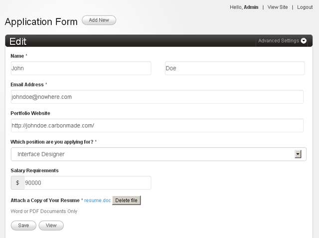

import { Steps } from '@astrojs/starlight/components';

Please refer to [**DataBound Forms** in **Core Concepts**](../../../concepts/databound-forms/) for more information.

---

:::danger[Prerequisites]
The discussion that follows assumes that you're already conversant with Couch's [**Form**](../../../concepts/forms/) and [**Editable Regions**](../../../concepts/editable-regions/) concepts. If you are new to Couch, please take some time to first study those as all the new functions discussed here build upon them.
:::

Please remember that there can literally be n-number of situations where we could put this new functionality to use. What I'd be demonstrating is (intentionally) a very simple scenario but it should be sufficient to get you going on your own.

Before we embark on our little tutorial, there is one little preparatory step that needs to be completed first. As not all sites deploying Couch will need the **DataBound Forms** feature, though Couch v1.4 ships with the module, it is not enabled by default. To enable this module, please edit the `kfunctions.php` file found in `couch/addons` folder and uncomment (or add if upgrading from an older version) the following line:

```php title="kfunctions.php"
require_once( K_COUCH_DIR.'addons/data-bound-form/data-bound-form.php' );
```

The code in our tutorial will also utilize the `cms:set_flash` tag to set flash messages signifying successful form submission. This will require the "sessions" module to be enabled so uncomment the following line too (if not already so):

```php title="kfunctions.php"
require_once( K_COUCH_DIR.'addons/cart/session.php' );
```

:::tip[New Installation Note]
Beginning with v1.4, new installations will find a file named `kfunctions.example.php` in the addon folder. This is to prevent future upgrades from overwriting your changes. Please rename this file to `kfunctions.php` and uncomment the mentioned line from it.
:::

With the required modules enabled, we can finally begin.

The situation is that my (hypothetical) client wishes to use his website to announce the job openings available at his agency. For this, he wishes to put up a form on his site that interested visitors could fill up with their details (which also include an uploaded resume). The submitted info should then get persisted in a database wherefrom he could access them at his leisure.

Couch's **DataBound Form** would be a perfect fit to pull this off easily. There are clearly two elements in the requirements:

<Steps>

1. The front-end form used to submit data.
2. The back-end database that holds the submitted form data.

</Steps>

If, for a moment, we ignore the requirement of persisting the submitted front-end data, we can see that Couch can already be used to implement each of these two parts independently.

<Steps>

1. The [**cms:form**](../../tags-reference/form/) and [**cms:input**](../../tags-reference/input/) tags to implement the front-end form.
2. A clonable template with [**cms:editable**](../../tags-reference/editable/) tags to hold data.

</Steps>

The obvious problem would be that there is no connection between the two. I mean, though the form can be used to submit data and the editable regions can be used to save data, there is no direct way of saving the form's data into the editable regions.

This is where the new 'databound form' feature comes in. You see, this simply connects an existing front-end form with existing back-end editable regions (in other words - 'binds' a Couch form with Couch database i.e. editable regions. This, incidentally, also explains why we chose to call this feature **DataBound Forms**).

So, when working with databound forms, we always start off with two concepts that are already well known to us - [**Form**](../forms/) and [**Editable Regions**](../editable-regions/). This is the form we'll be working on (kindly provided by [@cheesypoof](https://www.couchcms.com/forum/memberlist.php?mode=viewprofile&u=11919)):



Following is a stripped-down code of the same form to show only relevant HTML markup. Link for downloading the styled form (both original and couchified) can be found at the end of this post.

```html
<form method="post">
    <label>First Name</label>
    <input name="first_name" type="text" />
    <br />

    <label>Last Name</label>
    <input name="last_name" type="text" />
    <br />

    <label>Email Address</label>
    <input name="email" type="text" />
    <br />

    <label>Portfolio Website</label>
    <input name="portfolio" type="text" />
    <br />

    <label>Which position are you applying for? </label>
    <select name="position">
        <option selected="selected"></option>
        <option>Interface Designer</option>
        <option>Software Engineer</option>
        <option>Systems Administrator</option>
        <option>Office Manager</option>
    </select>
    <br />

    <label>Salary Requirements</label>
    <input name="salary" type="text" />
    <br />

    <label>Attach a Copy of Your Resume</label>
    <input name="resume" type="file" />
    <p>Word or PDF Documents Only</p>
    <br />

    <button type="submit">Submit Application</button>
</form>
```

Let us begin by creating and registering a clonable template (we'll name it `applications.php`). Place the above form code within the template. Of course, the form is not (yet) a Couch managed one but we'll do that soon. The plan of action is that, once we have a fully functional form on the front-end, we'll capture each successful form submission by automatically creating a cloned page of our template and dumping the submitted values into the page's editable regions.

This, obviously, means that our template needs to have editable regions that correspond to the input fields of the front-end form. Let us define those.

### 1. The 'data' part of DataBound forms

Following is what should be sufficient to capture all data inputted through our form's fields:

```php title="applications.php"
<cms:template title='Application Form' clonable='1'>
    <cms:editable name='first_name' required='1' type='text' />
    <cms:editable name='last_name' required='1' type='text' />
    <cms:editable name='email' required='1' validator='email' type='text' />
    <cms:editable name='portfolio' validator='url' type='text' />
    <cms:editable name='position' required='1' type='dropdown'
        opt_values=' Please choose=- | Interface Designer | Software Engineer | Systems Administrator | Office Manager'
    />
    <cms:editable name='salary' type='text' search_type='decimal' />
    <cms:editable name='resume' required='1' allowed_ext='pdf, doc, docx' max_size='1024' type='securefile' />
</cms:template>
```

Notice that we have defined editable regions that are equivalent to the input fields in the form.

:::tip
This is a new editable region that debuts with v1.4 and is meant exclusively to be used for uploading files securely from the front-end.
:::

Also notice that we've also added all data constrains (e.g. the field being required, validator, search_type etc.) to the editable regions. This part is exactly how we use other templates in Couch and can be tested independently of the front-end form - i.e. after visiting the template as super-admin for the changes to be picked up, we can create cloned pages from the admin-panel, add data to the editable regions we defined and save. This is the right time to manually test everything e.g. validations etc. work as expected.

With the 'data' component completed, time to move to the 'form' component.

### 2. The 'form' part of DataBound forms

It should be trivial to 'couchify' the plain HTML form we have in our template (as explained [here](../forms/)).

Following is what we end up with:

```php title="form-example.php"
<cms:set submit_success="<cms:get_flash 'submit_success' />" />
<cms:if submit_success >
    <h4>Success: Your application has been submitted.</h4>
</cms:if>

<cms:form method='post' anchor='0'>

    <cms:if k_success >
        <cms:set_flash name='submit_success' value='1' />
        <cms:redirect k_page_link />
    </cms:if>

    <cms:if k_error >
        <div class="error">
            <cms:each k_error >
                <br><cms:show item />
            </cms:each>
        </div>
    </cms:if>

    <label>First Name</label>
    <cms:input name="first_name" type="text" />
    <br />

    <label>Last Name</label>
    <cms:input name="last_name" type="text" />
    <br />

    <label>Email Address</label>
    <cms:input name="email" type="text" />
    <br />

    <label>Portfolio Website</label>
    <cms:input name="portfolio" type="text" />
    <br />

    <label>Which position are you applying for? </label>
    <cms:input name="position" type="text" />
    <br />

    <label>Salary Requirements</label>
    <cms:input name="salary" type="text" />
    <br />

    <label>Attach a Copy of Your Resume</label>
    <cms:input name="resume" type="text" />
    <p>Word or PDF Documents Only</p>
    <br />

    <cms:if "<cms:not submit_success />" >
        <button type="submit">Submit Application</button>
    </cms:if>

</cms:form>
```

Please notice that we are using the simplest definition possible for the inputs - all have the same 'text' type and there are no validation and requirement checks in place. This is deliberate and we'll soon see the logic behind this.

So, we have the 'data' component and the 'form' component ready. Time for 'binding' the two. This is where all the fun lies.

### 3. The 'bound' part of DataBound forms

You'll be surprised to find how easy this step is going to be. We've already done all the difficult stuff and this step will require only minimal changes. All these changes (three to be precise) need to be made only to the 'form' component. The 'data' component, for all practical purposes, remains agnostic of the fact that the data it is receiving comes from a frontend form.

#### a. Modify the cms:form tag

Before:

```php
<cms:form method='post' anchor='0'>
```

After:

```php
<cms:form
    masterpage=k_template_name
    mode='create'
    enctype='multipart/form-data'
    method='post'
    anchor='0'
    >
```

The key change here is the 'masterpage' parameter. By specifying this parameter we are making it known to the form that it is no longer a regular form but a 'data bound' one (bound to the template specified as the masterpage).

The other parameter of interest is the 'mode'. It can take two possible values, 'edit' and 'create'. However, for this tutorial of ours we are hard coding it to 'create' because we'll only be using our form for creating new cloned pages and never for editing existing ones.

#### b. Modify the cms:input tags

This is where the rubber meets the road. Please notice carefully the modification done to the existing input tags:

Before:

```php
    <label>First Name</label>
    <cms:input name="first_name" type="text" />
    <br />

    <label>Last Name</label>
    <cms:input name="last_name" type="text" />
    <br />

    <label>Email Address</label>
    <cms:input name="email" type="text" />
    <br />

    <label>Portfolio Website</label>
    <cms:input name="portfolio" type="text" />
    <br />

    <label>Which position are you applying for? </label>
    <cms:input name="position" type="text" />
    <br />

    <label>Salary Requirements</label>
    <cms:input name="salary" type="text" />
    <br />

    <label>Attach a Copy of Your Resume</label>
    <cms:input name="resume" type="text" />
```

After:

```php "type="bound""
    <label>First Name</label>
    <cms:input name="first_name" type="bound" />
    <br />

    <label>Last Name</label>
    <cms:input name="last_name" type="bound" />
    <br />

    <label>Email Address</label>
    <cms:input name="email" type="bound" />
    <br />

    <label>Portfolio Website</label>
    <cms:input name="portfolio" type="bound" />
    <br />

    <label>Which position are you applying for? </label>
    <cms:input name="position" type="bound" />
    <br />

    <label>Salary Requirements</label>
    <cms:input name="salary" type="bound" />
    <br />

    <label>Attach a Copy of Your Resume</label>
    <cms:input name="resume" type="bound" />
```

I am sure you'd be surprised to notice that the only change we've done is convert the 'type' of *all* `cms:input` tags to 'bound'. Try accessing the template in the browser at this point. You'll see that although we declared all the inputs with the same type 'bound', on the front-end each renders differently - the 'position' input renders as a dropdown, the 'resume' input renders as a file input etc. In fact, each renders exactly as it does in the admin-panel. That is the 'bound' in 'data-bound' for you.

Please read the following explanation carefully -
**For rendering a bound cms:input on the front-end, Couch actually uses the definition of the 'editable region' of the same name from the template the form is bound to.**
Got it? The key here is to use the same 'name' for the bound cms:inputs as those used for the defined editable regions.

So, actually what we are seeing on the front-end form are the very editable regions that we see on the backend. It is almost like we have slit open the form in places and the editable regions from the admin-panel are peeping out of these slits ( well, at least that is how I feel about them :-) ).

Test the form out. All the validations, requirements etc. that we defined for the editable regions will be enforced on the front-end too (not surprising as these actually *are* the editable regions).

When all the inputs are filled with proper data, the form submission succeeds and the `<cms:if k_success >` block executes. However, we haven't placed anything there. Let us do that in the final modification

#### c. Persist submitted values on successful form submission

Before:

```php
<cms:if k_success >

    <cms:set_flash name='submit_success' value='1' />
    <cms:redirect k_page_link />

</cms:if>
```

After:

```diff lang:php
<cms:if k_success >

+   <cms:db_persist_form
+       _invalidate_cache='0'
+       _auto_title='1'
+   />

    <cms:set_flash name='submit_success' value='1' />
    <cms:redirect k_page_link />

</cms:if>
```

The `db_persist_form` tag is the final piece of this puzzle.

Used without any parameters, this tag simply pulls in the submitted values (from the 'bound' inputs) and saves them into the template the form is bound to. Since in our case, the binding 'mode' of the form is 'create', this saving action results in the creation of a new cloned page of our template.

Try submitting some filled forms from the front-end. Coming back to the admin-panel, you should see a list of cloned pages that were created for all successful form submissions.



Try editing any such page and you should see all the data that was submitted.



This is how our form stands right now:

```php
<cms:set submit_success="<cms:get_flash 'submit_success' />" />

<cms:if submit_success >
    <h4>Success: Your application has been submitted.</h4>
</cms:if>


<cms:form
    masterpage=k_template_name
    mode='create'
    enctype='multipart/form-data'
    method='post'
    anchor='0'
    >

    <cms:if k_success >

        <cms:db_persist_form
            _invalidate_cache='0'
            _auto_title='1'
        />

        <cms:set_flash name='submit_success' value='1' />
        <cms:redirect k_page_link />
    </cms:if>

    <cms:if k_error >
        <div class="error">
            <cms:each k_error >
                <br><cms:show item />
            </cms:each>
        </div>
    </cms:if>


    <label>First Name</label>
    <cms:input name="first_name" type="bound" />
    <br />

    <label>Last Name</label>
    <cms:input name="last_name" type="bound" />
    <br />

    <label>Email Address</label>
    <cms:input name="email" type="bound" />
    <br />

    <label>Portfolio Website</label>
    <cms:input name="portfolio" type="bound" />
    <br />

    <label>Which position are you applying for? </label>
    <cms:input name="position" type="bound" />
    <br />

    <label>Salary Requirements</label>
    <cms:input name="salary" type="bound" />
    <br />

    <label>Attach a Copy of Your Resume</label>
    <cms:input name="resume" type="bound" />
    <p>Word or PDF Documents Only</p>
    <br />

    <cms:if "<cms:not submit_success />" >
        <button type="submit">Submit Application</button>
    </cms:if>

</cms:form>
```

:::tip
The `_auto_title` parameter of `cms:db_persist_form` tag merits some discussion. Take a look at the edit screen of any cloned page in the back-end and you'll find that it has two default fields - name & title. Of the two, only the 'name' is mandatory. This is the unique id by which a cloned page is known internally by the system. However, you are permitted to leave it blank as long as you fill the 'title' field. This is because if the 'name' is not supplied, Couch automatically generates a 'name' from the 'title'. If, however, even the 'title' is left empty this results in an error.

In this tutorial of ours, if we were to simply use:

```php
<cms:db_persist_form />
```

This would result in an error complaining that the 'name' cannot be left empty. The explanation above should explain that.

As a solution:

<Steps>

1. We could duplicate the method used in the admin-panel (i.e. offer explicit input boxes for name and title).
   This can be done by using cms:input fields bound to the system fields e.g.:

    ```php
    <cms:input type="bound" name="k_page_name" />
    <cms:input type="bound" name="k_page_title" />
    ```

    If the input bound to `k_page_name` is omitted, a name would be auto-generated using the value from the field bound to the 'title' (i.e. `k_page_title`).

2. We could indirectly supply values for the name/title as parameters of the cms:db_persist_form tag e.g.:

    ```php
    <cms:db_persist_form
        k_page_name='my-page-name'
        k_page_title='My Page Name'
    />
    ```

    As before, if the `k_page_name` is skipped, the value of `k_page_title` will be used to generate a name automatically. Of course, in a real-life situation instead of hard-coding the values you'd want to use some code or algorithm to provide unique values.

    For the case we are dealing with in our tutorial, the first solution (explicit input boxes) would be too much to ask from the visitor. The second solution would either require providing a unique name at every submission or provide a fixed 'title' and then bank on the system to generate a unique 'name' out of it. Since the 'title' is fixed, the generated name will always be suffixed with a unique number (1, 2 etc.). Doing this would be wasteful if the number of submissions could run into thousands.

    In any case, if we reflect over it, the 'name' is just a requirement of the system and adds nothing to the data we are capturing (i.e. the application). So the most efficient way of providing the required name would be to ask the form to generate one for itself. This is what the `_auto_title` parameter is doing.

    ```php
    <cms:db_persist_form
        _auto_title='1'
    />
    ```

</Steps>
:::

### Security

OK, so we have a fully functional job application form on our website. Any visitor interested in applying for the job may now use it submit his/her info into our database (in the form of cloned pages). However, the very nature of the Internet dictates that not all visitors filling up the form would be job seekers. Any form on a website is always a juicy target for spammers and wannabe hackers and there is no reason why ours would be any different. The onus of securing up the form lies squarely on our shoulders.

Since the form is Couch managed, the default security offered by the CMS against serious attacks like XSS, CSRF, SQL injection etc. covers the form as well. Nothing needs to be done on this front. Preventing spam submissions will require some work though.

As discussed elsewhere on our forum ([Fighting Spam](https://www.couchcms.com/forum/viewtopic.php?f=8&t=7047)), **Captcha** has long lost its efficacy in stopping spam. We have to look at other measures now. As discussed in the mentioned thread, there are two main sources of spam to contend with:

1. Spambots
2. Human

We'll have put in appropriate measures to thwart each of them.

#### Handling Spambots

Fortunately, foiling most spambots is not very difficult. Just throw in a little question that requires human intelligence to solve and that should be sufficient to deal with most bots out there (unless, of course, yours is a high-profile site and spammers have programmed bots specifically targeting your defenses. Handling that would require additional work.)

I personally have found the following method extremely effective. Decide upon a question simple enough for a human to answer but difficult for a bot to do so even by googling (yes, bots use google). This webpage has some interesting sample questions that should give us an idea about the kind of questions that are effective. [Anti-Spam Questions Your Spam Bot Can't Answer](http://www.reverbstudios.ie/2649/anti-spam-questions-your-spam-bot-cant-answer/)

An excerpt from it:

- What is the address of this website?
- What are the last 2 words in this question?
- What colour is a blue apple?
- What size is a 'big' dog?
- If a piece of string is 1 foot long, how long is it?
- What is the very last letter or symbol in this question?
- How many legs has a 3 legged spider?
- How many strings has a 9 string guitar?
- My dog is a spaniel, what breed is he?

Suppose we choose, 'What colour is a blue apple?'. To implement it in the form, we add the following field to it:

```php
<label>What colour is a blue apple? (4 characters required)</label>
<cms:input name="human" type="text" required='1' validator='regex=/^blue$/i' />
```

To explain the code - we are using a simple `cms:input` of type 'text' with the `required` parameter set to make it mandatory. The real deal is the `validator` parameter where we are checking if the inputted response matches the correct answer:

```php
validator='regex=/^blue$/i'
```

Make sure to change the highlighted portion to match whatever is the answer to the question you put. Your visitors will also appreciate if you provided a hint about the length of the right answer.

:::note
This step, incidentally, also shows that we can use 'bound' and normal `cms:input` tags together in the same form (the 'human' input we used above, unlike others, is not a bound field). Submitted values or error messages from both types will be made available by the form in identical fashion (i.e. as variables prefixed by `frm_` and `k_error_` to input names). The only difference between the two lies in the fact that values of normal inputs, unlike those of bound inputs, will not be saved into the database.
:::

This one step alone should cut down the spam spewed by bots appreciably. Spam submitted by real humans is a different prospect altogether.

#### Handling human spam

Our form was intended to be used by humans, right?. So really there is little we can 'directly' do to stop someone who decides to use the form for submitting what amounts to spam for us. Indirectly, however, there are services like **Akismet** etc. that can be used to examine the submission and report if it could be considered as spam or not. One such service is provided by [StopForumSpam](https://www.stopforumspam.com/). This site maintains a list of known spammers as identified by the emails, usernames and IP addresses they tend to use while spamming around the Internet. The way it works is that upon receiving a form submission, we send the submitted email and username (if any - our form does not have this but others like registration forms etc. will have one) to stopforumspam.com. The IP address gets sent automatically. The service responds back with whether or not the email, username and IP address appears in its list of known spammers.

The idea is simple but I can vouch for its effectiveness as I've seen it cut the, literally, hundreds of daily spam registrations on our forum to nearly zero.

Incorporating this spam-check in our form couldn't be any simpler. We have a new tag named `check_spam` to handle that. Just before we persist a successful form submission in the database by using `cms:db_persist_form`, we place the `check_spam` tag like this:

```diff lang="php"
<cms:if k_success >

+   <cms:check_spam email=frm_email />

    <cms:db_persist_form
        _invalidate_cache='0'
        _auto_title='1'
    />

    <cms:set_flash name='submit_success' value='1' />
    <cms:redirect k_page_link />

</cms:if>
```

Notice how we are sending the submitted email address (made available as `frm_email` in the `k_success` block) as its `email` parameter. And that is all that would be required. The tag contacts stopforumspam.com and if the user is reported as a spammer, simply terminates the submission after displaying a short notice.

At this point, we have a fully functional and secure form on the website that can accept user-submitted content. In terms of functionality, this completes what we set out to do. So we can, if so we wish, call it quits at this stage.

The final code of our applications template:

```php
<?php require_once( 'couch/cms.php' ); ?>
<cms:template title='Application Form' clonable='1'>
    <cms:editable name='first_name' required='1' type='text' />
    <cms:editable name='last_name' required='1' type='text' />
    <cms:editable name='email' required='1' validator='email' type='text' />
    <cms:editable name='portfolio' validator='url' type='text' />
    <cms:editable name='position' required='1' type='dropdown'
        opt_values=' Please choose=- | Interface Designer | Software Engineer | Systems Administrator | Office Manager'
    />
    <cms:editable name='salary' type='text' search_type='decimal' />
    <cms:editable name='resume' required='1' allowed_ext='pdf, doc, docx' max_size='1024' type='securefile' />
</cms:template>
<!doctype html>
<html>
<head>
<title>Employment Application</title>
    <style>
        body{ width:500px; }
        input[type="text"]{ width:99%; }
        .error{ color:red; }
    </style>
</head>

<body>
    <h3>Employment Application</h3>

    <cms:set submit_success="<cms:get_flash 'submit_success' />" />
    <cms:if submit_success >
        <h4>Success: Your application has been submitted.</h4>
    </cms:if>

    <cms:form
        masterpage=k_template_name
        mode='create'
        enctype='multipart/form-data'
        method='post'
        anchor='0'
        >

        <cms:if k_success >

            <cms:check_spam email=frm_email />

            <cms:db_persist_form
                _invalidate_cache='0'
                _auto_title='1'
            />

            <cms:set_flash name='submit_success' value='1' />
            <cms:redirect k_page_link />
        </cms:if>

        <cms:if k_error >
            <div class="error">
                <cms:each k_error >
                    <br><cms:show item />
                </cms:each>
            </div>
        </cms:if>

        <label>First Name</label>
        <cms:input name="first_name" type="bound" />
        <br />

        <label>Last Name</label>
        <cms:input name="last_name" type="bound" />
        <br />

        <label>Email Address</label>
        <cms:input name="email" type="bound" />
        <br />

        <label>Portfolio Website</label>
        <cms:input name="portfolio" type="bound" />
        <br />

        <label>Which position are you applying for? </label>
        <cms:input name="position" type="bound" />
        <br />

        <label>Salary Requirements</label>
        <cms:input name="salary" type="bound" />
        <br />

        <label>Attach a Copy of Your Resume</label>
        <cms:input name="resume" type="bound" />
        <p>Word or PDF Documents Only</p>
        <br />

        <label>What colour is a blue apple? (4 characters required)</label>
        <cms:input name="human" type="text" required='1' validator='regex=/^blue$/i' />
        <br />

        <cms:if "<cms:not submit_success />" >
            <button type="submit">Submit Application</button>
        </cms:if>

    </cms:form>

</body>
</html>
<?php COUCH::invoke(); ?>
```

### Custom admin screens

Version 1.4 ships with one more very useful new feature that can be used in tandem with the databound forms functionality to deliver a more 'holistic' solution to the clients.

A look at the admin-panel will reveal that, although we can define any number of editable regions for a template, the admin page that lists all cloned pages of any template always does so in a tabular form and more so shows only a fixed number of columns.

Similarly, while editing any cloned page, the edit screen always displays the editable regions in a fixed format that does not allow much customization, if at all any.

If you are prepared to put in just a little more work, Couch 1.4 now allows you to 'completely' takeover the display part of both the admin screens mentioned. And the fact that will, I hope, please you the most is that we can do so using the same Couch tags that we use on the front-end templates! Intrigued? Let us see how this works.

#### Custom listing screen

Let us start with the listing page of our `applications.php` template. This is how the default listing looks like:


As you can see, it shows the auto-generated titles assigned to the cloned pages and it looks real ugly. We'd rather have the applicant's 'Name', 'EMail' and the 'Position' applied for shown here.
Let us do just that.

We'll begin by creating a snippet, say named `my_list.html`, and saving it in the `snippets` folder of Couch (or in whichever folder you have configured to hold the snippets. If you've used the [**cms:embed**](../../tags-reference/embed.html) tag this process will seem familiar).

For a quick test, let us put the following in the snippet:

```html title="my_list.html"
<cms:repeat '4'>
    <h3>Hello <cms:show k_template_title />!</h3>
</cms:repeat>
```

As you can see, it is regular Couch code that we normally use in our templates and snippets.

Now edit the `kfunctions.php` file present in `couch/addons` folder and place the following bit of code within it:

```php title="kfunctions.php"
$FUNCS->register_admin_listview( 'application.php', 'my_list.html' );
```

Visit the admin-panel and access the 'applications.php' template. Here is what should appear:



That is our snippet in action. Not doing anything useful though, I agree, but the point to note is that it has completely replaced the default listing shown by Couch.

Place a [**cms:dump**](../../tags-reference/dump/) tag in the snippet and you'll find that for all practical purposes our code thinks it is executing in the 'home-view' of masterpage `applications.php`.



So now we have the full arsenal of our familiar Couch tags at our disposal to come up with any kind of display. Create a table, create a stacked display, show images, use custom CSS, JS ... whatever.
Everything that can be used on the front-end can now be used in identical fashion on the backend.

:::danger[Caveat]
One little thing to keep in mind is that, unlike the front-end where our code controls the output of the entire page i.e. from `<html>` to `</html>`, the snippet we use in the admin panel is constrained within an existing `<div>`:

```php
<div id="admin-wrapper-body">
<!-- our snippet gets output here -->
</div>
```

If your snippet uses its own CSS, this piece of information will likely be necessary to be taken into account.
:::

It is important to realize here that the default page listing shown by Couch, apart from listing pages, does several things. e.g. it handles folders display, pagination, bulk-selection of pages for deletion etc. Once we specify our snippet to be used for the display, it is an 'all or nothing' proposition. That is to say, Couch true to its principle gets you a blank slate and now the onus for providing all the default functionality (assuming we need it) rests on our snippet.

Chances, however, are that in most cases we'd only want to modify the way the pages are listed - like using other fields as columns or showing the pages in a non-tabular manner. Rest of the functions would normally remain unchanged. To help jumpstart the process, the attached zip at the bottom contains in the `couchified\snippets` folder a sample snippet named `default_list.html` that duplicates (well, almost) the default listing using regular Couch tags. This can be used to create our custom listing and then make changes only to the parts relevant to us.

For the task in hand, let us copy the contents of the sample snippet mentioned above into the snippet we are using to render our custom listing. Coming back to the admin-panel should show that it mimics the default listing pretty well. But now since the code is accessible we can tweak it to suit our need.

The attached zip contains the final version of our `my_list.html` snippet. You can do a comparison of both versions to find the minimal modifications needed. The portions requiring changes are marked by:

```html title="my_list.html"
<!-- EDIT -->
```

and:

```html title="my_list.html"
<!-- END EDIT -->
```

This is what our listing now looks like:



Here is another example done on a different site:



#### Custom edit screen

In all fairness, our 'applications' module does not need any change to the way Couch displays its edit screen. However, there are situations where rendering the edit screen in a custom manner can make a world of difference. Consider, for example, the following screenshot from a site using a custom edit screen:



Notice how related editable regions (e.g. the 'Max Power' and 'Max Torque' fields seen above actually have three separate editable regions displayed in one row) when placed adjacent to each other make editing so much easier and intuitive for the end user as compared to the default way where they are displayed as separate unconnected blocks.

Anyways, just to illustrate how to use a custom edit screen, we'll (redundantly) deploy one for our 'applications' template.

The procedure is very similar to what we used for custom listing above. It begins by creating a snippet file in Couch's snippets folder and then registering it for the template in `kfunctions.php`. Assuming the snippet we use is named `my_edit.html`, this is what needs to be placed in `kfunctions.php`:

```php title="kfunctions.php"
$FUNCS->register_admin_pageview( 'application.php', 'my_edit.html', 1 ); // '1' for showing the 'advanced setting dropdown'
```

As with the custom listing, Couch forgoes everything it normally does while rendering the edit screen and delegates the process to our snippet. If we place a [**cms:dump**](../../tags-reference/dump/) in our snippet, we'll find that our code thinks it is executing in a 'page-view' (where the current page is the one being edited).

So, although we can do anything we wish through our snippet it is only fair to assume that we'd want to provide the editing functionality here (after all it is the edit screen). If we take a look at the code used by Couch's default edit screen (using browser tools), we'll find that it uses an HTML form for the purpose. That is hardly surprising as anything related to editing database fields in a browser invariably has to use a form. Speaking of which, remember our databound form? I think you get the connection - yes, we'll use the databound form in our snippet to handle page editing.

Once again, it'd be useful to begin with a snippet that mimics the default edit screen and then add our modifications to it. The attached zip at the bottom contains (in the `couchified\\snippets` folder) a sample snippet named `default_edit.html` that has all the necessary boilerplate code.
The block between `<!-- EDIT -->` and `<!-- END EDIT -->` is where we should place our 'bound' `cms:inputs` (the `cms:form` is already in place).

`my_edit.html` found in the same folder is its modified version tailored for our applications module.

If you do a comparison of both versions, you'll find that the added code for the 'bound' inputs is just a copy/paste job from the front-end template (i.e. `applications.php` found in the 'couchified' folder). So we are basically just duplicating the front-end form on the back-end.

The other minor modifications consist of adding a few in-page CSS styles and linking `bootstrap.min.css` to the form (you might have to adjust its href if located at a different location).

Here is what our rendered edit screen looks like:



Not very different from the default screen provided by Couch but now since the output is completely controlled by us there is a lot we can accomplish that cannot be done otherwise. For example:

1. Define the markup used to show the form.
2. Place the inputs in any sequence.
3. Style the inputs in any manner using CSS.
4. Show only some inputs or show/hide them depending on custom logic using JS.

and much more.

:::tip
You can study this code to see the use of **DataBound Forms** for editing existing pages.
:::

So that brings us to the end of our little tutorial.

In closing, I'd like to say that one noticeable feature of this new release (v1.4) is the blurring of lines between the front-end and the back-end. What could hitherto only be done from the back-end can now be achieved from the front-end (**DataBound Forms**) while everything that could be done on the front-end can now also be implemented on the back-end (custom admin screens).

The separation is not quite complete yet. I am not sure when (or even 'if') this happens but in later versions of Couch, I'd like to see this disappear completely so you, as a designer, could code up your very own admin-panel using your own HTML templates with the same ease as coding up the front-end site. Mind you, I am not talking about simply styling the admin-panel using CSS but actually generating its markup. So, in a sense, Couch then would become a 'CMS maker' instead of just a CMS.

Keeping my fingers crossed :-)

#### [**Download Source Code**](https://www.couchcms.com/docs/code/db_code.zip)

---

Please refer to [**Core Concepts - DataBound Forms**](../../../concepts/databound-forms.html) for more information.
