import { Steps, Card } from '@astrojs/starlight/components';

<Card icon="star" title="CouchCart">

Please refer to [**CouchCart**](../../concepts/couchcart/) for additional information regarding **CouchCart**.

</Card>

As more and more people turn to the Internet for buying things, even simpler sites now regularly require some kind of e-commerce facility built into them.

While dedicated scripts like osCommerce or Magento have their places, they seem overkill for sites requiring only basic e-commerce facility. CouchCMS now ships with a shopping cart component designed to fill this niche - **CouchCart**.

True to  's philosophy where it is your design that always takes center-stage (the CMS always getting 'retrofitted' within the existing HTML markup), **CouchCart** simply provides a set of tags that can be added to any HTML shopping cart design to convert it into a fully functional e-store in no time.

To demonstrate the use of these tags, we'll take a sample HTML template (kindly provided by [@cheesypoof](https://www.couchcms.com/forum/memberlist.php?mode=viewprofile&u=11919)) and convert it into a working e-commerce site.

- [**Download original HTML version**](https://www.couchcms.com/docs/code/simple.zip)
- [**Download couchified version**](https://www.couchcms.com/docs/code/simple-couchified.zip)

Before commencing, you might want to take a look at what our finished site would look like - [**here is a demo of it**](https://www.couchcms.com/demo/simple/). Please keep in mind that the design has been kept intentionally simple to focus only on the specific functionality added by the cart component to  . Coupled with the existing features of Couch (e.g. **Categories**, **menus**, **Related Pages** etc.) a much more full-featured site can easily be created.

:::note[Step-by-step tutorial]
**CouchCart** builds upon the existing features of Couch, as such a basic familiarity with Couch's core concepts is assumed for one to understand fully the discussion that follows. If you are new to Couch, please first take some time to explore how things work in Couch. Our [**step-by-step tutorial**](../portfolio-site/) showing how to build a site from scratch using Couch is a good place to begin with.
:::

Before we dive right into the thick of action, a couple of things need your special consideration:

<Steps>

1. Although **CouchCart** comes bundled in with Couch (beginning with `v1.3.5`), since not all sites are likely to need e-commerce functionality, it is **not enabled by default**.
    So to use it, the first thing that we need to do is enable it. This is how we do it -
    In `couch/addons` folder of your Couch installation, you'll find a file named `kfunctions.php`.
    Open it up in your favorite text editor and find the following lines

    ```php title="kfunctions.php"
    //require_once( K_COUCH_DIR.'addons/cart/cart.php' ); // automatically includes session
    ```

    Remove the double slashes (`//`) found at the very start of the line so as to uncomment it.
    This will enable **CouchCart**.

2. The e-commerce portion of any website using **CouchCart** will have its own set of templates e.g. you could have one that defines the products and another that shows the cart etc. You are, of course, absolutely free to use any number of templates. However, **there are two templates that are essential** for **CouchCart** to function properly - first is the one that shows the cart (you know, the template that usually displays a table of items currently in the cart along with totals etc.) and another used for the checkout step.
    More often than not, your design will already have these two templates (at least certainly the cart template), but if not, then you'll have to create those two for **CouchCart**'s internal use (we'll see this later in this tutorial so for now just keep this requirement in mind).

    In **CouchCart**'s configuration file (`addons/cart/config.php`) you'll find the following lines where the names of the two templates are specified:

    ```php title="addons/cart/config.php"
    $pp['tpl_cart'] = 'cart.php';
    $pp['tpl_checkout'] = 'checkout.php';
    ```

    If the templates you use have other names, please modify the config file to indicate the new names.

</Steps>

:::note
From `1.3.5` final version, instead of `config.php` you'll find a file named `config.example.php` in the `addons/cart` folder. This is to prevent your changes in `config.php` from being overwritten by future updates. If you don't already have a `config.php` present in the said folder, please rename `config.example.php` to `config.php`.
:::

:::caution
Don't forget that a Couch template that is present in a subfolder will have the name of the subfolder appended to it. If in any doubt, hover your mouse over the template's entry in Couch admin-panel sidebar to see the template's name.
:::

With the caveats out of the way, we can get down to work now. The original HTML design is [attached in zip form here](https://www.couchcms.com/docs/code/simple.zip). Extract all files and place them in your test site's root (or in a sub-folder if you so desire - just make sure to remember that the template names will now have the subfolder appended to them).

## Creating the products

A quick look at the site we are porting shows that it is the `index.html` template that is used to list the products. This seems to be the appropriate template to define editable regions we'll use to input data about the products.

To do that, we'll have to register this template with Couch first. You know the drill - change its extension from `html` to `php`, add to it the mandatory PHP statements and then access it as super-admin using the browser.

Once the name of the template appears in the admin-panel's sidebar, we can now add definitions of the editable regions we require.

So, what are the editable regions that a product template should have? That is totally for you to decide and will really depend on the kind of products your site deals in. Just know that you have the full power of Couch's editable regions at your disposal. Create as many (or as few) editable regions as you want - you can have any number of product images, repeatable regions, related pages - absolutely everything that Couch supports.

**One editable region is mandatory**, though. It is the one that is used to input the product's price and **has to be named** `pp_price`. There are two other editable regions that, while not being mandatory (i.e. you can skip defining them if not required), carry special significance for **CouchCart**. The first amongst them is `pp_options`. A region by this name is used with products that support 'variants' or 'options' e.g. colors, sizes etc. The other is `pp_requires_shipping`. This is used for physical products that need to be taken into account while calculating the shipping charges.

In the couchified version of this site ([attached below in zip form](https://www.couchcms.com/docs/code/simple-couchified.zip)), you'll find the `index.php` containing definitions for a set of editable regions. You can use that as a starting point for defining your own. For now let us just copy/paste the entire `<cms:template>` block containing the full set of definitions. This what the edit-panel for the products looks like once the regions have been defined:

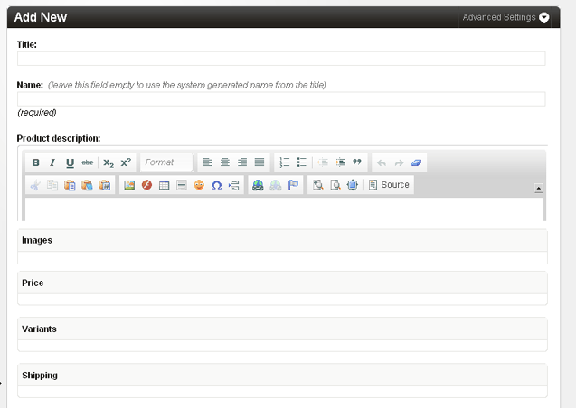

As you can see, there are a few groups of editable regions that we've not talked about yet. We'll come to those when we discuss **Shipping** and **Discounts** later but for now it is only the **Variants** section that needs some explanation as we begin entering data for the products listed on the site.

## Product Options (or Variants)

Take a look at the products listed on the [demo site](https://www.couchcms.com/demo/simple/). There are only three of them but each is available in several variants or options e.g. The 'Paper Clips' come in three different sizes - Large, Medium and Small.

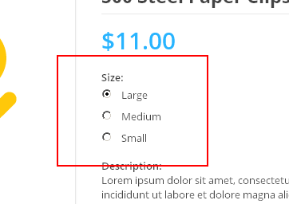

The terminology might not be exact but in **CouchCart** we call the 'Color', 'Size' etc. the options and the values within each option (e.g. the 'Large', 'Medium' and 'Small' within the 'Size' option) simply option-values.

Notice that the options are displayed in **three** different ways - either as a set or **radio-buttons** (as seen above) or as a **dropdown** of option-values or as a **text-box** (as shown in the following image).

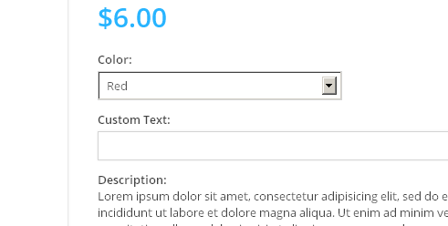

Also notice that some of the option-values have a different price than the base price shown for the product:

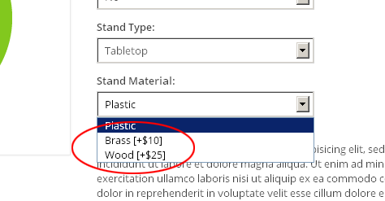

You'll remember we discussed an editable region named `pp_options` above. The *Variants* section of the edit-panel shows this very region and, as discussed, this will be used to define the variants supported by the product being edited.

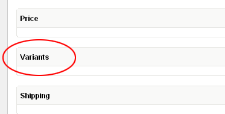

The variants are defined using a special syntax. For example, to define an option named 'Color' having three option-values named 'Red', 'Black' and 'Green', the following text needs to be inputted:

```php
Color[Red | Black | Green]
```

If the product has another option, e.g. 'Size' with option-values of 'Large', 'Medium' and 'Small', this could be added on a separate line. The input will now become:

```php
Color[Red | Black | Green]
Size[Large | Medium | Small]
```

If any of the option-values modify the base price of the product, the difference in price (negative or positive) can be added to the string this way:

```php
Color[Red | Black=+3 | Green=-2]
Size[Large | Medium | Small]
```

In the example above, choosing the 'Black' option-value will automatically add 3 to the base price while the 'Green' option-value will reduce the base price by 2.

By default, **CouchCart** will render the option-values of these variants on the front-end as dropdowns.

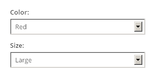

To display them as radio-buttons, simply add an asterisk (`*`) at the end of the string e.g. the following modification will make the option-values of 'Size' get displayed as a set of radio-buttons.

```php
Color[Red | Black=+3 | Green=-2]
Size[Large | Medium | Small]*
```

Each radio-button, by default, will be shown on a separate line.

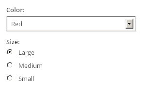

To make all the radio-buttons appear on the same line, simply use two asterisks (`**`) e.g.

```php
Color[Red | Black=+3 | Green=-2]
Size[Large | Medium | Small]**
```

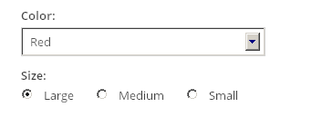

An option that is shown as a text-box (e.g. for allowing buyers to specify the text printed on mugs or T-Shirts) is a little different, from the other two we've seen, in that it does not consist of a pre-defined set of option-values. Any text that is entered into it by the buyer becomes an option-value in itself. The syntax used to define a text-box is also slightly different. So, for example, if the name of the option is 'Your Message', the following text can be used to define it:

```php
Your Message[*TEXT*]
```

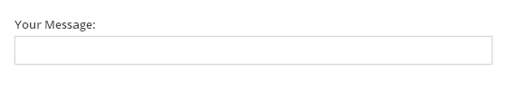

Please note that instead of a series of option-values that we used in the other variant types, we use only a single one which is always named **`*TEXT*`**. Of course, if for specifying a custom text the buyer has to pay a higher (or even a lower) price, the difference can be specified just as we did with the other variants. The following. for example. will add 5 to the base-price of the product:

```php
Your Message[*TEXT*=5]
```

That's it. Not too difficult, is it? To make it even easier for the end-users (your clients who'll most likely be the ones entering this data), I've added the syntax examples as a note (using editable region of type `message`) before the `pp_options` field

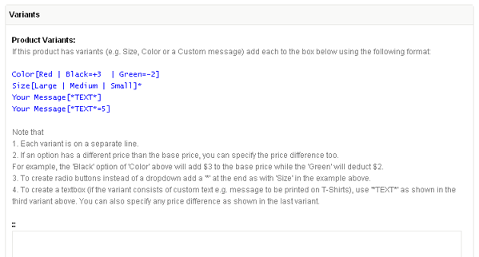

The users can now simply copy/paste and then edit the examples to suit their needs.

We can now move on to actually create the products. Each product, no prizes for guessing, will be created as a cloned page of the products template (which is `index.php` in our example). Create three cloned pages representing the three products in our store and add their data. The only mandatory piece of data would be the price (remember the `pp_price` editable region?).

We've already seen an explanation for the syntax required to input the variants information. I'm sure you can easily add those on your own but just to speed up things, this what the three products need:

#### Raised Relief World Globe

```php
Illuminated[No | Yes=5]
Stand Type[Tabletop | Floor=15]
Stand Material[Plastic | Brass=10 | Wood=25]
```

#### Paper Airplane

```php
Color[Red | Green | Blue]
Custom Text[*TEXT*]
```

#### 500 Steel Paper Clips

```php
Size[Large | Medium | Small]*
```

We've completed adding the products to our database. Now we move on to get them displayed on the front-end.

## Listing products

If you've had any prior experience with Couch, you'll know that listing the products is an absolute no-brainer.
In our template, we'll simply isolate the markup for one single product and then enclose it with the `pages` tag to create a dynamic listing of all the products. The hard-coded values like the product name, images, price etc. will be substituted with the Couch variables made available by `pages` tag.

This is all routine stuff. The display of the product options (variants) will, however, require the use of a new tag - `pp_product_options`. Used alone it will simply list off the names of the product's options (e.g. 'Color', 'Size'). To show the dropdowns (or radio-buttons or text-boxes) representing the option-values (e.g. 'Red', 'Green', 'Blue' for 'Color'), we make use of another tag named `pp_option_values`. Tag `pp_option_values` can only be used as a child tag of `pp_product_options` which provides it with all the information required by it to display the option-values.

This is the portion of the original HTML showing the options:

```html title="index.php"
<div class="product-options">
    <label>Illuminated:</label>
    <select name="illuminated">
        <option>No</option>
        <option>Yes [+$5.00]</option>
    </select>
    <label>Stand Type:</label>
    <select name="stand-type">
        <option>Tabletop</option>
        <option>Floor [+$15.00]</option>
    </select>
    <label>Stand Material:</label>
    <select name="stand-material">
        <option>Plastic</option>
        <option>Brass [+$10.00]</option>
        <option>Wood [+$25.00]</option>
    </select>
    <p><strong>Description:</strong><br>Lorem ipsum dolor sit amet, consectetur adipisicing elit, sed do eiusmod tempor incididunt ut labore et dolore magna aliqua. Ut enim ad minim veniam, quis nostrud exercitation ullamco laboris nisi ut aliquip ex ea commodo consequat. Duis aute irure dolor in reprehenderit in voluptate velit esse cillum dolore eu fugiat nulla pariatur.</p>
</div>
```

This is what the modified template looks like:

```php title="index.php" ins="<cms:pp_product_options >" ins="<cms:pp_option_values />"
<div class="product-options">
    <cms:pp_product_options >
        <label><cms:show option_name />:</label><br>
        <cms:pp_option_values /><br>
    </cms:pp_product_options>
    <p><strong>Description:</strong><br>Lorem ipsum dolor sit amet, consectetur adipisicing elit, sed do eiusmod tempor incididunt ut labore et dolore magna aliqua. Ut enim ad minim veniam, quis nostrud exercitation ullamco laboris nisi ut aliquip ex ea commodo consequat. Duis aute irure dolor in reprehenderit in voluptate velit esse cillum dolore eu fugiat nulla pariatur.</p>
</div>
```

:::note
Incidentally, this has been our first encounter with tags provide by **CouchCart**. If at this point you get an error saying *Unknown tag*, you have missed enabling the **CouchCart** component (as discussed somewhere above). Please do so before continuing.
:::

You'll notice that `pp_option_values` faithfully outputs the option-values as dropdowns, radio-buttons or text-boxes in accordance to whatever you specified in the string inputted via `pp_options` editable region above.

This `pp_option_values` tag is an interesting one. When used as a self-closing tag (as we did above), it goes ahead and outputs the complete HTML markup for the option-values (which could create a dropdown or radio-buttons etc.). For most cases this should be adequate, requiring only some trivial tweaking of the site's CSS to style the auto-generated elements.

If, however, you need absolute control over every byte of the markup being generated, you can make `pp_option_values` switch off its 'auto-pilot' mode and hand over the control to you. This can be done by using `pp_option_values` tag in the opening/closing pair form (instead of a self-closing one). Used in this manner, the tag simply iterates through all the option-values and makes available (as variables) all the information required to render the values manually.

As an example, the following snippet of code outputs exactly the same HTML as that by the self-closing version of `pp_option_values`:

```php title="index.php"
<div class="product-options">
   <cms:pp_product_options >
      <cms:if option_type='list'>
        <cms:if option_modifier='*' || option_modifier='**'>
            <label><cms:show option_name />:</label><br>
            <input type="hidden" name="on<cms:show k_count />" value="<cms:show option_name />" style="display:none;">
            <cms:set radio_input_name="os<cms:show k_count />" />
            <cms:pp_option_values>
                <label class="radio-label">
                    <input type="radio" name="<cms:show radio_input_name />" value="<cms:show k_count />"<cms:if k_count='0'> checked="true"</cms:if>>
                    <cms:show option_val />
                    <cms:if option_price >
                        [<cms:show option_price_sign /><cms:pp_config 'currency_symbol' /><cms:show option_price />]
                    </cms:if>
                </label>
                <cms:if option_modifier='*'></cms:if>
            </cms:pp_option_values>
        <cms:else />
            <label><cms:show option_name />:</label><br>
            <input type="hidden" name="on<cms:show k_count />" value="<cms:show option_name />" style="display:none;">
            <select name="os<cms:show k_count />">
                <cms:pp_option_values>
                    <option value="<cms:show k_count />">
                        <cms:show option_val />
                        <cms:if option_price >
                            [<cms:show option_price_sign /><cms:pp_config 'currency_symbol' /><cms:show option_price />]
                        </cms:if>
                    </option>
                </cms:pp_option_values>
            </select>
        </cms:if>
      <cms:else />
        <label><cms:show option_name />:</label><br>:
        <input type="hidden" name="on<cms:show k_count />" value="<cms:show option_name />" style="display:none;">
        <input type="text" name="os<cms:show k_count />" maxlength="200">
      </cms:if>
   </cms:pp_product_options>
   <br>
</div>
```

The snippet above looks a little complex only because it has to output three different types of option selectors.

So far we have managed to create products (along with variants) and list them. Time now to put core actions of the shopping cart in effect.

## Core actions of cart

The shopping cart provided by **CouchCart** (as is true for any other shopping cart script) supports the following core actions:

- [Add item to cart](#add-item-to-cart)
- [List items in cart](#listing-cart-items)
- [Update quantity of item in cart](#update-quantity-of-item-in-cart)
- [Remove item from cart](#remove-item-from-cart)
- [Display global cart values](#displaying-global-cart-values)
- Empty cart
- [Checkout](#checkout)

Let us implement each of those in our site.

### Add item to cart

If you take a look at the original HTML markup, you'll find that each product's entry is enclosed within a `<form>` element. This seems to be a universal way of adding items to cart. The form submission posts back data, pertaining to the item being added, to a server-side script that in turn use the data to effect the item's insertion into the cart.

**CouchCart** simplifies this task for you by providing a handy tag named `pp_product_form` that takes care of all the nitty-gritty. Simply replace the original `form` element (both the opening as well as the closing tag)

```php title="index.php"
<form class="cart-form" action="cart.html" method="post" accept-charset="utf-8">
    <div class="product-top-box">

    ... content truncated ...

    </div>
</form>
```

with `pp_product_form` to make it:

```php title="index.php" ins="<cms:pp_product_form class="cart-form">" ins="</cms:pp_product_form>"
<cms:pp_product_form class="cart-form">
    <div class="product-top-box">

    ... content truncated ...

    </div>
</cms:pp_product_form>
```

Note that the `action`, `method` and `accept-charset` parameters are not needed now because `pp_product_form` will handle those. Except for these parameters, any other parameter specified with the tag will be output back without any change (this can be used to pass on the `class` or `id` of the original markup, as we do in our example above).

One last modification is required and our **add to cart** function is complete. The data that the form posts back to the server, of other things, also includes the quantity of the item being added. **CouchCart** expects the `name` of this value to be `qty`.**

In the original markup, the following statement defines the textbox used to enter the quantity:

```php title="index.php" "name="quantity""
<input class="product-quantity" name="quantity" id="quantity" type="number" step="1" value="1" title="Quantity">
```

As you can see, the `name` of this field is `quantity`. Simply modify it to make it `qty`:

```php title="index.php" ins="name="qty""
<input class="product-quantity" name="qty" id="quantity" type="number" step="1" value="1" title="Quantity">
```

:::note
If in your design, the add-item form does not allow the buyer to specify a quantity (e.g. always adds a quantity of `1`), you can add a `hidden` input with the name of `qty` with the value set to whatever default quantity is to be added e.g.:

```html
<input type="hidden" value="1" name="qty"/>
```

:::

Our products are now ready to be added to the cart. Press the **Add to cart** button to submit the form and voila! We get...

... a `404 Page not found error`!?

What is happening?

Nothing to worry about :-) Remember, we discussed at the outset that **CouchCart** requires two dedicated templates for it to function properly? This 404 error is **CouchCart** complaining that it cannot find the first of the two templates - `cart.php`.

The way **CouchCart** works, after most of the actions we listed above (notable exception being `checkout`), its default behavior is to invoke a template named `cart.php` (or, as also discussed, any other template specified in its place in the config file).

The design we are porting already contains a cart template named `cart.html` so this is not a problem.

:::note
In the rare event, however, where your design does not consist of a separate template showing the cart (e.g. in a very simple design where the cart is always shown on the same page that lists the products), use **CouchCart**'s config file to specify the name of another Couch managed template that it can invoke instead. In such cases, you might also find the `redirect` parameter of `pp_product_form` tag useful to make the visitor come back to the page he clicked the **Add to cart** button from.
:::

Convert `cart.html` to a Couch managed template by following the usual drill of changing the extension to `.php`, adding to it the mandatory `<php require_once 'couch/cms.php'; ?>` and `<php COUCH::invoke(); ?>` statements and then accessing it as super-admin using the browser.

One additional bit of code that I've added to the very beginning of the template is this:

```php title="cart.php"
<cms:no_cache />
```

This tag ensures that Couch never caches this cart template.

With `cart.php` template now registered, try adding a product once again. This time the `cart.php` template should appear in the browser as expected. The cart that gets displayed will, of course, NOT show the product we just added because what we get to see is the original static HTML markup for the cart. Let us now retrofit some **CouchCart** tags into this cart HTML to make it show dynamically the current state of the cart.

### Listing cart items

Listing cart items is very similar to listing pages, folders etc. in Couch.
**CouchCart** gives us a tag named `pp_cart_items` that can iterate through all the items currently in the cart and provide us details about each item by setting certain variables (very similar to, for example, what `pages` tag does).

To create a listing of all the items in the cart, simply modify the original markup showing several rows of items to end up with only one row in the table. Enclose this solitary row within the `pp_cart_items` tag pair and then substitute the hard-coded data about the item with the variables set by this tag. Regular stuff.

Following is the original HTML showing a single row of the cart:

```html title="cart.html"
<tr>
    <td class="col-remove"><a href="cart.html?action=remove" class="cart-remove" title="Remove">&times;<span class="screen-reader">Remove</span></a></td>
    <td class="col-desc">
        <a href="index.html" class="cart-thumb">
            
        </a>
        <div class="desc-box">
            <a href="index.html">Paper Airplane</a>
            <p>Color: Red<br>Custom Text: John Doe</p>
        </div>
    </td>
    <td class="col-quantity"><input class="quantity-input" type="number" min="0" step="1" value="3" title="Quantity"></td>
    <td class="col-price">$6.00</td>
    <td class="col-subtotal">$18.00</td>
</tr>
```

And following is the Couchified version:

```php title="cart.php" ins="<cms:pp_cart_items>" ins="</cms:pp_cart_items>" ins="<cms:pp_remove_item_link />" ins="<cms:show link />" ins="<cms:show title />" ins="<cms:show quantity />>" ins="<cms:show product_thumb />" ins="<cms:show quantity />" ins="<cms:pp_selected_options separator='<br>' />" ins="qty[<cms:show line_id />]" ins="<cms:if line_discount><span class="compare-price">$<cms:number_format orig_price /></span></cms:if>" ins="$<cms:number_format price />" ins="$<cms:number_format line_total />"
<cms:pp_cart_items>
    <tr>
        <td class="col-remove"><a href="<cms:pp_remove_item_link />" class="cart-remove" title="Remove">&times;<span class="screen-reader">Remove</span></a></td>
        <td class="col-desc">
            <a href="<cms:show link />" class="cart-thumb">
                " width="70" height="64" alt="<cms:show title />">
            </a>
            <div class="desc-box">
                <a href="<cms:show link />"><cms:show title /></a>
                <p><cms:pp_selected_options separator='<br>' /></p>
            </div>
        </td>
        <td class="col-quantity"><input name="qty[<cms:show line_id />]" class="quantity-input" type="number" min="0" step="1" value="<cms:show quantity />" title="Quantity"></td>
        <td class="col-price">
            <cms:if line_discount><span class="compare-price">$<cms:number_format orig_price /></span></cms:if>
            $<cms:number_format price />
        </td>
        <td class="col-subtotal">$<cms:number_format line_total /></td>
    </tr>
</cms:pp_cart_items>
```

This is a list of core variables that `pp_cart_items` sets to provide info about each item in the cart:

- `line_id`
- `id`
- `name`
- `title`
- `link`
- `price`
- `quantity`
- `line_total`
- `requires_shipping`

A couple of points in the code snippet shown above are worth noting. As you'll recall, our products can consist of variants (options) too. So, an item in the cart can possibly consist of several lines of description representing all the options selected by the buyer e.g.:

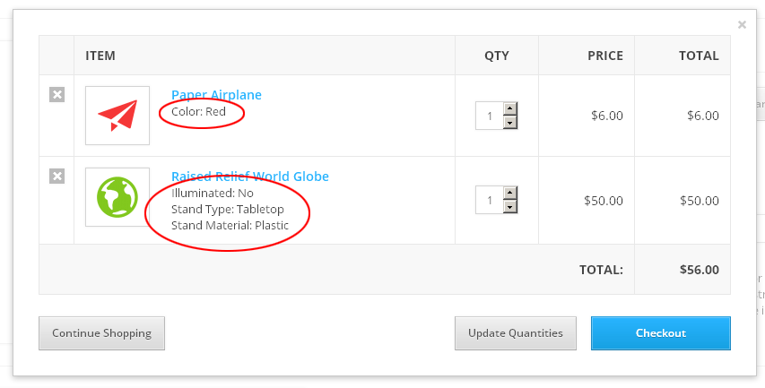

To make it easy for us to display this information, **CouchCart** has a tag named `pp_selected_options`.
Like its counterpart tag `pp_product_options` that we discussed before, the `pp_selected_options` tag can also be used in **two** ways -

<Steps>

1. **As a self-closing tag.** When used this way, it simply outputs a single line containing all the selected options separated by commas. You can specify any another separator by using its 'separator' parameter (as we do in the snippet above where we use `<br>`). e.g.:

    ```php
    <cms:pp_selected_options separator='<br>' />
    ```

2. **As a tag-pair.** When used this way, the tag simply iterates through all the selected options and makes data about them available as variables.
    We can now output the options in any desired manner, for example as follows:

    ```php
    <cms:pp_selected_options startcount='1'>
        <b><cms:show k_count />. <cms:show option_name /></b>: <cms:show option_value /><br />
    </cms:pp_selected_options>
    ```

</Steps>

#### Custom variables for line-items

Sometimes, we need more information about line-items than that provided by the default variables listed above.
For example, take a look at the list above and you'll find that it does not consist of a thumbnail image that we can show in the cart. **CouchCart** makes it super-easy for us to add any custom data we want to the line-items.

Basically, any editable region defined for the products that begins with a `pp_` in its name will be automatically made available by `pp_cart_items` as a variable with the same name (but the `pp_` removed).

If you take a look at the editable regions we defined for our products (in template `index.php` of the finished version), you'll see a thumbnail region defined with the name of `pp_product_thumb`.

```php title="index.php"
<cms:editable
    name="pp_product_thumb"
    label="Thumbnail"
    width="70"
    height="64"
    show_preview="1"
    assoc_field="product_image"
    type="thumbnail"
    group="group_images"
    order="11
/>
```

The `pp_` prefixed to its name will make its value available as a variable named `product_thumb`. This is how we are using it in the snippet shown:

```php
" width="70" height="64" alt="<cms:show title />">
```

Go back to the products template and try adding more items to the cart. The cart template should now show the added items with full fidelity (including the modified price for variant products with different prices).

Time to move on to the next core action of the cart.

### Update quantity of item in cart

The implementation of this action is quite similar to the 'Add item to cart' action we've already seen. Take a look at the original HTML and you'll find that the table representing the cart is wrapped in a `<form>` element:

```php
<form action="" method="post" accept-charset="utf-8">
    <table>

    ... content trunctated ...

</form>
```

Note that each row in this table (representing each item in the cart) has a textbox input for entering the quantity:

```php
<td class="col-quantity"><input class="quantity-input" type="number" step="1" value="2"></td>
```

It takes the **same two steps** as that required when we implemented the 'Add item' action, to quickly put the update function in place.

<Steps>
1. Replace the `<form>` tag with 'pp_cart_form' (another tag that **CouchCart** provides) to make it:

    ```php ins="<cms:pp_cart_form>" ins="</cms:pp_cart_form>"
    <cms:pp_cart_form>
        <table>

        ... content truncated ...

    </cms:pp_cart_form>
    ```

2. Set the `name` of the input element to `qty`. Since in this `<form>`, there can be multiple items and hence multiple quantity input boxes, we make the name an array. So the name we give to the input element is `qty[`<cms:show line_id />`]` (where `line_id` is a unique ID allocated to each item in the cart by **CouchCart**).
    The line-item now becomes this after the modification:

    ```php ins="name="qty[<cms:show line_id />]"
    <td class="col-quantity"><input name="qty[<cms:show line_id />]" class="quantity-input" type="number" min="0" step="1" value="<cms:show quantity />" ></td>
    ```

    Notice that the original did not have a `name` attribute so we added one and that we set the `value` to dynamically show the current quantity of the line-item.

    That should be it. Refresh the cart page and try updating the quantities of the items in cart.

</Steps>

### Remove item from cart

This action is a little different (but also simpler) than the 'Add' and 'Update' actions we have implemented so far. It does not depend on the `<form>` element to work. Instead it is a simple link - a URL that is invoked with the id of the line-item to be removed. To make things even easier, **CouchCart** provides a tag to output this link. This is the original HTML markup:

```php
<td class="col-remove"><a href="cart.html?action=remove" class="cart-remove" title="Remove">&times;<span class="screen-reader">Remove</span></a></td>
```

Modify it to make it:

```php ins="<cms:pp_remove_item_link />"
<td class="col-remove"><a href="<cms:pp_remove_item_link />" class="cart-remove" title="Remove">&times;<span class="screen-reader">Remove</span></a></td>
```

Notice how we simply use the `pp_remove_item_link` tag to output the `href` attribute's value.

Refresh the cart page and try removing items from the cart.

### Displaying global cart values

With the last step in place, we should now be able to click on the 'X' icon to remove an item from the cart.
Keep removing the items from the cart until the last item gets removed. At this point an empty table gets displayed. Ideally we should show a polite message here informing the buyer that there are no items in his cart.

A simple `cms:if` tag checking the number of items currently in the cart should be sufficient to handle this empty cart situation. **CouchCart** provides a tag named `pp_count_items` that gives us this number.
In fact, **CouchCart** provides quite a few other tags that show us the current state of the cart, for example, the number of items within it, the total value of all the items, the discount value etc.

Here is a list of all such tags that can be used absolutely anywhere on your site (i.e. in any template) to show the current state of the cart:

#### `pp_count_items`

Shows the total number of items in the cart. e.g. if there are 4 units of Product A and 1 unit of Product B, this tag will output `5`

#### `pp_count_unique_items`

Shows the total number of unique items in the cart. e.g. if there are 4 units of Product A and 1 unit of Product B, this tag will output `2`

#### `pp_count_shippable_items`

Shows the total number of items in the cart that require shipping (this is set using an editable region named `pp_requires_shipping`)

#### `pp_sub_total`

Shows the total price of all the items in cart before any discount or shipping or taxes are applied

#### `pp_discount`

Shows the discount amount applied to the cart

#### `pp_sub_total_discounted`

Shows the total price of all the items in cart with the discount applied (but not the shipping and taxes)

#### `pp_taxes`

Shows the tax amount applied to the cart

#### `pp_shipping`

Shows the shipping amount applied to the cart

#### `pp_total`

Shows the actual amount of the cart that would be payable by the buyer (after applying all discounts, shipping and taxes)

#### `pp_currency_symbol`

Shows the currency symbol set by the user in `addons/cart/config.php`

#### `pp_config`

Shows the value of any key set by the user in `addons/cart/config.php`. e.g. `<cms:pp_config 'paypal_email' />` will show the PayPal email address set in the config file.

#### `pp_cart_link`

Shows the link of the cart template (taking prettyURLs into consideration).

So armed with these 'global' tags now, we can complete the remaining bits of the cart template. First let us output the cart table only when there are any items in it:

```php
<cms:if "<cms:pp_count_items />" >
    <div class="row">
        <div class="twelve columns">
            <cms:pp_cart_form>
            ... contents truncated ...
            </cms:pp_cart_form>
        </div>
    </div>
<cms:else />
    <div class="message">
        <p class="info">Your cart is empty!</p>
    </div>
</cms:if>
```

Next let us make the total always show the current value - Change the following:

```html
<td class="col-total">$230.00</td>
```

to:

```php ins="<cms:number_format "<cms:pp_total />" />"
<td class="col-total">$<cms:number_format "<cms:pp_total />" /></td>
```

Notice that we have nested the `pp_total` tag within the `number_format` tag to be able to format the value in whatever format we desire (please see [**number_format**](../../../tags-reference/core/number_format/) for details).

Same thing needs to be done with the other price components of the cart, namely, 'Subtotal', 'Discount', 'Shipping' and 'Taxes'.

```php
<cms:if "<cms:pp_discount />" || "<cms:pp_shipping />" || "<cms:pp_taxes />" >
    <tr class="row-extras">
        <td class="col-extras-label" colspan="4">Subtotal</td>
        <td class="col-extras">$<cms:number_format "<cms:pp_sub_total />" /></td>
    </tr>
</cms:if>

<cms:if "<cms:pp_discount />">
    <tr class="row-extras">
        <td class="col-extras-label" colspan="4">Discount:</td>
        <td class="col-extras col-discount"><span class="subtract">-</span>$<cms:number_format "<cms:pp_discount />" /></td>
    </tr>
</cms:if>


<cms:if "<cms:pp_shipping />">
    <tr class="row-extras">
        <td class="col-extras-label" colspan="4">Shipping:</td>
        <td class="col-extras">$<cms:number_format "<cms:pp_shipping />" /></td>
    </tr>
</cms:if>

<cms:if "<cms:pp_taxes />">
    <tr class="row-extras">
        <td class="col-extras-label" colspan="4">Taxes:</td>
        <td class="col-extras">$<cms:number_format "<cms:pp_taxes />" /></td>
    </tr>
</cms:if>

<tr class="row-total">
    <td class="col-total-label" colspan="4">Total:</td>
    <td class="col-total">$<cms:number_format "<cms:pp_total />" /></td>
</tr>
```

Since it is better to display the 'Discount', 'Shipping' and 'Taxes' rows only when their values are non-zero, we've wrapped the statements in an `if` check to output them conditionally.

Finally, the top navigation bar portion of `cart.php` (and also `index.php`) shows the number of items currently in cart along with the cart's total value:

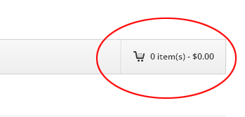

```html
<a href="cart.html" class="nav cart"><span class="quantity">3</span> item(s) - $<span class="price">250.00</span></a>
```

Replace the hard-coded values with the 'global' tags:

```php
<a href="<cms:pp_cart_link />" class="nav cart"><span class="quantity"><cms:pp_count_items /></span> item(s) - $<span class="price"><cms:number_format "<cms:pp_total />" /></span></a>
```

Our cart is almost complete now. The last remaining action to be implemented is the checkout.

### Checkout

Checkout can be implemented using either of the following two methods:

<Steps>

1. As an HTML `input` or `button` of type `submit` within the form generated by 'pp_cart_form'. It is mandatory to name this `input` or `button` element as `checkout` for this method to work.

2. As a simple anchor `<a>` element. The value for its href attribute can be generated using the 'pp_checkout_link' tag e.g. `<a href="<cms:pp_checkout_link />">Checkout</a>`

</Steps>

Use whichever of the two methods suits more the design you are working on.
For the one we are porting in this example, it seems more convenient to use the `submit` method.
This is how the checkout button appears originally:

```html
<input class="button checkout-button" type="submit" value="Begin Checkout">
```

The only change required is to add to it a `name` attribute with the value set to `checkout`. It now becomes:

```html ins="name="checkout""
<input class="button checkout-button" type="submit" name="checkout" value="Checkout">
```

Our cart is now ready. Refresh the cart template and press the checkout button. If everything goes well, you should get a **404. Page not found** error. I think you can guess the reason now. The second (and also the last) required template, `checkout.php`, is missing.

As it happens, the design we are porting has no checkout template. That is OK. We'll create our own. Create a new text file named `checkout.php`. For now, we can do with a very bare-bone template so we'll put in it just the essential code required to register it with Couch. This is what our template looks like:

```php title="checkout.php"
<?php require_once 'couch/cms.php'; ?>
    <cms:no_cache />
<?php COUCH::invoke(); ?>
```

The only additional bit of code is the `no_cache` tag to make sure Couch never caches the output of this template. Add this one final tag to the template and it is ready to execute the checkout action:

```php title="checkout.php"
<?php require_once 'couch/cms.php'; ?>
    <cms:no_cache />
    <cms:pp_payment_gateway
        shipping_address="<cms:if "<cms:pp_count_shippable_items />" >1<cms:else />0</cms:if>"
        empty_cart='0'
    />
<?php COUCH::invoke(); ?>
```

The `pp_payment_gateway` tag uses the current state of the cart, formats it in a manner stipulated by PayPal and finally simply redirects the buyer to PayPal where he can complete the transaction by making the payment.

:::note
The `pp_payment_gateway` tag accepts the following parameters:

- **`shipping_address`**
    - If set to `0` (the default) means 'address not required' and hence the buyer will not be prompted by PayPal for his address.
    - If set to `1`, means 'address required' and PayPal will make the buyer input the shipping address at its site.
    - If set to `2`, means 'address required but will be supplied by us'. In this case the onus of capturing the buyer's address falls on us. This tag expects the elements of the address to be saved in session as variables of the following names:
        - 'contact_email'
        - 'shipping_first_name'
        - 'shipping_last_name'
        - 'shipping_address1'
        - 'shipping_address2'
        - 'shipping_city'
        - 'shipping_state_code'
        - 'shipping_country_code'
        - 'shipping_zip'
- **`calc_shipping_at_paypal`** PayPal allows merchants to configure shipping charges at its site. If shipping is to be calculated there, set this parameter to `1`.
- **`logo`** The URL of merchant's 50 x 150 pixel logo that appears at PayPal.
- **`return_url`** URL of the page where the buyer is prompted by PayPal to return after successful transaction.
- **`cancel_url`** URL of the page where the buyer is prompted by PayPal to return after cancelling the transaction.
- **`empty_cart`** This tag empties the cart before redirecting to PayPal. Setting this parameter to `1` prevents this behaviour.

:::

:::note
The seller's email shown at PayPal can be set in the `addons/cart/config.php` file.
:::

To explain the code above, the `pp_payment_gateway` tag, by default, empties the cart before redirecting to PayPal. As we are still in the phase of testing the cart, it might be a good idea to prevent it from doing so. The `empty_cart` parameter set to `0` switches off this behaviour. As for the `shipping_address` parameter, if there are any shippable items in the cart (the `pp_count_shippable_items` tag gives us this count), we set it to `1`. Else, we set it to `0`. This makes PayPal allow the buyer to set the shipping address, when required.

Try clicking the checkout button to test if the cart's current data gets transmitted to PayPal as expected.
One little modification that we can do to our checkout.php template is to first make sure that the cart in not empty before invoking the `pp_payment_gateway` tag. The `if` tag coupled with `pp_count_items` tag will see to this:

```php title="checkout.php"
<?php require_once 'couch/cms.php'; ?>
    <cms:no_cache />

    <cms:if "<cms:pp_count_items />" >
        <cms:pp_payment_gateway
            shipping_address="<cms:if "<cms:pp_count_shippable_items />" >1<cms:else />0</cms:if>"
            empty_cart='0'
        />
    <cms:else />
        <p>Your cart is empty!</p>
    </cms:if>
<?php COUCH::invoke(); ?>
```

:::note
Using a separate template for the checkout provides us a way to code more involved use-cases. For example, instead of straightaway redirecting to PayPal, as we've done above, we can show the buyer a summary of his cart, show a form to capture his address, give him an opportunity to enter any discount coupon he might have etc. and then invoke `pp_payment_gateway` after all necessary information has been captured.

In fact, you can even give the buyer a choice of either using PayPal or pay using a bank check etc. If the choice is a bank check, we can skip invoking `pp_payment_gateway` and show him the seller's bank details etc. as the final step of the transaction.

In the second part of this tutorial we'll extend this checkout template.
:::

With this, we've finally implemented all the core actions of our shopping cart. Before moving over to handle the other essential parts of any e-commerce site (namely, configuring the discounts, shipping charges and taxes), let us put in a final touch to our cart by AJAXifying it.

## AJAXifying the cart

**CouchCart** does not contain any specific AJAX related functions, as those described so far should work equally well when called via AJAX. Following is a brief description of the method used in our sample site.

You'll find a JavaScript file named `cart-modal.js` in the `js` folder of our site. It contains all the AJAX related functions used by the cart, as implemented on this sample site, and is based on jQuery and Bootstrap. The sites you'll be using **CouchCart** with might, or might not, use the same libraries (e.g. your design could be using MooTools as its JS library or LightBox for the pop-up), as such it is unlikely that you'll be able to use `cart-modal.js` as-it-is.

However, the basic steps required to get the cart working in a pop-up will remain the same. Hence, I'll just outline the core algorithm behind those steps here. With the principle understood, any JS library can be used to create the AJAXified version of the cart.

<Steps>

1. The first thing we do is add the `cart-modal.js` script to the `index.php` template (which is where we'll be showing the pop-up on).

    ```php title="index.php"
    <script type="text/javascript">
        // Set global values for 'js/cart-modal.js' that follows
        var cart_link = "<cms:link "<cms:pp_config 'tpl_ajax_cart' />" />";
        var checkout_link = "<cms:pp_checkout_link />";
    </script>
    <script src="js/cart-modal.js" type="text/javascript"></script>
    ```

    Please notice that we are setting some global variables for the JS code in `cart-modal.js` to make use of. We do so here in `index.php` because we use Couch tags to get the values and these tags can only be used within Couch-managed templates. These global variables are the URLs of the checkout template and a template (we'll come to it a little later) used to display the cart in the pop-up window. The name of this template has been set in the config file as `cart-modal.php`. The `pp_config` tag is being used in the code above to fetch this name from the config file.

2. As we've seen, both the 'Add' as well as the 'Update' actions make use of HTML forms. The 'Remove' action, on the other hand, is link based. The 'Checkout' action may be form based or may be a link. The code in `cart-modal.js` 'hooks' into the 'submit' event of the two above-mentioned forms and the 'click' events of the two links

    ```js title="cart-modal.js"
    // Handle 'Add Item' & 'Update Cart' form submissions
    $(document).on('submit', '.cart-form', function(event) {
    ```

    ```js title="cart-modal.js"
    // Handle 'Remove Item' link
    $(document).on('click', '.cart-remove', function(e) {
    ```

    ```js title="cart-modal.js"
    // Handle 'Checkout' link
    $(document).on('click', '.checkout-button', function(e) {
    ```

    By doing so, whenever these core actions are invoked on the cart, the JS functions get executed instead (if JavaScript happens to be disabled on a site, the original code we've implemented keeps working normally which makes this approach 'degrade gracefully').

    These functions, simply execute the same actions as were originally intended (i.e. the forms get submitted to the original locations and the links invoke the same URLs). However (and this is the crux of using JavaScript), they do so using AJAX and so the actions take place in the background and `index.php` does not refresh.

    ```js title="cart-modal.js"
    // Execute action by submitting form
    $.ajax({
        type: 'post',
        url: $(this).attr('action'),
        data: $(this).serialize(),
        success: function() {
            show_cart();
        }
    });

    // Execute action by following link
    $.get($(this).attr("href"), function() {
        show_cart();
    });
    ```

3. Finally, once the invoked action completes in the background, the control returns back to these functions and they make another background call to the server.
    This time to a template named `cart-modal.php` (we set this name as a global variable in the first step above). The `cart-modal.php` is a simple Couch managed template that makes use of **CouchCart**'s tags to generate and return the HTML showing the current state of the cart. This HTML gets displayed in the pop-up window.

    ```js title="cart-modal.js"
    // Fetch updated cart
    $.get(url, function(response) {
        // Update modal window
        $('#cart-modal>.modal-body').html(response);
    ```

    When the `index.php` is first displayed only the 'Add' forms exist on the page (one for each product).
    The HTML returned above by `cart-modal.php` contains the 'Update' form and the 'Remove' and 'Checkout' links. Since these now become a part of the page, the JS code 'hooks' onto them as well and so any actions now taken on the cart shown in the pop-up follow the same cycle as described above.

    These basically are the core steps. Notice that every action requires two Ajax calls to the server - one to get the action executed and another to get the HTML showing the cart in its current state.
    Rest of the functions in there simply serve auxiliary roles e.g. to show or hide the pop-up window etc.

    The JS file is there for you to see and it shouldn't be difficult to modify it to suit your design's need.
    As for the `cart-modal.php`, please take a look at it in the [couchified version](https://www.couchcms.com/docs/code/simple-couchified.zip) of our site and you'll find that it is almost an exact copy of `cart.php` (with only the now not-required HTML elements like `head` and `body` removed).

</Steps>

## A little break

So, there we have it. A fully functional shopping cart that required only minimal changes to our static HTML design.

- [**Download original HTML version**](https://www.couchcms.com/docs/code/simple.zip)
- [**Download Couchified version**](https://www.couchcms.com/docs/code/simple-couchified.zip)

Of course, there is more to an e-commerce site than just a shopping cart :-) No e-commerce site can do without functions like discounts, shipping charges and taxes. We'll get all that done in [**Part II**](./part-2/).

<Card icon="star" title="CouchCart">

Please refer to [**CouchCart**](../../concepts/couchcart/) for additional information regarding **CouchCart**.

</Card>

---

[Next Chapter: **Shopping Cart (Part II)**](./part-2/)
