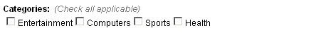
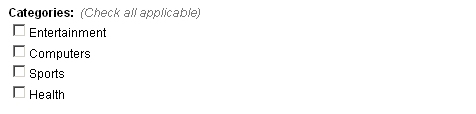

# type = 'checkbox'

Editable region of _checkbox_ type is used to allow the user to choose multiple options from several presented to him in the form of check boxes.

An editable region of _checkbox_ type can be defined this way -

```
<cms:editable
  name="my_categories"
  label="Categories" desc="Check all applicable"
  opt_values='Entertainment | Computers | Sports | Health'
  type='checkbox'
/>
```

The code above will result in -



The options selected in this region can be accessed, as with all other editable regions, by using the variable named after it.<br/>
Unlike its counterparts, [_dropdown_](../../dropdown.html) and [_radio_](../../radio.html) types, _checkbox_ type can contain multiple selected options. In the example given above, if the user selected _Entertainment_, _Sports_ and _Health_, the following code -

```
<cms:show my_categories />
```

will output -

```
Entertainment|Sports|Health
```

As you can see, the value consists of all the three selected options clubbed together with a '|' (pipe) character separating them.

<p class="success">
    **TIP:** To access each of the individual selected option, you can use the [**Each**](../../../each.html) tag -<br/>
    <br/>
    ```
<cms:each my_categories as='cat'>
      <cms:show cat /><br>
</cms:each>
    ```
</p>

## Parameters

In addition to the parameters common to all the types of editable regions, _checkbox_ accepts the following parameters

*   opt\_values
*   opt\_selected
*   separator
*   val\_separator

### opt_values

This parameter takes a list of all the options that are displayed as check boxes.

```
<cms:editable name="my_categories" label="Categories" desc="Check all applicable"
  opt_values='Entertainment | Computers | Sports | Health'
  type='checkbox'
/>
```

The selected options will get saved as the value of the editable region. For example, if the user selected _Sports_, the following code -

```
<cms:show my_categories />
```

\- will output 'Sports'.

As can be seen, the saved value is the same as the option's name. However we can a specify a different value that can get saved into the editable region by using the following syntax -

```
opt_values='Entertainment=0 | Computers=1 | Sports=2 | Health=3'
```

Printing out the value contained within the editable region -

```
<cms:show my_categories />
```

\- will now output '2'

<p class="notice">Multiple selections have been discussed above.</p>

<p class="success">
    **TIP:** Specifying an empty option makes Couch generate a break '&lt;BR&gt;'. e.g.<br/>
    <br/>
    ```
opt_values='Entertainment=0 | | Computers=1 | | Sports=2 | | Health=3'
    ```
    In the code above, actually seven options have been specified - three are empty (nothing between the pipes).<br/>
    This results in -<br/>
    <br/>
    
</p>

### opt_selected

You can show any option as selected by setting _opt\_selected_ to the value of that option. For example -

```
<cms:editable name="my_categories" label="Categories" desc="Check all applicable"
  opt_values='Entertainment | Computers | Sports | Health'
  opt_selected = 'Sports'
  type='checkbox'
/>
```

\- or -

```
<cms:editable name="my_categories" label="Categories" desc="Check all applicable"
  opt_values='Entertainment=0 | Computers=1 | Sports=2 | Health=3'
  opt_selected = '2'
  type='checkbox'
/>
```

\- will show _Sports_ as the option selected by default.

Multiple options can be shown as selected by separating the values by a '|' (pipe character) -

```
opt_selected = '0 | 2'
```

The above will show _Entertainment_ and _Sports_ selected by default.

### separator

As seen in the examples above, the list provided to _opt\_values_ parameter consists of the options separated by a '|' (pipe) character and so are the values provided to _opt\_selected_.<br/>
This is the default separator used by Couch. For some reason if you do not wish to have a pipe as separator (e.g. if any of the options contains the pipe character within itself, obviously the same character cannot be used as the separator), any other character can be designated as the separator by setting this parameter. For example as in follows -

```
<cms:editable name="my_categories" label="Categories" desc="Check all applicable"
  opt_values='Entertainment=0 * Computers=1 * Sports=2 * Health=3'
  opt_selected = '1 * 3'
  separator='*'
  type='checkbox'
/>
```

Note how the _opt\_values_ and _opt\_selected_ are separated by '\*'.

### val_separator

Similar to the problem outlined above, sometimes the options in the list contain the '=' (equals to) character. This makes it imposible to use '=' between the option's name and value. You can set any other character for this purpose by setting this parameter. For example -

```
val_separator=':'
```

## Related Tags

*   [editable](../../../editable.html)
*   [editable (text)](../../text.html)
*   [editable (password)](../../password.html)
*   [editable (textarea)](../../textarea.html)
*   [editable (richtext)](../../richtext.html)
*   [editable (image)](../../image.html)
*   [editable (thumbnail)](../../thumbnail.html)
*   [editable (file)](../../file.html)
*   [editable (radio)](../../radio.html)
*   [editable (dropdown)](../../dropdown.html)
*   [editable (group)](../../group.html)
*   [editable (message)](../../message.html)
*   [editable (nicedit)](../../nicedit.html)
*   [editable (relation)](../../relation.html)
