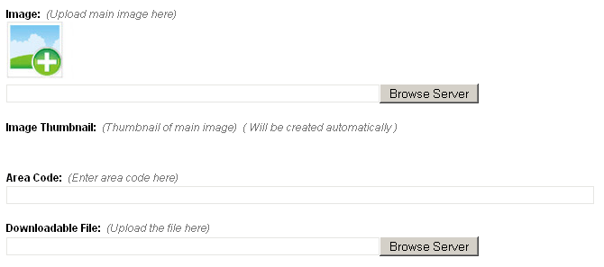
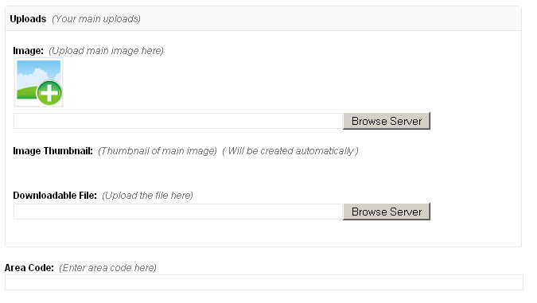

# type = 'group'

Editable region of type _group_, in fact, is not editable at all.<br/>
It is meant to group together related editable regions and thus improve end user experience.

As an example, suppose a template has the following editable regions -

```
<cms:editable name='prop_image' label='Image' desc='Upload main image here' show_preview='1'
    type='image' />

<cms:editable name='prop_image_thumb' label='Image Thumbnail' desc='Thumbnail of main image'
    width='100'
    height='80'
    assoc_field='prop_image'
    type='thumbnail' />

<cms:editable name='prop_code' label='Area Code' desc='Enter area code here'
    maxlength='20'
    type='text' />

<cms:editable name='prop_document' label='Downloadable File' desc='Upload the file here'
    type='file' />
```

This is how they look like in the admin panel -



Of the four regions, three are closely related (_prop\_image_, _prop\_image\_thumb_ and _prop\_document_) since they need the user to upload something from his machine to the server.

To visually convey this relation we can group them together. For this first we create an editable region of _group_ type -

```
<cms:editable name='prop_uploads' label='Uploads' desc='Your main uploads' type='group' />
```

Next link the three aforementioned editable regions to this group by setting their group parameters to its name.

```
<cms:editable name='prop_image' label='Image' desc='Upload main image here' show_preview='1'
    group='prop_uploads'
    type='image' />

<cms:editable name='prop_image_thumb' label='Image Thumbnail' desc='Thumbnail of main image'
    width='100'
    height='80'
    assoc_field='prop_image'
    group='prop_uploads'
    type='thumbnail' />

<cms:editable name='prop_code' label='Area Code' desc='Enter area code here'
    maxlength='20'
    type='text' />

<cms:editable name='prop_document' label='Downloadable File' desc='Upload the file here'
    group='prop_uploads'
    type='file' />
```

And here is the result -



As you can see, the three regions have been grouped together in a panel.

If there are multiple groups in the template (and hence multiple panels), only one panel remains fully expanded while all the rest remainj collapsed, thus reducing the visual clutter in the admin panel.

## Parameters

Only the parameters common to all editable regions apply to this type.

## Related Tags

*   [editable](../../../editable.html)
*   [editable (text)](../../text.html)
*   [editable (password)](../../password.html)
*   [editable (textarea)](../../textarea.html)
*   [editable (richtext)](../../richtext.html)
*   [editable (image)](../../image.html)
*   [editable (thumbnail)](../../thumbnail.html)
*   [editable (file)](../../file.html)
*   [editable (radio)](../../radio.html)
*   [editable (checkbox)](../../checkbox.html)
*   [editable (dropdown)](../../dropdown.html)
*   [editable (message)](../../message.html)
*   [editable (nicedit)](../../nicedit.html)
*   [editable (relation)](../../relation.html)
