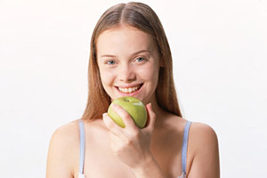

# type = 'image'

Editable region of type **image** is primarily used to allow the user to upload an image from his local computer onto the server. The user can also browse and select any of the previously uploaded images.<br/>
Once an image has been selected, this editable region then holds a fully qualified URL of the uploaded image.

<p class="notice">
    **NOTE:** By default, all uploaded images will be saved within the _**couch/uploads/image**_ folder (or any subfolders created by the user within it). You can set the location to any other folder by uncommenting entry number 12 (_K\_UPLOAD\_DIR_) in _config.php_ and changing it to the desired location.<br/>
    <br/>
    ```
// 12.
// Upload folder if not using the default upload folder within 'couch'.
// Should be relative to your site (don't forget to set write permissions on it).
define( 'K_UPLOAD_DIR', 'myuploads' );
    ```
</p>

An editable region of type _image_ can be defined this way -

```
<cms:editable
    name='prop_image'
    label='Image'
    desc='Upload main image of property here'
    type='image'
/>
```

The code will result in -


Clicking the 'Browse Server' button will bring up a window which can be used to browse previously uploaded images on the server or upload a new image from the local machine.

The contents of this region can be accessed, as with all other editable regions, by using the variable named after it -

```
" />
```

## Parameters

Apart from the parameters common to all types of editable regions, the regions of _image_ type can take the following parameters -

*   width
*   height
*   enforce\_max
*   crop
*   quality
*   show\_preview
*   preview\_width
*   preview\_height

### width

### height

```
<cms:editable name='prop_image' width='300' height='200' type='image' />
```

As mentioned above, when a user uploads an image, Couch saves it in a particular folder on the server. You can ask Couch to ensure that the saved image is of a **particular width and height** or **never exceeds certain width and height**.<br/>
These dimensions (in pixels) are represented by the _width_ and _height_ parameter.

How these dimensions are interpreted by Couch depends on the settings of two other (mutually exclusive) parameters -<br/>
_enforce\_max_ and _crop_.

<p class="notice">
    **NOTE:** If **none** of the two dimensions are specified, e.g.<br/>
    <br/>
    ```
<cms:editable name='prop_image' type='image' />
    ```
    regardless of any settings of _enforce\_max_ and _crop_, the saved image will always be of exactly the same dimensions as the one uploaded (i.e. not resized at all).
</p>

### enforce_max

With _enforce\_max_ set to _1_ (the default), the _width_ and _height_ parameters are interpreted as being the maximum permitted values of the saved image's width and height.

If any of the dimensions of an uploaded image exceeds the provided value, Couch resizes the image (preserving the existing proportion between width and height) till that dimension is reduced to the supplied value.

If both height and width are specified, enforcing the limit of one dimension might end up making the other dimension smaller than what was specified (_see examples below_).

<p class="notice">**By default _enforce\_max_ is always on so you do not have to explicitly set it.** It can be turned off either by specifically setting it to _0_ (enforce\_max='0') or by turnng on _crop_ (crop='1').</p>

#### Examples:

#### Specifying only one dimension

```
<cms:editable name='prop_image' label='Image' desc='Upload main image of property here'
    width='150'
    type='image' />
```

| Uploaded Image (300 x 200) | Saved Image (150 x 100) | Remarks |
| :------------------------- | :---------------------- | :------ |
|  |  | The width was constrained to 150px while also decreasing the height proportionately. |

| Uploaded Image (200 x 300) | Saved Image (150 x 225) | Remarks |
| :------------------------- | :---------------------- | :------ |
|  |  | The width was constrained to 150px while also decreasing the height proportionately. |

| Uploaded Image (100 x 75) | Saved Image (100 x 75) | Remarks |
| :------------------------ | :--------------------- | :------ |
|  |  | The width was already smaller than the required 150px, hence no changes made to the image. |

#### Specifying both dimensions

```
<cms:editable name='prop_image' label='Image' desc='Upload main image of property here'
    width='150'
    height='150'
    type='image' />
```

| Uploaded Image (300 x 200) | Saved Image (150 x 100) | Remarks |
| :------------------------- | :---------------------- | :------ |
|  |  | The width was constrained to 150px while also decreasing the height proportionately. The resulting height of 100px was smaller than the required 150px hence no further changes were made. |

| Uploaded Image (200 x 300) | Saved Image (100 x 150) | Remarks |
| :------------------------- | :---------------------- | :------ |
|  |  | The width was constrained to 150px while also decreasing the height proportionately. The resulting height of 225px was larger than the required 150px hence the image was proportionately scaled further till the height became 150px. In doing so the width became smaller than 150px. |

| Uploaded Image (100 x 75) | Saved Image (100 x 75) | Remarks |
| :------------------------ | :--------------------- | :------ |
|  |  | The width as well as the height were already smaller than the required 150px, hence no changes made to the image. |

#### SIDENOTE:

A short discussion is necessary about what happens if _enforce\_max_ is explicitly set to '0' instead of implicitly doing it by setting _crop_ - e.g..

```
<cms:editable name='prop_image' label='Image' desc='Upload main image of property here'
    width='150'
    height='150'
    enforce_max='0'
    type='image' />
```

In such cases, since height and width are no longer enforcing maximum dimensions, these values are interpreted as being the absolute dimensions for the saved image. While resizing the image to these values **_no effort is made to preserve the existing proportion_** between original height and width. The new image is simply resized to the given values and thus if the ratio of the new dimensions do not match that of the original ones you'll end up with having a distorted image. Thus -

| Uploaded Image (200 x 300) | Saved Image (150 x 150) | Remarks |
| :------------------------- | :---------------------- | :------ |
|  |  | The image was simply resized to a width of 150px and a height of 150px. No attempt was made to mantain proportion and the resulting image is visibily squashed. |

### crop

With _crop_ set to _1_, the _width_ and _height_ parameters are interpreted as specifying the dimensions using which the uploaded image should be saved.

If any of the dimensions of an uploaded image is lesser or greater than the value provided as parameters, Couch resizes the image (preserving the existing proportion between width and height) till that dimension is equal to the supplied value.

If both width and height are specified, very often while matching one dimension the other dimension overshoots the given value. In such cases, the overflowing part of it is cropped.

<p class="notice">By setting this parameter to _1_ we also implicitly turn off _enforce\_max_.</p>

#### Examples:

<br/>

#### Specifying only one dimension

```
<cms:editable name='prop_image' label='Image' desc='Upload main image of property here'
    width='150'
    crop='1'
    type='image' />
```

| Uploaded Image (300 x 200) | Saved Image (150 x 100) | Remarks |
| :------------------------- | :---------------------- | :------ |
|  |  | The required width (150px) is smaller than the actual (300px), hence the width was reduced to 150px while also decreasing the height proportionately. The result is the same as with _enforce\_max_ on one dimension. |

| Uploaded Image (200 x 300) | Saved Image (150 x 225) | Remarks |
| :------------------------- | :---------------------- | :------ |
|  |  | The required width (150px) is smaller than the actual (200px), hence the width was reduced to 150px while also decreasing the height proportionately. The result is the same as with _enforce\_max_ on one dimension. |

| Uploaded Image (100 x 75) | Saved Image (150 x 112) | Remarks |
| :------------------------ | :---------------------- | :------ |
|  |  | The required width (150px) is larger than the actual (100px), hence the width was increased to 150px while also increasing the height proportionately. Note how the result differs from _enforce\_max_ on one dimension. |

#### Specifying both dimensions

```
<cms:editable name='prop_image' label='Image' desc='Upload main image of property here'
    width='150'
    height='150'
    crop='1'
    type='image' />
```

| Uploaded Image (300 x 200) | Saved Image (150 x 150) | Remarks |
| :------------------------- | :---------------------- | :------ |
|  |  | The image is proportionately scaled till one of the two dimension is _equal_ to the required value and the other is either _equal or larger_ than the required value. In case the other dimension is larger, the surplus area is cropped off. |

| Uploaded Image (200 x 300) | Saved Image (150 x 150) | Remarks |
| :------------------------- | :---------------------- | :------ |
|  |  | -same as above- |

| Uploaded Image (100 x 75) | Saved Image (150 x 150) | Remarks |
| :------------------------ | :---------------------- | :------ |
|  |  | -same as above- |

### quality

```
<cms:editable name='prop_image' label='Image' desc='Upload main image of property here'
    width='150'
    quality='50'
    type='image' />
```

You can set _quality_ from 0 (worst quality, smaller file) to 100 (best quality, biggest file). The default value is 80\.

### show_preview

```
<cms:editable name='prop_image' label='Image' desc='Upload main image of property here'
    show_preview='1'
    type='image' />
```

Setting _show\_preview_ to '1' makes Couch display a preview of the selected image above the upload control.


If _show\_preview_ is not set at all or is set to '0', upon selecting an image a link is added below the upload control for previewing the selected image.


### preview_width

### preview_height

As illustrated above, setting _show\_preview_ to '1' causes a preview of the selected image to appear. The dimensions of this preview can be set by using _preview\_width_ and _preview\_height_ (needless to say, these two parameters take effect only with _show\_preview_ set to '1').

```
<cms:editable name='prop_image' label='Image' desc='Upload main image of property here'
    show_preview='1'
    preview_width='150'
    type='image' />
```


<p class="success">It is always a good idea to set at least one of the two dimensions while using _show\_preview_.</p>

## Related Tags

*   [editable](../../../editable.html)
*   [editable (text)](../../text.html)
*   [editable (password)](../../password.html)
*   [editable (textarea)](../../textarea.html)
*   [editable (richtext)](../../richtext.html)
*   [editable (thumbnail)](../../thumbnail.html)
*   [editable (file)](../../file.html)
*   [editable (radio)](../../radio.html)
*   [editable (checkbox)](../../checkbox.html)
*   [editable (dropdown)](../../dropdown.html)
*   [editable (group)](../../group.html)
*   [editable (message)](../../message.html)
*   [editable (nicedit)](../../nicedit.html)
*   [editable (relation)](../../relation.html)
