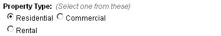

# type = 'radio'

Editable region of _radio_ type is used to allow the user to choose one option from several presented to him in the form of radio buttons.

An editable region of _radio_ type can be defined this way -

```
<cms:editable
  name="my_property_type"
  label="Property Type"
  desc="Select one from these"
  opt_values='Residential | Commercial | Rental'
  type='radio'
/>
```

The code above will result in -


The option selected in this region can be accessed, as with all other editable regions, by using the variable named after it -

```
<cms:show my_property_type />
```

## Parameters

In addition to the parameters common to all the types of editable regions, _radio_ accepts the following parameters

*   opt\_values
*   opt\_selected
*   separator
*   val\_separator
*   search\_type

### opt_values

This parameter takes a list of all the options that are displayed as radio buttons.

```
<cms:editable name="my_property_type" label="Property Type" desc="Select one from these"
  opt_values='Residential | Commercial | Rental'
  type='radio'
/>
```

The selected option will get saved as the value of the editable region. For example, if the user selected _Rental_, the following code -

```
<cms:show my_property_type />
```

\- will output 'Rental'.

As can be seen, the saved value is the same as the option's name. However we can a specify a different value that can get saved into the editable region by using the following syntax -

```
opt_values='Residential=0 | Commercial=1 | Rental=2'
```

Printing out the value contained within the editable region -

```
<cms:show my_property_type />
```

\- will now output '2'.

<p class="success">
    **TIP:** Specifying an empty option makes Couch generate a break '&lt;BR&gt;'. e.g.<br/>
    <br/>
    ```
opt_values='Residential=0 | Commercial=1 | | Rental=2'
    ```
    In the code above, actually four options have been specified - the third option (between _Commercial_ and _Rental_) is empty.<br/>
    This results in -<br/>
    <br/>
    
</p>

### opt_selected

By default, the first option in the list is shown as the selected option. You can show any other option as selected by setting _opt\_selected_ to the **value** of that option. For example -

```
<cms:editable name="my_property_type" label="Property Type" desc="Select one from these"
  opt_values='Residential | Commercial | Rental'
  opt_selected = 'Rental'
  type='radio'
/>
```

\- or -

```
<cms:editable name="my_property_type" label="Property Type" desc="Select one from these"
  opt_values='Residential=0 | Commercial=1 | Rental=2'
  opt_selected = '2'
  type='radio'
/>
```

will show _Rental_ as the option selected by default.

### separator

As seen in the examples above, the list provided to _opt\_values_ parameter consists of the options separated by a '|' (pipe) character.<br/>
This is the default separator used by Couch. For some reason if you do not wish to have a pipe as separator (e.g. if any of the options contains the pipe character within itself, obviously the same character cannot be used as the separator), any other character can be designated as the separator by setting this parameter. For example as in follows -

```
<cms:editable name="my_property_type" label="Property Type" desc="Select one from these"
  opt_values='Residential=0 * Commercial=1 * Rental=2'
  separator='*'
  type='dropdown'
/>
```

Note how the opt\_values are separated by '\*'.

### val_separator

Similar to the problem outlined above, sometimes the options in the list contain the '=' (equals to) character. This makes it imposible to use '=' between the option's name and value. You can set any other character for this purpose by setting this parameter. For example -

```
val_separator=':'
```

### search_type

Can be set to the following valid values -

*   text
*   integer
*   decimal

The default _search\_type_ is (as with all other types of editable regions) _text_.<br/>
If you wish to use this region to input numeric values (e.g. age or salary), set the type to either _numeric_ or _decimal_ (if the value can be fractional).

<p class="notice">It is necessary to set an explicit numeric type on an editable region only when you wish to use the values contained within it to make comparisions (i.e. age &lt; 40) or to sort some output based on these values. See [**Pages**](../../../pages.html#custom_field).</p>

## Related Tags

*   [editable](../../../editable.html)
*   [editable (text)](../../text.html)
*   [editable (password)](../../password.html)
*   [editable (textarea)](../../textarea.html)
*   [editable (richtext)](../../richtext.html)
*   [editable (image)](../../image.html)
*   [editable (thumbnail)](../../thumbnail.html)
*   [editable (file)](../../file.html)
*   [editable (checkbox)](../../checkbox.html)
*   [editable (dropdown)](../../dropdown.html)
*   [editable (group)](../../group.html)
*   [editable (message)](../../message.html)
*   [editable (nicedit)](../../nicedit.html)
*   [editable (relation)](../../relation.html)
