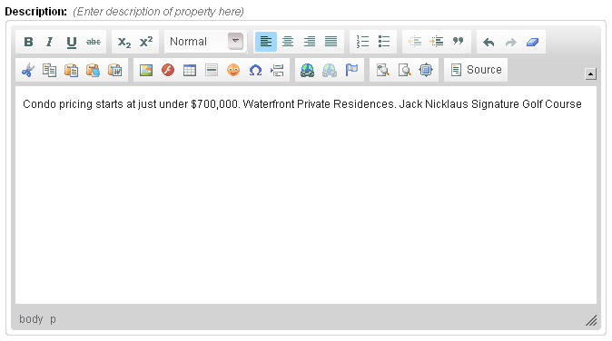
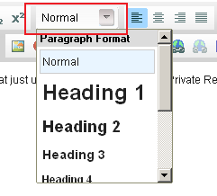
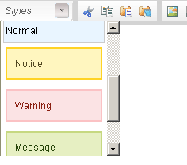
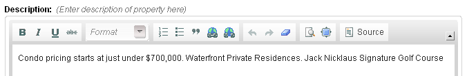
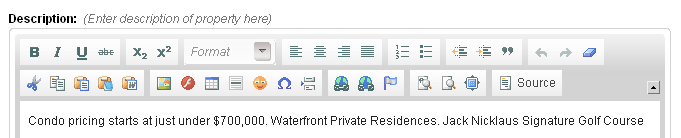
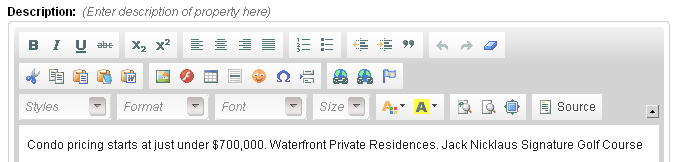
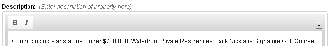
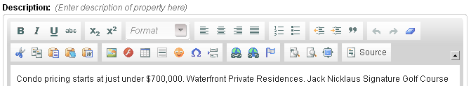

# type = 'richtext'

Editable region of _richtext_ type is used to allow users to easily input HTML formatted text without manually keying in the HTML tags.<br/>
For this type, Couch creates an instance of a WYSIWYG richtext editor ([CKEditor](http://ckeditor.com/)) containing almost all the editing features present in desktop editing applications like MS Word.

An editable region of _richtext_ type can be defined this way -

```
<cms:editable
 name='prop_desc'
 label='Description'
 desc='Enter description of property here'
 type='richtext'>
    Condo pricing starts at just under $700,000. Waterfront Private Residences. Jack Nicklaus
    Signature Golf Course.
</cms:editable>
```

The code above will result in -



<p class="notice">
    Any text enclosed between the opening and the closing tags will appear as the default text within the editor. If you do not wish to have any default text, simply make the **Editable** tag self-closing e.g.<br/>
    <br/>
    ```
<cms:editable name='prop_desc' label='Description'
     desc='Enter description of property here'
     type='richtext' />
    ```
</p>

The contents of this region can be accessed, as with all other editable regions, by using the variable named after it -

```
<cms:show prop_desc />
```

<p class="success">
    Opinion is divided about providing a WYSIWYG editor to the end user (some CMS'es going as far as not providing one at all). After all it only takes a few clicks for a user to change the background color of your meticulously designed web-page to shocking red with the fonts set to _Comics Sans MS_.<br/>
    <br/>
    But ask any end user and the first feature he'll judge a CMS by would be the WYSIWYG editor. Not surprising considering the ease that it brings to him in editing his content.<br/>
    <br/>
    The problem, in our humble opinion, is not the WYSIWYG editor but the unbridled power that it hands over to the end user. The approach of Couch is to allow the designer/coder to decide how much power is he willing to give to the end user. If the user is supposed to only make the text bold and italic, you can set that only these buttons are available. If you wish to constrain the user into applying to the page elements only a few styles that you have coded, you can make available only those styles to the editor. The parameters discussed below will go into more details.<br/>
</p>

## Parameters

In addition to the parameters common to all the types of editable regions, _richtext_ accepts the following parameters

*   height
*   width
*   css
*   body\_id
*   body\_class
*   custom\_styles
*   toolbar
*   custom\_toolbar

### height

### width

```
<cms:editable name='desc' label='Description'
    desc='Enter description of property here'
    height='100'
    width='500'
    type='richtext'/>
```

As the name of the parameters, they can be used to set the width and height of the WYSIWYG editor.

### css

If you have used other CMSes that use WYSIWYG editors, you might have noticed that, in most of them, the content being edited in the editor rarely looks like the way it does when displayed on your website. This is because the styles used by your website (most probably from within CSS stylesheets) are different from that used by the editor.

In order to make the appearance of the content within the editor as similar as possible to what it would look like on the published page, the _css_ parameter can be set to a CSS stylesheet containing matching styles. Sometimes even setting it to the same stylesheet as that of the main site can do the trick. e.g.

```
<cms:editable name='desc' label='Description'
    desc='Enter description of property here'
    css='styles/editor_styles.css'
    type='richtext'/>
```

If a fully qualified path (URL) is not provided, the path is assumed to be relative to the main site (remember that Couch considers its own parent folder i.e. the folder within which the folder named _couch_ resides, as the main website). Thus in the example above, the editor will try and use a stylesheet named _editor\_styles.css_ contained within a folder named _styles_ which itself resides within the main website folder.

The full URL of the stylesheet can also be used e.g.

```
<cms:editable name='desc' label='Description'
    desc='Enter description of property here'
    css='http://www.mysite.com/styles/editor_styles.css'
    type='richtext'/>
```

If a URL is specified, the stylesheet need not necessarily be located within your website. It can be anywhere on the Internet. However, if it is situated within your website, the following is the most appropriate way of setting its full path -

```
<cms:editable name='desc' label='Description'
    desc='Enter description of property here'
    css="<cms:show k_site_link />styles/editor_styles.css"
    type='richtext'/>
```

Multiple stylesheets may also be specified by separating each by a pipe '|' -

```
<cms:editable name='desc' label='Description'
    desc='Enter description of property here'
    css="<cms:show k_site_link />styles/editor_styles.css | styles/my_styles.css"
    type='richtext'/>
```

### body_id

### body_class

Parameters _body\_id_ and _body\_class_ augment the functionality provided by the _css_ parameter discussed above where we try to make the content within the editor look similar to what it would look like on the published webpage .

Suppose the contents of the WYSIWYG editor will eventually appear on the webpage within a **div** with an **id** of _prop\_desc_. Also assume that this **div** has been styled with CSS statements that refer to it by its **id** e.g.

```
#prop_desc {
    padding:25px;
    background:#fff url(bg-prop.jpg) no-repeat scroll 0 bottom;
    font-size: 13px;
}
```

In this case, to style the contents within the editor with the CSS rules given above, set the _css_ parameter to a stylesheet that contains the statement given above and set the _body\_id_ parameter to _prop\_desc_. This way, CSS will treat the WYSIWYG editor as having this **id** and all the contents within it will be rendered accordingly.

```
<cms:editable name='desc' label='Description'
    desc='Enter description of property here'
    css="<cms:show k_site_link />styles/editor_styles.css"
    body_id='prop_desc'
    type='richtext'/>
```

Similarly, if the CSS rules are applicable to an element of a certain **class**, to make the editor take on those rules, set the _body\_class_ parameter to that class. Unlike _body\_id_, _body\_class_ can be set to multiple classes, each separated by a space. e.g. in the snippet below, the editor will have two classes applied - _class1_ and _class2_.

```
<cms:editable name='desc' label='Description'
    desc='Enter description of property here'
    css="<cms:show k_site_link />styles/editor_styles.css"
    body_class='class1 class2'
    type='richtext'/>
```

### custom_styles

The toolbar above the editor contains a drop-down list that allows the user to apply some very generic formats to his content -



[CKEditor](http://ckeditor.com/) provides a method to display **your** custom styles in a similar drop-down list.

This is a very powerful technique to give the user access to a set of predefined styles that correspond to the styles used by your website and thus ensure that any formatting that he applies will be in concordance to your design.

The method that [CKEditor](http://ckeditor.com/) provides requires you to create a JavaScript file defining the list elements in a particular (JSON) format. You can see a sample file provided by them [here](http://www.couchcms.com/docs/style/ckeditor_custom_styles.js). Even if you do not happen to be conversant with JavaScript, it shouldn't be too difficult to figure out how this sample script works.

As an example, suppose that the websites stylesheet has certain **classes** defined that set the background and border to specific colors

```
.error      { background: #FBE3E4; color: #8a1f11; border-color: #FBC2C4; }
.notice     { background: #FFF6BF; color: #514721; border-color: #FFD324; }
.success    { background: #E6EFC2; color: #264409; border-color: #C6D880; }
```

To allow the user easily apply any of these styles to the content while editing, create a file named _custom\_styles.js_ (can be named anything) and place the following code within it -

```
CKEDITOR.stylesSet.add( 'my_styles',
[
    { name : 'Normal'    , element : 'p' },
    { name : 'Notice'    , element : 'p', attributes : { 'class' : 'notice' } },
    { name : 'Warning'   , element : 'p', attributes : { 'class' : 'error' } },
    { name : 'Message'   , element : 'p', attributes : { 'class' : 'success' } }
]);
```

Notice the highlighted part - _my\_styles_. It is a requirement of [CKEditor](http://ckeditor.com/) to give a unique name to each set of custom styles that you may use. For this example, we have named it _my\_styles_.

Next we need to inform [CKEditor](http://ckeditor.com/) to use the elements defined in this file to create a drop-down list. Couch makes this part easy. Simply set the _custom\_styles_ parameter of the **Editable** tag in the following manner -

```
<cms:editable name='desc' label='Description'
    desc='Enter description of property here'
    custom_styles="my_styles=styles/custom_styles.js"
    type='richtext'/>
```

<p class="notice">**IMP.** Notice how we have provided the value of _custom\_styles_ in two parts - name given to this set of styles (_my\_styles_) follwed by an **equal-to** sign and then the path of the JavaScript file (for our example, we assume that it has been saved within _styles_ folder of your website). Absolute path can also be used (see discussion of path in _css_ parameter above).</p>

The resulting drop-down list -



<p class="success">Everytime you modify the JavaScript file, you might need to clear your browser's cache to make the editor pickup the changed file.</p>

### toolbar

This parameter can be used to determine which buttons (and hence which actions) become available to the user in the toolbar above the editor. This helps in limiting the amount of freedom that you are prepared to grant the end user.

This parameter can take one of the following four values

*   basic
*   medium
*   full
*   custom

#### basic

```
<cms:editable name='desc' label='Description'
    desc='Enter description of property here'
    toolbar='basic'
    type='richtext'/>
```

results in -



#### medium

```
<cms:editable name='desc' label='Description'
    desc='Enter description of property here'
    toolbar='medium'
    type='richtext'/>
```

results in -



<p class="notice">_Medium_ is the default value and hence if _toolbar_ parameter is omitted, this is what is used.</p>

#### full

```
<cms:editable name='desc' label='Description'
    desc='Enter description of property here'
    toolbar='full'
    type='richtext'/>
```

results in -



#### custom

```
<cms:editable name='desc' label='Description'
    desc='Enter description of property here'
    toolbar='custom'
    type='richtext'/>
```

If none of the three sets of buttons shown above suits your need, set the _toolbar_ parameter to _custom_. By doing this you can specify your handpicked buttons and their positions in the toolbar by using the _custom\_toolbar_ parameter discussed below.

### custom_toolbar

As mentioned above, this parameter will only take effect when the _toolbar_ parameter has been set to _custom_.

You have the following buttons to choose from to display them in the toolbar -

*   bold
*   italic
*   underline
*   strike
*   subscript
*   superscript
*   justifyleft
*   justifycenter
*   justifyright
*   justifyblock
*   numberedlist
*   bulletedlist
*   outdent
*   indent
*   blockquote
*   undo
*   redo
*   removeformat
*   cut
*   copy
*   paste
*   pastetext
*   pastefromword
*   image
*   flash
*   table
*   horizontalrule
*   smiley
*   specialchar
*   pagebreak
*   link
*   unlink
*   anchor
*   styles
*   format
*   font
*   fontsize
*   textcolor
*   bgcolor
*   showblocks
*   preview
*   maximize
*   source
*   -
*   \_

<p class="notice">The last two buttons are hyphen and underscore. Both can be used to create a separator between buttons.</p>

#### Examples:

As a very simple (and unrealistic) example, here is a toolbar containing only two buttons (bold and italic) -

```
<cms:editable name='desc' label='Description'
    desc='Enter description of property here'
    toolbar='custom'
    custom_toolbar='bold, italic'
    type='richtext'/>
```



A more practical example - here is how you can mimic the _medium_ type of toolbar discussed above.

```
<cms:editable name='desc' label='Description'
    desc='Enter description of property here'
    toolbar='custom'
    custom_toolbar='bold, italic, underline, strike, -, subscript, superscript |
    format |
    justifyleft, justifycenter, justifyright, justifyblock |
    numberedlist, bulletedlist, -, outdent, indent, blockquote |
    undo, redo, removeformat |
    |
    cut, copy, paste, pastetext, pastefromword |
    image, flash, table, horizontalrule, smiley, specialchar, pagebreak |
    link, unlink, anchor |
    showblocks, preview, maximize, -, source'
    type='richtext' />
```



**Points to note in the example above -**

A space can be introduced between two buttons by placing a '-' (hyphen) or '\_' (underscore) between them while related buttons can be grouped together by placing a '|' (pipe character) between two groups.<br/>
Visually both might appear to be the same but when the toolbar needs to be broken up due to lack of space, buttons in the same group are treated as a unit and are kept together.

Also note that you can force the toolbar to be break into a new row by specifying '|' twice (i.e. no buttons between two pipes - see how the group begining with the **cut** button has been forced into a new row).

<p class="success">
    **TIP** - if you find yourself reusing a custom toolbar at many places, instead of repeating the quite large chunk of code everywhere, use the [**Embed**](../../../embed.html) tag. Cut and paste the _value_ of the _custom\_toolbar_ parameter (everything between the quotes) and save it in a file named, say, _my\_toolbar.inc_. Instruct the [**Embed**](../../../embed.html) tag to use this file.<br/>
    <br/>
    ```
<cms:editable name='desc' label='Description'
      desc='Enter description of property here'
      toolbar='custom'
      custom_toolbar="<cms:embed 'my_toolbar.inc' />"
      type='richtext' />
    ```
</p>

## Related Tags

*   [editable](../../../editable.html)
*   [editable (text)](../../text.html)
*   [editable (password)](../../password.html)
*   [editable (textarea)](../../textarea.html)
*   [editable (image)](../../image.html)
*   [editable (thumbnail)](../../thumbnail.html)
*   [editable (file)](../../file.html)
*   [editable (radio)](../../radio.html)
*   [editable (checkbox)](../../checkbox.html)
*   [editable (dropdown)](../../dropdown.html)
*   [editable (group)](../../group.html)
*   [editable (message)](../../message.html)
*   [editable (nicedit)](../../nicedit.html)
*   [editable (relation)](../../relation.html)
