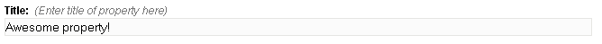

# type = 'text'

Editable region of _text_ type is used to allow users to input text when only one line of text is required.<br/>
For this type, Couch creates a single line textbox for data input.

An editable region of _text_ type can be defined this way -

```
<cms:editable
 name='prop_title'
 label='Title'
 desc='Enter title of property here'
 type='text'>Awesome property!</cms:editable>
```

The code above will result in -



<p class="notice">
    Any text enclosed between the opening and the closing tags will appear as the default text within the textbox. If you do not wish to have any default text, simply make the **Editable** tag self-closing e.g.<br/>
    <br/>
    ```
<cms:editable name='prop_title' label='Title'
 desc='Enter title of property here'
 type='text' />
    ```
</p>

The contents of this region can be accessed, as with all other editable regions, by using the variable named after it -

```
<cms:show prop_title />
```

## Parameters

In addition to the parameters common to all the types of editable regions, _text_ accepts the following parameters

*   width
*   maxlength
*   search\_type

### width

The width of the generated textbox can be changed by setting this parameter. For example, the following will make the textbox 200px wide -

```
<cms:editable name='prop_title' label='Title'
 desc='Enter title of property here'
 width='200'
 type='text'>Awesome property!</cms:editable>
```

### maxlength

The maximum number of characters that can be inputted by the user in this textbox can be constrained by setting this parameter. For example, the following code will prevent the user from entering more than 40 characters -

```
<cms:editable name='prop_title' label='Title'
 desc='Enter title of property here'
 maxlength='40'
 type='text'>Awesome property!</cms:editable>
```

### search_type

Can be set to the following valid values -

*   text
*   integer
*   decimal

The default *search\_type* is (as with all other types of editable regions) _text_.<br/>
If you wish to use this region to input numeric values (e.g. age or salary), set the type to either _numeric_ or _decimal_ (if the value can be fractional).

<p class="notice">It is necessary to set an explicit numeric type on an editable region only when you wish to use the values contained within it to make comparisions (i.e. age &lt; 40) or to sort some output based on these values. See [**Pages**](../../../pages.html#custom_field).</p>

## Related Tags

*   [editable](../../../editable.html)
*   [editable (password)](../../password.html)
*   [editable (textarea)](../../textarea.html)
*   [editable (richtext)](../../richtext.html)
*   [editable (image)](../../image.html)
*   [editable (thumbnail)](../../thumbnail.html)
*   [editable (file)](../../file.html)
*   [editable (radio)](../../radio.html)
*   [editable (checkbox)](../../checkbox.html)
*   [editable (dropdown)](../../dropdown.html)
*   [editable (group)](../../group.html)
*   [editable (message)](../../message.html)
*   [editable (nicedit)](../../nicedit.html)
*   [editable (relation)](../../relation.html)
