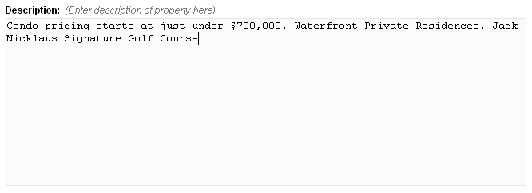

# type = 'textarea'

Editable region of _textarea_ type is used to allow users to input multiple lines of text. It is suitable for inputting multiple lines of unformatted text (i.e. not requiring HTML tags) although the user can format the text by manually adding HTML tags to the input.<br/>
For this type, Couch creates a multi-line textbox for data input.

An editable region of _textarea_ type can be defined this way -

```
<cms:editable
  name='prop_desc'
  label='Description'
  desc='Enter description of property here'
  type='textarea'>
    Condo pricing starts at just under $700,000. Waterfront Private Residences. Jack Nicklaus
    Signature Golf Course.
</cms:editable>
```

The code above will result in -



The default type of an editable region is _textarea_. Hence if the code example given above were to be written without explicitly setting the _type_ parameter, the result would have been just the same. Thus -

```
<cms:editable
  name='prop_desc'
  label='Description'
  desc='Enter description of property here'>
    Condo pricing starts at just under $700,000. Waterfront Private Residences. Jack Nicklaus
    Signature Golf Course.
</cms:editable>
```

will result in an identical textbox.

<p class="notice">
    Any text enclosed between the opening and the closing tags will appear as the default text within the textbox. If you do not wish to have any default text, simply make the **Editable** tag self-closing e.g.<br/>
    <br/>
    ```
<cms:editable name='prop_desc' label='Description' desc='Enter description of property here' />
    ```
</p>

The contents of this region can be accessed, as with all other editable regions, by using the variable named after it -

```
<cms:show prop_desc />
```

## Parameters

In addition to the parameters common to all the types of editable regions, _textarea_ accepts the following parameters

*   width
*   height
*   no\_xss\_check

### width

### height

The dimensions of the textarea can be changed by setting the _width_ and _height_ parameters. For example, the following will make it 400px wide and 200px high -

```
<cms:editable name='prop_desc' label='Description'
    desc='Enter description of property here'
    width='400'
    height='200'
    type='textarea'
/>
```

### no_xss_check

XSS (Cross Site Scripting) is a type of Web Application vulnerability which is caused by user managing to inject malicious script code into a webpage. Couch, by default, sanitizes all user input and that includes all inputs through all types of editable regions.

In some cases though, you'll wish to allow your user to input Javascript code, or even script containing Couch tags, into an editable region. This could be, for example, when you have created a textarea type editable region into which the user is supposed to enter his Google AdSense code. In such cases, to instruct Couch to leave the input alone and not to sanitize it, set the *no\_xss\_check* to '1'. As an example -

```
<cms:editable name='my_adsense' label="Adsense Code" desc="Enter your Adsense code here"
    height='100'
    no_xss_check='1'
    type='textarea'
/>
```

Without the *no\_xss\_check* explicitly set, Couch would disable all Javascript code contained within the AdSense code and thus make it useless.

## Related Tags

*   [editable](../../../editable.html)
*   [editable (text)](../../text.html)
*   [editable (password)](../../password.html)
*   [editable (richtext)](../../richtext.html)
*   [editable (image)](../../image.html)
*   [editable (thumbnail)](../../thumbnail.html)
*   [editable (file)](../../file.html)
*   [editable (radio)](../../radio.html)
*   [editable (checkbox)](../../checkbox.html)
*   [editable (dropdown)](../../dropdown.html)
*   [editable (group)](../../group.html)
*   [editable (message)](../../message.html)
*   [editable (nicedit)](../../nicedit.html)
*   [editable (relation)](../../relation.html)
