# Starting off simple - the About-Us page

Of all the five sections that Aurelius has (i.e. _About-Us_, _Portfolio_, _Blog_, _Contact-Us_ and _Home_), the _Portfolio_ and _Blog_ sections will need the 'cloned pages' feature of Couch because they consist of multiple pages each cloned out of the same template.[](http://www.couchcms.com/docs/code/about.zip)

We'll tackle the cloned pages in the next chapter. For now let us begin with a simpler section that doesn't require cloning. The _About Us_ page will serve our purpose.<br/>
Before proceeding further, make sure that you are logged into Couch using the super-admin account that got created during installation.

Access _about.html_ in your browser by visiting _http&#58;//www.mytestsite.com/about.html_<br/>
The _About Us_ page should appear.

Change the extension of the template from _.html_ to _.php_ so that _about.html_ now becomes _about.php_. Access _about.php_ in your browser -<br/>
_http&#58;//www.mytestsite.com/about.php_<br/>
The same _About Us_ page should appear as did when the file's extension was _html_.<br/>
This change of extension from _.html_ to _.php_ is necessary before Couch can be retrofitted into a template.

Time to fit Couch into _about.php_.<br/>
Open up _about.php_ in your favorite text editor and paste the following line to the very top of the file -

```
<?php require_once( 'couch/cms.php' ); ?>
```

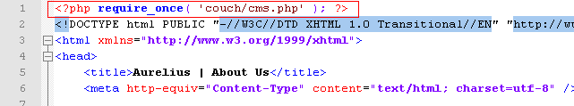

<p class="notice">
    If you had chosen to rename the default admin folder from couch to something else, make sure the line pasted above also reflects the change. Thus if the new name of the folder was myadmin, the line to be pasted will become -<br/>
    <br/>
    &lt;?php require\_once( 'myadmin/cms.php' ); ?&gt;
</p>

As the final step, paste the following to _about.php_ as the last line of the file (i.e. after all other content of the file) -

```
<?php COUCH::invoke(); ?>
```

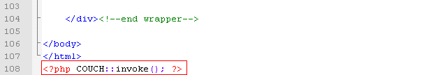

These two boilerplate lines of code are the only PHP that you should ever need to write to work with Couch.

Refresh the template within your browser by revisiting _about.php_ and now visit the admin section once again.

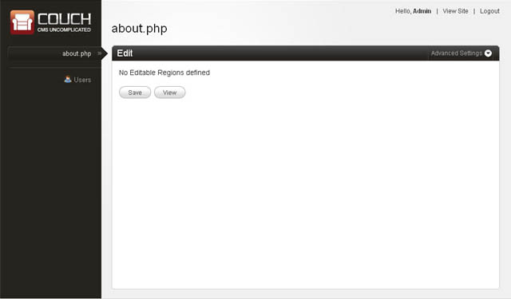

Notice how _about.php_ now appears in the list of templates in the sidebar on the left and how the right panel informs you that _about.php_ has no editable regions defined yet.

These steps are all that you need to take in order to port any template to Couch.

### Defining editable regions

With Couch now hooked into _about.php_, let us now decide which regions within the template should be editable by the client.<br/>
Looking at _about.php_ in the browser, it appears that these two regions are the ones that the client will want to edit -

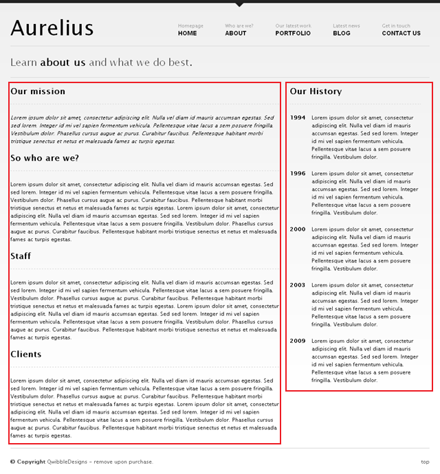

With _about.php_ open in the text editor, find the HTML block representing the main content region -

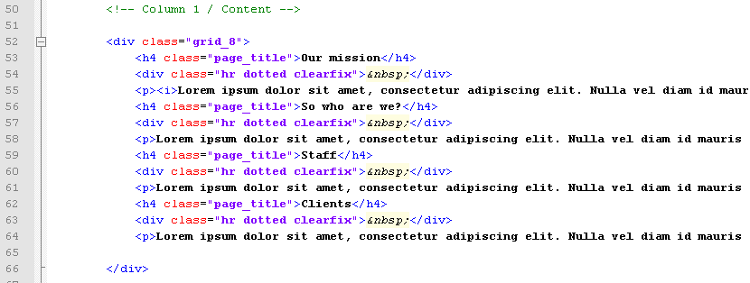

and surround it with Couch's editable tags as follows -

```
<cms:editable name='main_content' type='richtext'> original content </cms:editable>
```

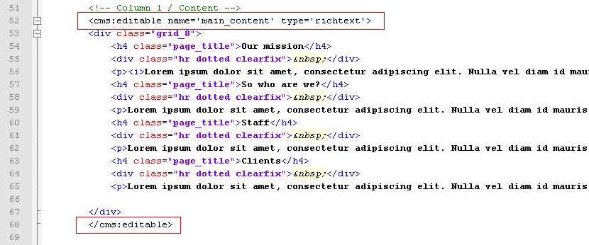

Similarly find the content in the sidebar -

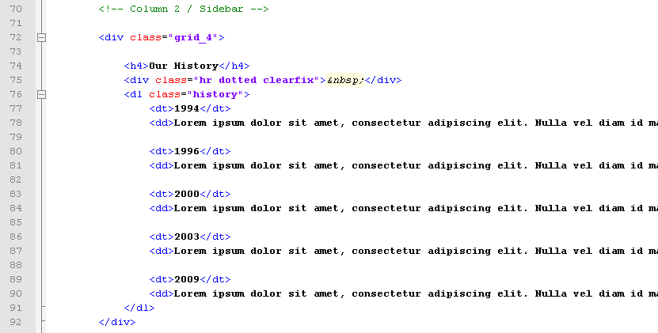

and surround it with the editable tags -

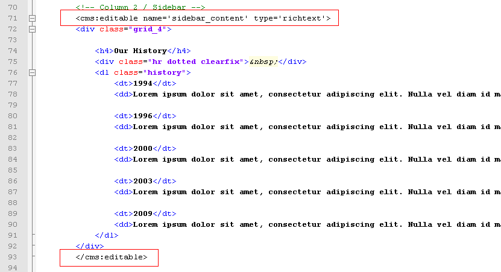

Refresh _about.php_ by revisiting it in your browser. Go to the admin section and click on _about.php_ in the list on the left.<br/>
The right panel should now display the following -

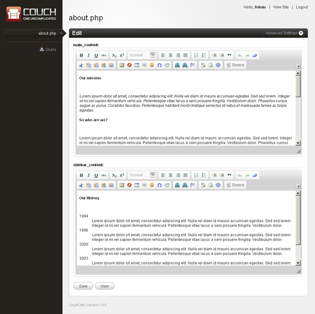

As you can see, Couch has now created the two editable regions for you.<br/>
Try editing the contents in them and revisit _about.php_ after saving your changes. Your changes should now appear on the website.

<p class="success">The editable tag, particularly the richtext type, has a plethora of options that you can set to tailor the created editable region to your client's need. Please consult the [documentation](../../../../concepts/editable-regions.html) for details.</p>

This is all that is needed to make a single page editable.<br/>
To further refine the experience for your client, a few minor enhancements can be made.<br/>
The name of the template appears as _about.php_ in the admin panel. Let us make it appear as About Us.<br/>
Couch has a tag named template. Add the following line containing the template tag to somewhere at the top of the page (below the boilerplate PHP include code we added, of course) -

```
<cms:template title='About Us' />
```

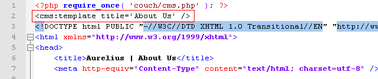

Repeat the mandatory step of refreshing the template in browser and then revisit the admin panel.<br/>
The template should now be listed as 'About Us' instead of its file-name.

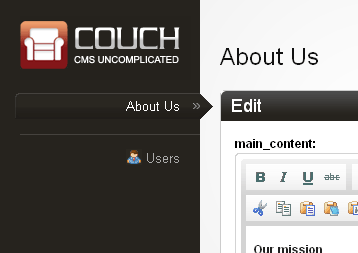

In the next chapter we'll tackle the templates that will be used to create multiple cloned pages.

[Diving deep - the Blog (Part 1)](../../blog.html)
