# Diving deep - the Blog (Part 2)
<br/>
### LISTING CLONED PAGES - The list-view

As already discussed, _http&#58;//www.mytestsite.com/blog.php_ is the view where we list all the existing blog entries.<br/>
Access it through your browser and you'll see that currently it is showing some hard coded HTML.<br/>
We are going to change that now to make it display pages cloned from _blog.php_ template in descending order of their publication date.

The way we have configured it, template _blog.php_ is using an embedded template _blog\_list.html_ to render the list-view.<br/>
File _blog\_list.html_ is where we'll make the changes now. Open it up in your text editor.

Couch has a tag named pages that is used to enumerate or list pages belonging to a particular template.<br/>
Let us take a little overview of how this tag works before putting it into real use.<br/>
The syntax of pages tag is pretty simple.

```
<cms:pages masterpage='blog.php' >

</cms:pages>
```

As you can see, the pages tag consists of a pair of opening and closing tags. The masterpage attribute specifies the template we wish to enumerate the cloned pages of. This attribute can be skipped if we want to enumerate pages cloned from the template this code is placed in but we'll use it for the sake of clarity.

The tag fetches all the relevant cloned pages of the specified template and then loops through them selecting one page at a time sequentially.
At each iteration, all the variables normally available for the selected page, had it been accessed directly in page-view, are made accessible by the tag. These variables, of course, include all the editable regions too.<br/>
Finally anything that appears within the opening and closing tags of pages will be output in the normal way. This content can contain Couch tags that can make use of the variables that are made available.

As a quick and dirty test, place the following code


anywhere within _blog\_list.html_ (I chose just after the BODY tag) and access _http&#58;//www.mytestsite.com/blog.php_.

You'll see that the heading '_Hi, I am a page!_' appears twice.

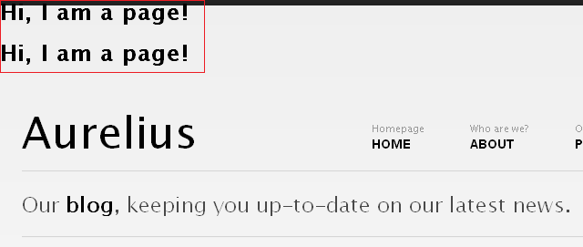

The _blog.php_ currently has only two cloned pages. As the pages tag loops through the two cloned pages, it executes the contents nested within itself at each iteration and hence the H1 tag gets output twice.

Since at each iteration it also makes available all the variables belonging to the page currently selected, changing the code to -

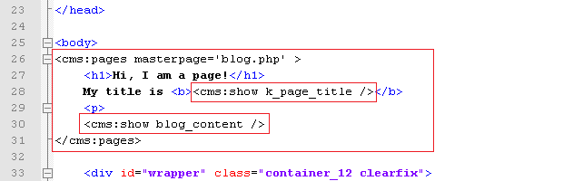

will display -


As you can see we can access all variables belonging to each cloned pages just the way we did when the page was accessed in its page-view.

<p class="notice">The [pages](../../../../tags-reference/pages.html) tag, in a way, is one of the most powerful tags in Couch and supports several parameters that you can use to fine-tune the cloned pages that are fetched and the way they are fetched. Please consult the [documentation](../../../../tags-reference/pages.html) for a full discussion.</p>

With this ability to list cloned pages and access their data, we can now make changes to the _blog\_list.html_ snippet to display the cloned pages instead of its hard coded content.

The _blog\_list.html_ is hard coded to display three blog posts.<br/>
Delete two posts so that we are left with only one. Visit _http&#58;//www.mytestsite.com/blog.php_ to ensure that it displays only one blog post.

We have already seen that the pages tag repeats the contents enclosed by it as many times as there are pages for it to display. We are going to enclose the remaining one post with the pages tag hence we need the HTML for only one blog post.<br/>
Enclose the solitary blog post by the pages tag this way -


Visit _http&#58;//www.mytestsite.com/blog.php_ again and see that now it has repeated the static blog post twice, once for each cloned page of _blog.php_. The two posts are of course identical. We'll now set them to display variables from the cloned pages fetched by the pages tag instead of the hard coded HTML.

We have already been through this step of finding relevant regions within the HTML code and replacing them with the page's variables while configuring the page-view. The finished code should look like this -

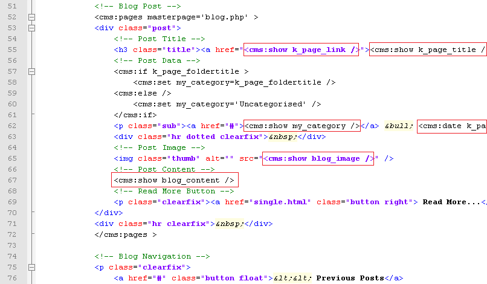

Visit _http&#58;//www.mytestsite.com/blog.php_ to see the two cloned pages listed on it -


Click on the title of any post to verify that it loads the page-view of that post.

Everything looks good for now.<br/>
The '_Read More.._' button at the bottom of each post needs some attention.<br/>
Usually when a blog post is displayed in its page-view (i.e. singly), its entire content is displayed. However, when the same post is displayed in the list-view (with several other posts) it is pragmatic to display only an excerpt of its contents and provide a link that leads to its page-view.

Couch has two tags that can be used to get an excerpt from any input provided to them - excerpt and excerptHTML.<br/>
The difference between the two, of course, is that excerptHTML preserves the HTML elements present in the input while excerpt strips off all HTML tags.<br/>
We'll use the excerptHTML tag for our purpose. It can be additionally configured to ignore certain HTML tags. We'll make it ignore any IMG tag because if it happens to be present within the excerpt it is certainly going to make the post taller than what we desire. We'll set the count of words for the excerpt to 75\.<br/>
The modified code is -

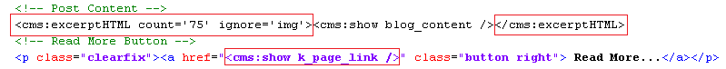

Note that we have fixed the '_Read More.._' link too.<br/>
Try it out by editing '_My second blog entry_', placing several paragraphs of text within it and then compare its page-view


with the list-view

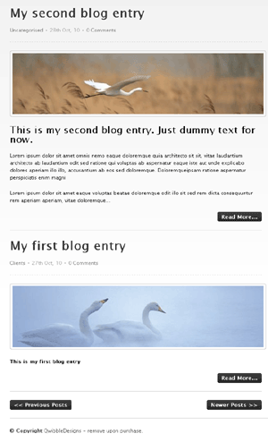

Our blog is beginning to take its final shape.<br/>
To illustrate the remaining features, we'll add three more blog entries (i.e. create cloned pages of _blog.php_).<br/>
We'll place two pages in '_clients_' folder, two in '_philosophy_' and leave one in the root (i.e. within no folder).


As we keep on adding new blog entries, the list-view faithfully keeps showing them all. It is okay for a few pages but as soon as the number of pages grows it soon becomes untenable to display all of them on a single page.<br/>
The solution? Show the pages in fixed chunks of, say, ten pages at a time and give visitors the option to navigate to other chunks by providing links. This is pagination and Couch supports it natively.

### PAGINATION

For the purpose of our demonstration, we'll show three pages at a time in the list-view.<br/>
Add the following parameters to the pages tag -

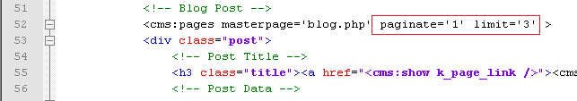

The _limit_ parameter limits the number of pages fetched to 3 while setting the _paginate_ parameter to 1 indicates to Couch that it now has to support pagination. Once Couch is made to support pagination, it will set some new variables for us that show the current status of the paginated result \[see Pagination in documentation for more details\].<br/>
The new variables include links to the next and the previous set of three pages (if available).<br/>
We can use them to modify the links of the two buttons at the bottom that say '_Previous Posts_' and '_Next Posts_', but before we can do that we'll have to move the HTML code for the two buttons within the pages tags (because the variables are available only within this tag's context) -<br/>
Before -


After -


But now when you access _blog.php_, you'll see that the next and previous buttons now get repeated for all the posts that are listed on the page. Certainly not what we desired. We wish to display the navigation buttons only after the last post on the page. As noted above, Couch sets up several variables that reflect the current status of the loop as the pages tag iterates through the fetched pages.<br/>
_k\_paginated\_top_ and _k\_paginated\_bottom_ are two such variables.

<p class="success">Use &lt;cms:dump /&gt; or &lt;cms:dump\_all /&gt; anywhere within the opening and closing component of the pages tag to see the variables change values as the cloned pages are looped through.</p>

_k\_paginated\_top_ is set when the first page of the current set of pages is being displayed while _k\_paginated\_bottom_ is set when it is the last page that is getting displayed.<br/>
We can use the _k\_paginated\_bottom_ variable to conditionally output the navigation buttons only after the last entry -


Visit _blog.php_ and the navigation buttons should now display properly after the last post.<br/>
We can now set the two buttons to link to the next and previous set of pages.<br/>
Couch sets two variables - _k\_paginate\_link\_prev_ and _k\_paginate\_link\_next_ that give us these links.<br/>
We'll add them to the buttons.


Visit _blog.php_ again and click on the '_Previous Posts_' button. You should now see _blog.php_ displaying the remaining two posts.

There is small issue here, however, that needs attention.<br/>
The five posts were split into two sets - the first set (or page) had three posts while the second has two posts.<br/>
We are at the second set and there are no more posts to display after this. Yet the '_Previous Posts_' is still being displayed.<br/>
Similarly, when we were at the first set there were no '_Newer Posts_' to display and yet this button was being displayed.

Couch, in fact, is aware of which set is being displayed and actually sets the _k\_paginate\_link\_prev_ and _k\_paginate\_link\_next_ variables only if there are any next or previous sets to display.<br/>
We simply have to check for these variables before displaying the navigation buttons.<br/>
Let us modify the code to do this -


Visit _blog.php_ again and the pagination should work perfectly.<br/>
Time to move our attention to the sidebar.

### THE SIDEBAR

The sidebar of both the views is almost identical. Both show a listing of Catagories (sic) and Archive periods.

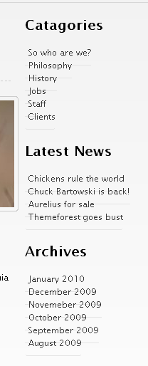

The one shown in page-view has an additional list showing the '_Latest News_'. It is difficult to say what the original designer of Aurelius had in mind as there is no '_news_' section. We'll list our latest four blog posts here.

Since the sidebars are almost identical, we can save the one that has more elements as a snippet and then embed it in both the views.

Find the following sidebar code in _blog.php_.


Cut and paste it into a file and save it as _blog\_sidebar.html_ in the snippets folder.<br/>
Place the following code in _blog.php_ in place the code removed above

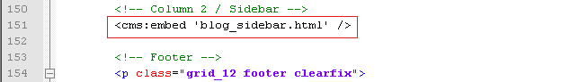

Similarly remove the sidebar code from _blog\_list.html_ (list-view) and replace it with the embed tag shown above.

The two views should now show identical sidebars. However the '_Latest News_' portion of the sidebar was supposed to be visible only in the page-view.<br/>
A little conditional code should handle this -<br/>
Open up _blog\_sidebar.html_ in your text editor and enclose the '_Latest News_' list with a conditional tag like this -


The '_Latest News_' section should now be visible only in page-view.

Let us now make the three listings in the sidebar dynamic.<br/>
We'll start with the first listing. The first thing to do is correct the header's spelling by changing 'Catagories' to 'Categories'. We'll now list the folders of this template.

### Listing Folders

As we can see, the category (folders) listing in the sidebar is a series of LI's within a UL tag -


In Couch, we can enumerate the folders of a template by using the folders tag. This tag works in a similar fashion as the pages tag we saw a little while back. It fetches the folders and then iterates through them, making available each folder's variables as it loops through each.<br/>
The LI portion of the list shown above is the part that needs to be output for each folder found.<br/>
Delete all LIs except one and then enclose this single LI with the folders tag -

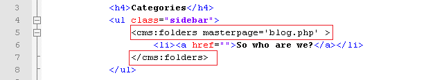

Next replace the folder's name and its link with the variables that Couch provides for each folder it finds -


This will result in a list of all the five folders we defined for _blog.php_ template.

#### Listing pages within a folder

Each folder in the list produced by the folders tag above is also linked to a URL similar to<br/>
_http&#58;//www.mytestsite.com/blog.php?f=5_<br/>
Notice how the name of the template is followed by '_?f=n_' (where n is a number denoting a particular folder).<br/>
This URL is meant for listing pages that belong to the specified folder only. Such view is a sub-category of the list-view and is known as the folder-view \[see [Views](../../../../concepts/views.html)\].

The '_?f=n_' after the template's name makes Couch treat this URL as the template's folder-view and it makes available to you (as variables) all the information about the folder specified in the URL \[see: [Variables available in Views](../../../../concepts/variables-in-views.html)\].<br/>
Currently, however, if you click on any of the folders in the list, it will lead you to blog.php in the same list-view that is displayed when _blog.php_ is accessed without any parameter appended after its name. That is, all pages regardless of the folder they belong to, get displayed.

The reason is that, although Couch recognizes the URL as folder-view and sets all relevant variables for us, it is eventually up to us to decide what to display in this view.<br/>
We can, for example, display information about the folder in question in this view or display only the pages that belong to the specified folder.<br/>
In our case, currently we are not checking at all if the list-view is actually also a folder-view (i.e. we do need to list pages in this view but the pages should belong only to the particular folder that is being specified in the URL).<br/>
Let us add this intelligence to our template.

As we know, it is the pages tag in _blog\_list.html_ template that is fetching and displaying pages in list-view.<br/>
Currently it only has the _masterpage_ parameter that is constraining the pages fetched.<br/>
The tag also supports a parameter named '_folder_' where we can specify the name of the folder (or folders) the pages belonging to which need to be fetched.<br/>
For example, if we hardcode the name of folder as '_clients_', the list-view will start showing only the two pages that currently reside in this folder -


As it happens, during folder-view, a variable named _k\_folder\_name_ gets set by Couch, which gives us the name of the folder specified in the URL. Place this variable as the '_folder_' parameter in the pages tag -


Refresh _blog.php_ and click on the '_Clients_' folder in the sidebar list.<br/>
Only two pages, each belonging to '_Clients_' folder will be displayed.<br/>
Click on the '_Philosophy_' folder and you should now see only the two pages belonging to '_Philosophy_' being listed.<br/>
Remove the '_?f=n_' part from the URL and access _http&#58;//www.mytestsite.com/blog.php_ directly.<br/>
It will display all folders, regardless of their containing folders, as before.<br/>
This works as before because this view not being the folder-view, the _k\_folder\_name_ variable comes up empty and hence the '_folder_' parameter of the pages tag is ignored.

Thus with only the addition of one parameter we were able to handle the folder-view too.<br/>
Couch supports one last sub-category of the list-view - the _archive-view_.<br/>
In this view we display pages belonging to only a particular time period.<br/>
Let us move on to it.

### Listing Archives

This section is very similar to the Listing folders section we handled above -


Edit _blog\_sidebar.html_ to delete all the LIs within the UL except one.<br/>
The Couch tag used to enumerate all the archive periods that have published pages within them is the archives tag.<br/>
Enclose the solitary LI with this tag -


Similar to the pages or folders tag, the archives tag makes available all information about each archive period by setting up variables.<br/>
Variable _k\_archive\_date_ gives the date that represents the first day of the archive period while _k\_archive\_link_ provides the link to the archive-view that should display all pages belonging to this period.<br/>
Add the aforesaid variables to the LI -


We have already discussed the use of date tag to format dates.

Visit _blog.php_ and you'll see the archives being displayed in the sidebar.<br/>
Click on one archive item and it should lead you to a URL like -<br/>
_http&#58;//www.mytestsite.com/blog.php?d=201010_

The '_?d=201010_' after the _blog.php_ signals to Couch that an archive-view is being accessed. Couch makes available all information pertaining to the archive period specified in the URL by setting various variables \[see [Variables available in Views](../../../../concepts/variables-in-views.html)\].<br/>
It is up to the template being accessed to handle the archive period anyway it chooses to.<br/>
For now, our _blog.php_ will simply display whatever it did in the list-view (remember archive-view and folder-view are sub-categories of list-view) because we have not yet handled the archive-view.<br/>
Let us do that now.

Once again it is the pages tag that we placed within the _blog\_list.html_ (that handles list-view) that needs a little modification.<br/>
Pages tag supports two parameters that can be set to constrain the fetched pages to belong to a certain time period - _start\_on_ and _stop\_before_.<br/>
We'll set the values of these parameters by using two variables that are set by Couch in archive-view that denote the start and end dates of the archive period - _k\_archive\_date_ and _k\_next\_archive\_date_.<br/>
The modified pages tag should look like -


This minor modification will make our original code handle the archive-view too (i.e. list only pages belonging to that archive period).<br/>
As with the folder-view, this works because when _blog.php_ is accessed in a view other than the archive-view, the two variables we used are empty and hence are ignored by the pages tag.

This wraps up the two lists that appear in the sidebar of list-view.<br/>
The page-view has an additional list, the _Latest News list_, which we'll use to display the latest four blog posts.<br/>
Open up _blog\_sidebar.html_ in your text editor and find the _Latest News_ listing.


Having already configured the folders and archive listings, this one should be a cinch.<br/>
We already know that the Couch tag used to list pages is the pages tag.<br/>
The steps needed to make this listing dynamic should now be familiar -

**a.** Delete all but one LI representing one page entry in the list.<br/>
**b.** Enclose the solitary LI with the tag that enumerates the objects being listed - in this case it is the pages tag.<br/>
**c.** Use the variables set by the enumerator tag in the list item.

The finished code is as follows -


Notice that we have set the limit to four.

Visit any blog entry (page-view) and the latest four blog entries should be found listed in the sidebar.


That wraps up all the sidebar sections.<br/>
The only features left to complete now are the comments listing and comments form.<br/>
Let us move on to them to finally finish the blog in Aurelius.

### COMMENTS

As the very first step in configuring comments, mark the _blog.php_ template as being commentable.<br/>
This is done by setting the _commentable_ attribute to '1' in the template tag present in _blog.php_ -

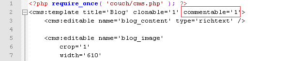

Access _blog.php_ in your browser while being logged-in as the super-admin.<br/>
Visit the admin section and you'll find that as soon as a template is declared as commentable, a new item is added to the sidebar -


This will be used to administrate all the submitted comments. For now there are no comments for us to administrate so we'll come back to it a little latter.

Let us add the form used to submit comments in the page-view.<br/>
Within _blog.php_, find the form that is meant to submit comments -

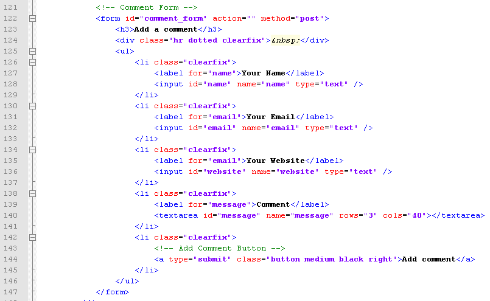

We could modify this form to make Couch fit into it. However, since a comments submission form is such a standard component of a blog, in this case we can save some time by reusing the submission form that is described in Couch documentation of [comments](../../../../concepts/using-comments.html).<br/>
Copy and save that sample form into a file named _comments\_form.html_ [\[download it\]](http://www.couchcms.com/docs/code/blog.zip) and save this into the snippet folder of Couch.<br/>
Replace the original form block in _blog.php_ shown above with -

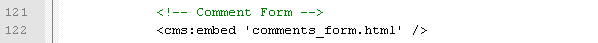

This will cause the following to display when you are logged in -


while the following form is shown to non logged-in users -

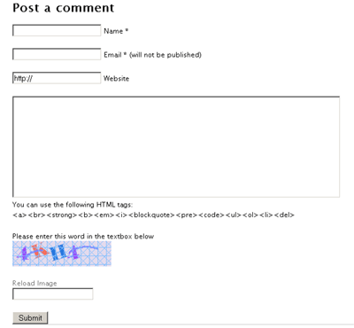

You can style the input elements within this form yourself or simply substitute them with those found in the original Aurelius code.

The code we copied uses the following values from _config.php_ to email submission intimation messages to the administrator -


Don't forget to change them.

Try submitting a few comments being logged in as admin and otherwise.<br/>
Comments submitted by non-admins are, by default, not published immediately but are enqueued for moderation.<br/>
\[This can be changed by editing the _config.php_ but we strongly advice against doing this.\]


Visit your admin panel and click on the comments item in the sidebar that we mentioned previously.<br/>
All the submitted comments should be available here.


Approve the comments that need approval and now we can move on to getting all the approved comments listed on the page they were submitted to.

### Listing Comments

Listing comments follows the same pattern we have seen so far with all the listings we have configured i.e. pages, folders and archives.<br/>
The enumerator tag for listing comments is, no prizes for guessing, the comments tag.<br/>
With no parameters specified, comments tag will list all the approved comments in the system regardless of the template they belong to. However, you can use the _masterpage_, _page\_id_ or _page\_name_ parameters to make it fetch only the comments that belong to a particular template or page.

To put the comments tag into use, follow the usual method of isolating a single item and enclosing it with the enumerator tags.<br/>
Here is how the sample comment contained in _blog.php_ looks like after being enclosed by the comments tag -


Notice how we are using the system variable _k\_page\_id_, which is set by Couch to give the current page's id, to fetch only the comments that are associated with the page being accessed in page-view.

Follow this with the usual step of replacing the static content with the variables set by the enumerator tag.


Notice the use of the gravatar tag. Also please notice the use of the following code

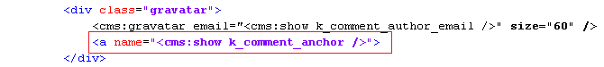

which is used to give every comment a unique anchor. This is helpful in linking back to specific comments from other pages.

If you wish you can add pagination to this list of comments. The method is the same as that we used to paginate the list of pages before.


For the pagination, we have opted to use the Couch paginator instead of the usual '_next_' and '_prev_' buttons. This tag automatically generates a Google style pagination. You'll need to add a bit of CSS though to make the looks suit your needs (please see [Pagination documentation](../../../../concepts/pagination.html) for a sample CSS)

As a final tweak, we'll add a conditional tag to display this list only if the page has any comments available else show a '_No comments_' message. The final code -

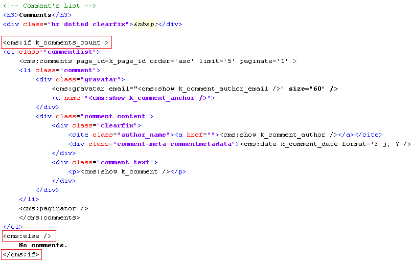

That completes the last feature of the blog section.

### FINISHING TOUCHES

Let us tie up some loose ends before wrapping up the blog section.

Below every blog post in page-view, there is a button that says '_Back to Blog_'. We need to make it link to our list view - _http&#58;//www.mytestsite.com/blog.php_.<br/>
We could hard-code the link ourselves but in Couch it is never a good idea to do so with any link.<br/>
The reason is that, latter on when all the templates have been configured, usually you'll want to turn on the prettyURLs feature. With this feature enabled, all default links of Couch will change to become more SEO friendly.

Thus, for example,<br/>
_http&#58;//www.mytestsite.com/blog.php_ will become<br/>
_http&#58;//www.mytestsite.com/blog/_<br/>
<br/>
_http&#58;//www.mytestsite.com/blog.php?p=2_ will become<br/>
_http&#58;//www.mytestsite.com/blog/my-first-blog-entry.html_<br/>
<br/>
_http&#58;//www.mytestsite.com/blog.php?f=5_ will become<br/>
_http&#58;//www.mytestsite.com/blog/clients/_<br/>
etc.

The right way to code any link in Couch is to use the link tag.<br/>
This tag takes as parameters the names of the masterpage, page, folder etc. and depending on whether or not prettyURL is turned on, outputs the proper link.

Find the following in _blog.php_

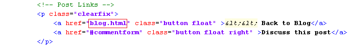

and change it to.

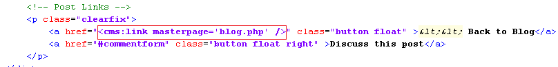

Congratulations. The blog section is finally complete.

Next: [The portfolio section](../../portfolio.html)
