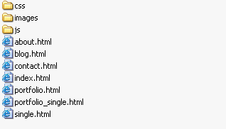
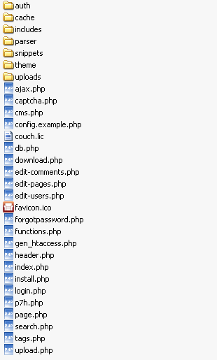
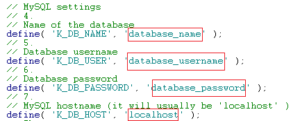
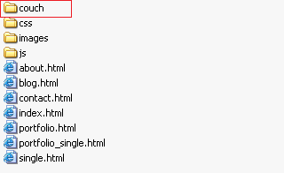
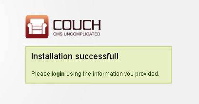
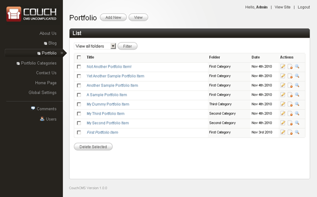

# Building a real-world site

To demonstrate the power and ease of Couch, we'll build a complete real world site from scratch using it.

The template we have chosen to do so is Aurelius. 
It was originally created to be sold commercially at Themeforest. However the author later on changed his mind and very graciously released it as a free template.

We chose this template because it has almost all the sections that you'll come across while building a similar site -

*   About Us
*   Portfolio
*   Blog
*   Contact Us
*   Home

It can be found at [_http&#58;//net.tutsplus.com/articles/news/free-website-template/_](http://net.tutsplus.com/articles/news/free-website-template/). You can choose to download it from the aforesaid link or get it from [here](http://www.couchcms.com/docs/code/Aurelius.zip) (our version has all unnecessary files removed).

### Installing Aurelius

Couch works by retrofitting within an existing working site. As such, our first step will be to get the static Aurelius site working. 
Unzip and upload all the files of Aurelius to your web server.

    You can use any hosted space that you might have for the purpose of this tutorial. However that would entail FTP'ing the modified files back to the server every time you make any changes. 
     
    A more pragmatic approach would be to use [XAMPP](http://www.apachefriends.org/en/xampp.html) or [WampServer](http://www.wampserver.com/en/) on your local machine. This way you can directly make changes to local files. 
     
    For this tutorial, we'll assume that your web server is hosted locally and hence will simply say 'edit this file and save it' instead of 'edit this file locally and FTP it back to your server'.

If you are using the files downloaded from _http&#58;//net.tutsplus.com/_, remove the _Documentation_ and _psd_ folders as well as the _config.php_, _send\_email.php_ and _full\_width.html_ files as these will no longer be needed by us (this won't be necessary if you downloaded the template from our site).

The resulting folder structure should look like this -

Confirm that all the pages of this template are now accessible through the browser. 
With the website in place, we can now move on to install Couch within it.

### Installing Couch

Download and unzip _couch.zip_. You'll get a folder named _couch_ containing the following files -

Rename the file named _config.example.php_ to _config.php_. 
Open it in your text editor and find the following lines -

Change the values to match those of your MySQL database.

Upload the entire _couch_ folder, along with the modified _config.php_, to your web server, which already contains the Aurelius files. 
The resulting site structure should now look like this with the _couch_ folder appearing as a subfolder of your existing site -

    The uploaded _couch_ folder is your site's admin section. 
    It is a good security measure to rename this folder to anything else you wish. This way you'll make it more difficult for unwanted visitors to try and access your admin section. 
    For this tutorial we'll assume you have chosen to go with the default name.

Access the admin section through your browser - _http&#58;//www.mytestsite.com/couch/_

For the rest of this tutorial we'll assume the site's address to be _http&#58;//www.mytestsite.com/_. Replace it with your site's address for all examples.

Couch will sense that installation is required and will display the following form for you to fill -

If, however, at this point you get an '500 Internal Server Error', please try deleting the .htaccess file present in the 'couch' installation folder. Certain hosts, notably GoDaddy, have problems with the directive contained in this file.

Enter your desired name, password and email address. Press install and in a little while you should be prompted with the following screen -

Couch created an account with super-admin privilege using the information provided by you in the last step and is now prompting you to login using the same.

    **V. Imp:** This account created for you by Couch is a very special one. This is the account you need to be logged in with, whenever you wish to make any 'structural' changes to the website as a designer - (which, for the site we are building now, is the entire duration of this tutorial). 
     
    Only one such account can ever exist in one installation of Couch. Be sure to provide a valid email address during installation so that it could be used in password recovery if you happen to forget this account's password.

Login using the super-admin account you created and brace yourself for facing the most 'barren' admin section you'll ever come across -

This almost bare admin panel is an important feature of Couch. 
We realize that the person most often logged into it is going to be the client that you'll be building the website for and, more often than not, he is not going to be as computer savvy as you are. 
Instead of overwhelming such a client with an admin panel that resembles the cockpit of an airliner, we wished to confront him with just as much information as is absolutely essential. 
As we move along with building the site, the admin panel will start displaying more information. This is the admin panel of our finished site -

It is important to note that the admin panels of no two sites built with Couch are going to be identical. As the designer of a website, it is you who'll choose how much data gets exposed to the client within the admin section.

With Couch installed we can now begin porting the Aurelius files to it.

Next: [Starting up simple - The About Us page](../../about-us.html).
