# Finally home

The home page in Aurelius is represented by _index.html_.

Having configured all the other sections of this web site, configuring the home page should now be pretty straightforward.

Let us begin by attaching Couch to this template. 
Take the usual steps to do so - 
Change the extension of _index.html_ to make it _index.php_ 
Add the two lines of boilerplate PHP code to enclose the contents of this file and use the template tag to change the display-name of the template.

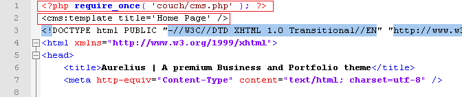

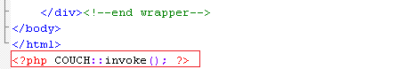

Access _http&#58;//www.mytestsite.com/_ while logged on as the super-admin. 
This will hook up Couch to the template. 
Visit the admin panel. An new entry 'Home Page' should appear in the list of templates.

### Defining editable regions

Take a look at the home page -

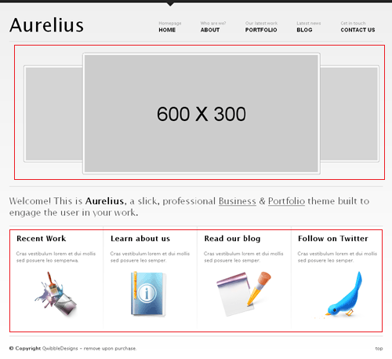

It has two distinct regions that will need to be handled. 
The top region shows images of the five latest portfolio entries in a carousel while the bottom region displays four separate boxes that have some content. 
The portfolio images will be fetched from the existing portfolio pages and hence do not require the creation of any editable regions. 
The boxes at the bottom need to be looked at a little closer -

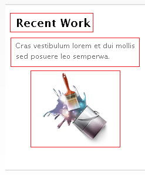

The three marked elements can do with an editable region each. A fourth editable region will be required to hold the link of the page that this box leads to.

This is the original code for the boxes with the proposed editable regions marked out for one box -

Create editable regions out of the marked regions by enclosing them with cms:editable tags. 
Here is how the editable regions are created for all the boxes -

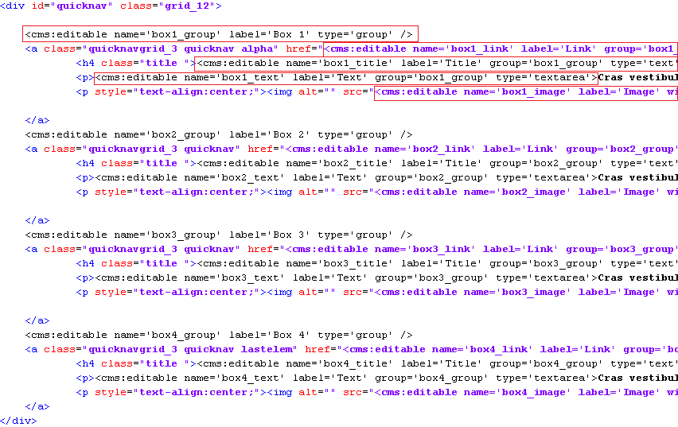

(There is not sufficient space to show the full width of the code so the closing tags of editable regions are not visible. However it is fairly regular stuff and you can check it out from the php file you'll find linked to this tutorial.)

If defining the editable regions in-line seems too cluttered to you, you can define them, the way we did for _blog_ and _portfolio_, within the template tag instead. In that case, you'll need to show only the variables representing the editable regions at the marked regions.

Please note in the code above that the labels of several regions are the same however, as is mandatory, their names are different. 
Also note that we have grouped together the editable regions belonging to each box by creating group type editable regions for each box and linking them to the regions.

Refresh the home page by visiting _http&#58;//www.mytestsite.com/_ logged-in as the super-admin. 
Visit the admin panel and you should find the following -

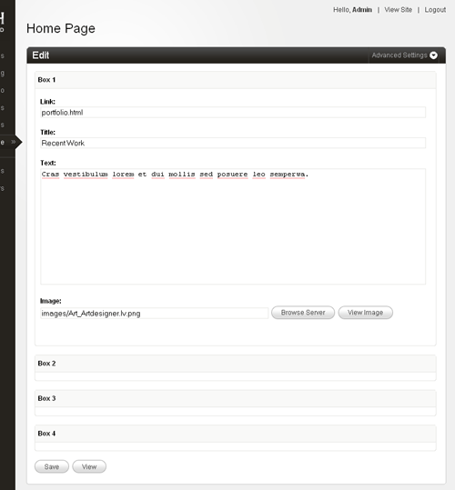

Edit the links to make the boxes lead to the proper sections and we can then move on.

### Listing the portfolio items

Let us now get the carousel display images from the latest five portfolio items. 
This is the original code -

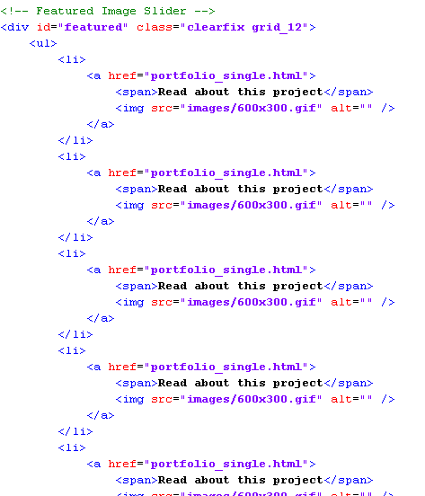

As you can see, it consists of an unordered list with each LI representing one portfolio item. 
You must have guessed that we'll use the Couch pages tag to fetch the pages cloned from _portfolio.php_ template. 
We'll proceed the way we have done several times while working with the enumerator tags (pages, folders, archives) in _blog_ and _portfolio_ sections - 
Delete all items representing the object to be enumerated (the pages, in this case), except one.

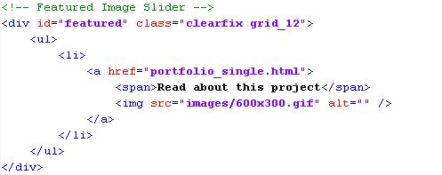

Enclose the solitary item by the enumerator tag. The tag will cause this item to be repeated as many times as the objects fetched by it.

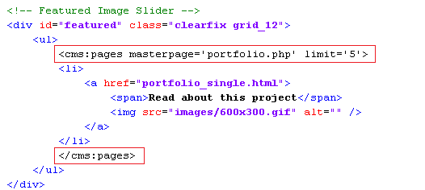

Finally, use the variables set by the enumerator tag belonging to each fetched object

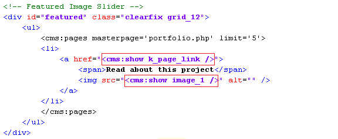

Visit _http&#58;//www.mytestsite.com/_ to see the results of your work -

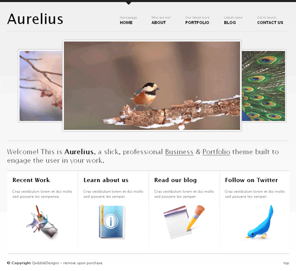

Couldn't have been any easier.

Well, that completes our last template. A little more work still needs to be done before we can finally call it quits - e.g. make the menu links work etc.

[We'll tie all the loose ends in the next tutorial.](../../tying-the-loose-ends.html)
